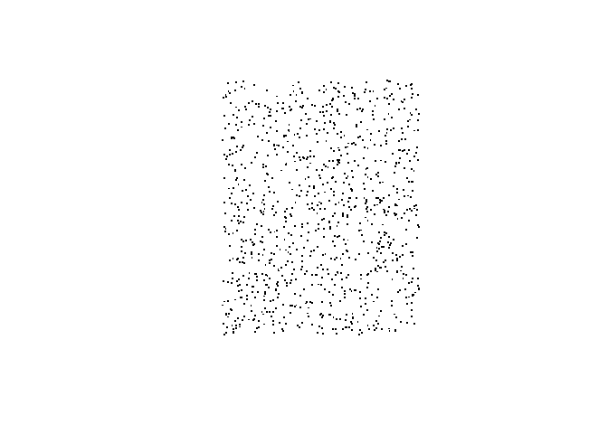
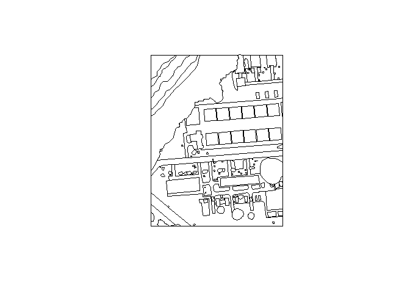
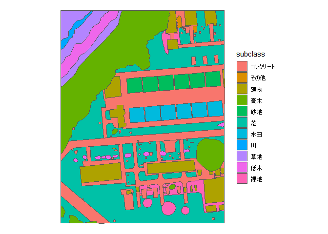
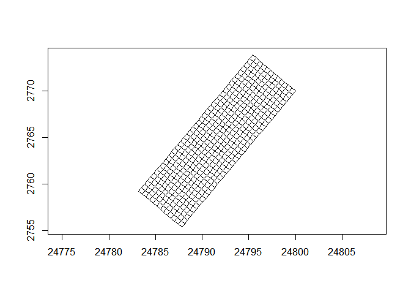
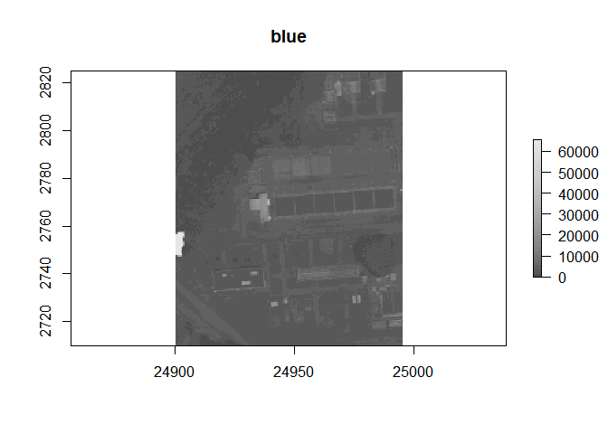
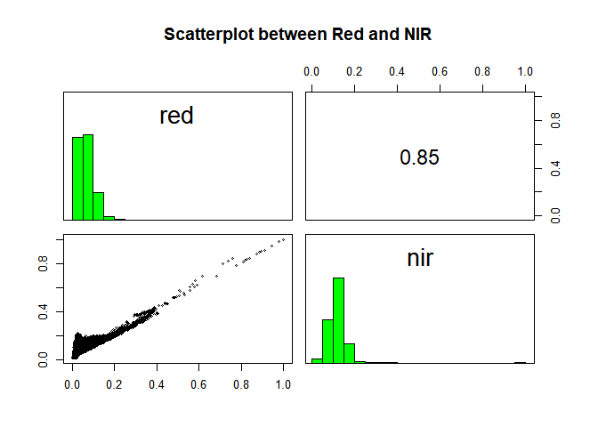
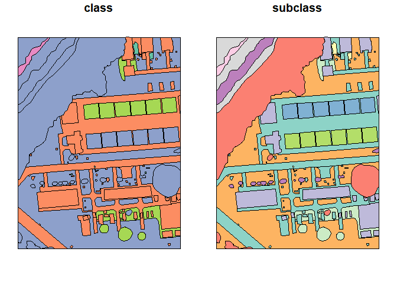
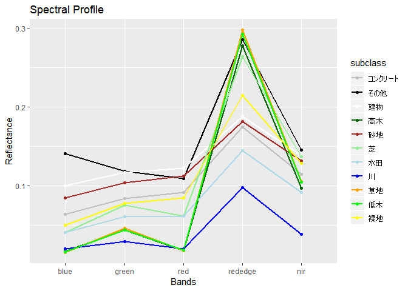
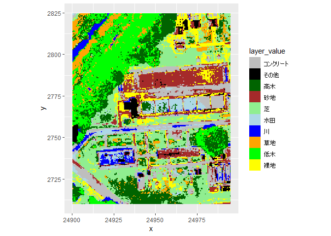
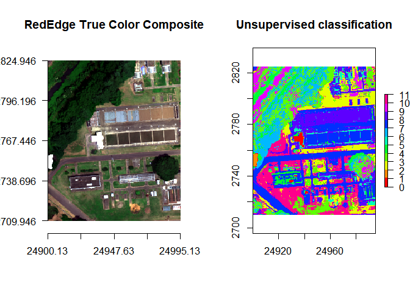

#準備編 


##インストール 


以下の環境を用意してください。

* Windows OS >=7
* R >= 3.5.1
* RStudio >= 1.0

使用するデータをダウンロードしてください。

* [使用データダウンロード]()

パッケージをインストールします。（最初の1回だけ）


```r
install.packages(c("sf","geos","dplyr","tidyr","raster","ggplot2","ggrepel","mapview","jpndistrict","rpart","randomForest","kernlab"),dependencies=T,type="win.binary")
```

ライブラリを読み込みます。


```r
library(sf) #ベクタ処理
library(raster) #ラスタ処理
library(dplyr) #属性処理
library(purrr) #属性処理
library(tidyr) #属性処理
library(ggplot2) #地図表示
library(ggrepel) #ラベル表示処理
library(mapview) #地図表示（インタラクティブ）
library(jpndistrict) #日本の行政界データ
library(rpart) #決定木
library(randomForest) #ランダムフォレスト
library(kernlab) #SVM
```


##基礎知識 


```r
#横長なデータを作成
data <- tibble(
  Point = c("地点A","地点B"),
  Red = c(0.1,0.3),
  Green = c(0.3,0.2),
  Blue = c(0.5,0.6)
)
print(data)
```

```
# A tibble: 2 x 4
  Point   Red Green  Blue
  <chr> <dbl> <dbl> <dbl>
1 地点A   0.1   0.3   0.5
2 地点B   0.3   0.2   0.6
```

```r
#縦長のデータに変換
data2<-data %>% gather(key = Band, value="Refrectance",-Point)
#横長のデータに変換
data2 %>% spread(key=Band,value=Refrectance)
```

```
# A tibble: 2 x 4
  Point  Blue Green   Red
  <chr> <dbl> <dbl> <dbl>
1 地点A   0.5   0.3   0.1
2 地点B   0.6   0.2   0.3
```

###パイプ


```r
#横長なデータを作成
data <- tibble(
  Point = c("地点A","地点B"),
  Red = c(0.1,0.3),
  Green = c(0.3,0.2),
  Blue = c(0.5,0.6)
)
print(data)
```

```
# A tibble: 2 x 4
  Point   Red Green  Blue
  <chr> <dbl> <dbl> <dbl>
1 地点A   0.1   0.3   0.5
2 地点B   0.3   0.2   0.6
```

```r
#縦長のデータに変換
data2<-data %>% gather(key = Band, value="Refrectance",-Point)
#横長のデータに変換
data2 %>% spread(key=Band,value=Refrectance)
```

```
# A tibble: 2 x 4
  Point  Blue Green   Red
  <chr> <dbl> <dbl> <dbl>
1 地点A   0.5   0.3   0.1
2 地点B   0.6   0.2   0.3
```

パイプ左側の関数の出力結果をパイプ右側の関数の第一引数にする


```r
#head(1:5,3)をパイプで書くと
1:5 %>% head(3)
```

```
[1] 1 2 3
```

```r
#パイプの出力を次のパイプの入力にできる
c(1,10,100) %>% tan %>% sin %>% cos
```

```
[1] 0.5403777 0.8231382 0.8504039
```

```r
#.を使うと第1引数以外にできる
3 %>% head(1:5,.)
```

```
[1] 1 2 3
```

```r
#横長なデータを作成
data <- tibble(
  Point = c("地点A","地点B"),
  Red = c(0.1,0.3),
  Green = c(0.3,0.2),
  Blue = c(0.5,0.6)
)
print(data)
```

```
# A tibble: 2 x 4
  Point   Red Green  Blue
  <chr> <dbl> <dbl> <dbl>
1 地点A   0.1   0.3   0.5
2 地点B   0.3   0.2   0.6
```

```r
#縦長のデータに変換
data2<-data %>% gather(key = Band, value="Refrectance",-Point)
#横長のデータに変換
data2 %>% spread(key=Band,value=Refrectance)
```

```
# A tibble: 2 x 4
  Point  Blue Green   Red
  <chr> <dbl> <dbl> <dbl>
1 地点A   0.5   0.3   0.1
2 地点B   0.6   0.2   0.3
```

###map関数 


```r
#横長なデータを作成
data <- tibble(
  Point = c("地点A","地点B"),
  Red = c(0.1,0.3),
  Green = c(0.3,0.2),
  Blue = c(0.5,0.6)
)
print(data)
```

```
# A tibble: 2 x 4
  Point   Red Green  Blue
  <chr> <dbl> <dbl> <dbl>
1 地点A   0.1   0.3   0.5
2 地点B   0.3   0.2   0.6
```

```r
#縦長のデータに変換
data2<-data %>% gather(key = Band, value="Refrectance",-Point)
#横長のデータに変換
data2 %>% spread(key=Band,value=Refrectance)
```

```
# A tibble: 2 x 4
  Point  Blue Green   Red
  <chr> <dbl> <dbl> <dbl>
1 地点A   0.5   0.3   0.1
2 地点B   0.6   0.2   0.3
```

ベクトルかリストを入力し、各要素に関数を適用し、入力と同じ長さのリストを返す


```r
#xを平均値とした正規乱数を5個作成する関数を定義
myfunc<-function(x){
  rnorm(5,x)
}
#各値を引数として、myfunc関数を適用する。戻り値は、各5個の乱数を持った3要素のリスト。
c(1,10,100) %>% map(myfunc)
```

```
[[1]]
[1]  0.28066114 -0.05131747  0.20912083 -1.51593390  0.39397943

[[2]]
[1] 10.408444 10.415428  9.137435  9.352509 10.234870

[[3]]
[1] 101.56536  98.99085 101.12642  99.72397 100.30545
```

```r
#以下のように簡略化して書ける。~はfunction、.xは引数を表す。
c(1,10,100) %>% map(~rnorm(5,.x))
```

```r
#リストの各要素ごとに平均値を計算する場合。戻り値は、身長の平均値、体重の平均値の2要素のリスト
mylist<-list(height=130:140,weight=40:50)
mylist %>% map(mean)
```

```
$height
[1] 135

$weight
[1] 45
```

```r
#横長なデータを作成
data <- tibble(
  Point = c("地点A","地点B"),
  Red = c(0.1,0.3),
  Green = c(0.3,0.2),
  Blue = c(0.5,0.6)
)
print(data)
```

```
# A tibble: 2 x 4
  Point   Red Green  Blue
  <chr> <dbl> <dbl> <dbl>
1 地点A   0.1   0.3   0.5
2 地点B   0.3   0.2   0.6
```

```r
#縦長のデータに変換
data2<-data %>% gather(key = Band, value="Refrectance",-Point)
#横長のデータに変換
data2 %>% spread(key=Band,value=Refrectance)
```

```
# A tibble: 2 x 4
  Point  Blue Green   Red
  <chr> <dbl> <dbl> <dbl>
1 地点A   0.5   0.3   0.1
2 地点B   0.6   0.2   0.3
```

###reduce関数 


```r
#横長なデータを作成
data <- tibble(
  Point = c("地点A","地点B"),
  Red = c(0.1,0.3),
  Green = c(0.3,0.2),
  Blue = c(0.5,0.6)
)
print(data)
```

```
# A tibble: 2 x 4
  Point   Red Green  Blue
  <chr> <dbl> <dbl> <dbl>
1 地点A   0.1   0.3   0.5
2 地点B   0.3   0.2   0.6
```

```r
#縦長のデータに変換
data2<-data %>% gather(key = Band, value="Refrectance",-Point)
#横長のデータに変換
data2 %>% spread(key=Band,value=Refrectance)
```

```
# A tibble: 2 x 4
  Point  Blue Green   Red
  <chr> <dbl> <dbl> <dbl>
1 地点A   0.5   0.3   0.1
2 地点B   0.6   0.2   0.3
```

ベクトルかリストを入力し、二変数関数を順々に適用して1つの値を返す。


```r
c(1,10,100) %>% reduce(sum)
```

```
[1] 111
```

```r
x <- list(c(0, 1), c(2, 3), c(4, 5))
x %>% reduce(c)
```

```
[1] 0 1 2 3 4 5
```

```r
#横長なデータを作成
data <- tibble(
  Point = c("地点A","地点B"),
  Red = c(0.1,0.3),
  Green = c(0.3,0.2),
  Blue = c(0.5,0.6)
)
print(data)
```

```
# A tibble: 2 x 4
  Point   Red Green  Blue
  <chr> <dbl> <dbl> <dbl>
1 地点A   0.1   0.3   0.5
2 地点B   0.3   0.2   0.6
```

```r
#縦長のデータに変換
data2<-data %>% gather(key = Band, value="Refrectance",-Point)
#横長のデータに変換
data2 %>% spread(key=Band,value=Refrectance)
```

```
# A tibble: 2 x 4
  Point  Blue Green   Red
  <chr> <dbl> <dbl> <dbl>
1 地点A   0.5   0.3   0.1
2 地点B   0.6   0.2   0.3
```

###データの変形


```r
#横長なデータを作成
data <- tibble(
  Point = c("地点A","地点B"),
  Red = c(0.1,0.3),
  Green = c(0.3,0.2),
  Blue = c(0.5,0.6)
)
print(data)
```

```
# A tibble: 2 x 4
  Point   Red Green  Blue
  <chr> <dbl> <dbl> <dbl>
1 地点A   0.1   0.3   0.5
2 地点B   0.3   0.2   0.6
```

```r
#縦長のデータに変換
data2<-data %>% gather(key = Band, value="Refrectance",-Point)
#横長のデータに変換
data2 %>% spread(key=Band,value=Refrectance)
```

```
# A tibble: 2 x 4
  Point  Blue Green   Red
  <chr> <dbl> <dbl> <dbl>
1 地点A   0.5   0.3   0.1
2 地点B   0.6   0.2   0.3
```


#ベクタ基本編


##基本操作


### シェープファイルを読み込みたい


```r
landcover<-read_sf("data/landcover.shp",options=c("ENCODING=CP932"))
```

### データの概要を確認したい


```r
head(landcover)
```

```
Simple feature collection with 6 features and 2 fields
geometry type:  POLYGON
dimension:      XY
bbox:           xmin: 24904.97 ymin: 2710.929 xmax: 24986.65 ymax: 2733.338
epsg (SRID):    NA
proj4string:    +proj=tmerc +lat_0=36 +lon_0=139.8333333333333 +k=0.9999 +x_0=0 +y_0=0 +ellps=GRS80 +units=m +no_defs
# A tibble: 6 x 3
  class  subclass                                                 geometry
  <chr>  <chr>                                               <POLYGON [m]>
1 構造物 コンクリート ((24985.42 2713.855, 24986.65 2713.886, 24986.65 27~
2 構造物 コンクリート ((24933.71 2711.357, 24932.91 2712.066, 24933.68 27~
3 植生   芝           ((24921.19 2711.823, 24920.89 2711.823, 24920.48 27~
4 植生   高木         ((24917.46 2711.022, 24917.61 2711.126, 24917.85 27~
5 構造物 コンクリート ((24925.27 2710.929, 24925.06 2710.985, 24924.73 27~
6 植生   高木         ((24917.46 2711.022, 24910.18 2710.995, 24910.08 27~
```

### 地図を表示したい


```r
plot(landcover)
```

<!-- -->

### データクラスを確認したい


```r
class(landcover)
```

```
[1] "sf"         "tbl_df"     "tbl"        "data.frame"
```

### データの構造を確認したい


```r
str(landcover) 
```

```
Classes 'sf', 'tbl_df', 'tbl' and 'data.frame':	157 obs. of  3 variables:
 $ class   : chr  "構造物" "構造物" "植生" "植生" ...
 $ subclass: chr  "コンクリート" "コンクリート" "芝" "高木" ...
 $ geometry:sfc_POLYGON of length 157; first list element: List of 1
  ..$ : num [1:5, 1:2] 24985 24987 24987 24986 24985 ...
  ..- attr(*, "class")= chr  "XY" "POLYGON" "sfg"
 - attr(*, "sf_column")= chr "geometry"
 - attr(*, "agr")= Factor w/ 3 levels "constant","aggregate",..: NA NA
  ..- attr(*, "names")= chr  "class" "subclass"
```

### 属性名を確認したい


```r
names(landcover)
```

```
[1] "class"    "subclass" "geometry"
```

### 属性値のサマリーを確認したい


```r
summary(landcover)
```

```
    class             subclass                  geometry  
 Length:157         Length:157         POLYGON      :157  
 Class :character   Class :character   epsg:NA      :  0  
 Mode  :character   Mode  :character   +proj=tmer...:  0  
```

### データの範囲を確認したい


```r
st_bbox(landcover)
```

```
     xmin      ymin      xmax      ymax 
24904.970  2710.929 24992.022  2824.005 
```

### Rstudioで属性表を確認したい


```r
View(landcover)
```

### インタラクティブな地図を表示したい


```r
mapview(landcover)
```

<!--html_preserve--><div id="htmlwidget-3ce0254c360d014c45c1" style="width:672px;height:480px;" class="leaflet html-widget"></div>
<script type="application/json" data-for="htmlwidget-3ce0254c360d014c45c1">{"x":{"options":{"minZoom":1,"maxZoom":100,"crs":{"crsClass":"L.CRS.EPSG3857","code":null,"proj4def":null,"projectedBounds":null,"options":{}},"preferCanvas":true,"bounceAtZoomLimits":false,"maxBounds":[[[-90,-370]],[[90,370]]]},"calls":[{"method":"addProviderTiles","args":["CartoDB.Positron",1,"CartoDB.Positron",{"errorTileUrl":"","noWrap":false,"detectRetina":false}]},{"method":"addProviderTiles","args":["CartoDB.DarkMatter",2,"CartoDB.DarkMatter",{"errorTileUrl":"","noWrap":false,"detectRetina":false}]},{"method":"addProviderTiles","args":["OpenStreetMap",3,"OpenStreetMap",{"errorTileUrl":"","noWrap":false,"detectRetina":false}]},{"method":"addProviderTiles","args":["Esri.WorldImagery",4,"Esri.WorldImagery",{"errorTileUrl":"","noWrap":false,"detectRetina":false}]},{"method":"addProviderTiles","args":["OpenTopoMap",5,"OpenTopoMap",{"errorTileUrl":"","noWrap":false,"detectRetina":false}]},{"method":"addPolygons","args":[[[[{"lng":[140.110556957537,140.110570643218,140.110570609142,140.110558291933,140.110556957537],"lat":[36.0241401543765,36.0241404006559,36.0241306736647,36.0241304242218,36.0241401543765]}]],[[{"lng":[140.109983233001,140.109974360288,140.109982938488,140.109991471027,140.109983233001],"lat":[36.0241189680176,36.0241253805598,36.0241325865952,36.0241267306697,36.0241189680176]}]],[[{"lng":[140.10984434368,140.109840969527,140.109836435133,140.109832923451,140.109828302072,140.109824324226,140.10981743389,140.10981217189,140.109807208393,140.109804512032,140.109802926462,140.109797850084,140.10979328846,140.109788763532,140.109785004485,140.109779407163,140.109776458461,140.109772098038,140.109767784385,140.109766760823,140.109766080106,140.109765106711,140.109765367668,140.109766401059,140.109765506883,140.109760639229,140.109756670119,140.10975496402,140.109752194385,140.109749805142,140.109737887132,140.109736519511,140.109733868098,140.109731130185,140.109725699066,140.109719411438,140.109718253272,140.109717842548,140.109718300099,140.109720888485,140.109721012412,140.109720282136,140.109713720694,140.109713118834,140.109712987385,140.109713407267,140.109714425977,140.10971822051,140.10972001226,140.10972099148,140.109722057564,140.109664841104,140.109665463048,140.109668196715,140.109669772095,140.10967113911,140.109674175648,140.109681749855,140.109682223178,140.109683395901,140.109687004999,140.109689973113,140.109690890825,140.109690906353,140.109690448315,140.109689641487,140.109686026865,140.109678957396,140.109675761322,140.109673117793,140.109666885907,140.109665007897,140.109664759127,140.10984434368],"lat":[36.0241234918158,36.0241234995955,36.0241231279152,36.0241217116907,36.0241209233363,36.0241207240701,36.0241192461556,36.0241187024541,36.0241179148876,36.024117295792,36.0241163614798,36.0241199860942,36.0241240611358,36.0241263991158,36.0241276236649,36.0241290261491,36.0241296235183,36.0241300851835,36.0241316931454,36.0241324945141,36.0241335035297,36.0241364238945,36.0241376739163,36.0241396864274,36.0241408001537,36.0241429652249,36.024145267183,36.0241465564783,36.0241494462436,36.0241510497692,36.0241548985873,36.0241551449162,36.0241551510271,36.024154879421,36.0241548919381,36.0241545590336,36.0241535542562,36.0241461556815,36.0241424722361,36.0241366647682,36.0241354138593,36.0241344775748,36.0241292122869,36.0241283104459,36.0241274075209,36.0241251832229,36.0241229922844,36.0241196832835,36.0241184285308,36.0241171756508,36.0241163047054,36.0241163513187,36.0241483607572,36.0241474164908,36.0241454327072,36.0241450126829,36.024145075165,36.0241464472933,36.0241472799515,36.0241524534401,36.0241572739191,36.0241622348331,36.0241678605233,36.0241723071482,36.0241758516364,36.0241774862538,36.0241833308254,36.0241917888231,36.0241950269647,36.0241972911259,36.0242006752206,36.024201721734,36.0242492718637,36.0241234918158]}]],[[{"lng":[140.109802926462,140.109804512032,140.109807208393,140.10981217189,140.10981743389,140.109824324226,140.109828302072,140.109832923451,140.109836435133,140.109840969527,140.10984434368,140.109847683585,140.109850335847,140.109863600067,140.109867321325,140.109870141974,140.109874155423,140.109875691432,140.109878675613,140.109883498191,140.109887233047,140.109802926462],"lat":[36.0241163614798,36.024117295792,36.0241179148876,36.0241187024541,36.0241192461556,36.0241207240701,36.0241209233363,36.0241217116907,36.0241231279152,36.0241234995955,36.0241234918158,36.024123484115,36.0241237211764,36.0241257402247,36.0241259400812,36.0241254124841,36.024123562034,36.0241225510455,36.0241198692198,36.0241170441966,36.0241158390527,36.0241163614798]}]],[[{"lng":[140.109889479301,140.109887233047,140.109883498191,140.109878675613,140.109875691432,140.109874155423,140.109870141974,140.109867321325,140.109863600067,140.109850335847,140.109847683585,140.10984434368,140.109664759127,140.109665544937,140.109789220291,140.109797254314,140.109959589073,140.109889479301],"lat":[36.0241153281667,36.0241158390527,36.0241170441966,36.0241198692198,36.0241225510455,36.024123562034,36.0241254124841,36.0241259400812,36.0241257402247,36.0241237211764,36.024123484115,36.0241234918158,36.0242492718637,36.0243178136887,36.0242326663044,36.0242272699576,36.0241156722962,36.0241153281667]}]],[[{"lng":[140.109802926462,140.109722057564,140.10972099148,140.10972001226,140.10971822051,140.109714425977,140.109713407267,140.109712987385,140.109713118834,140.109713720694,140.109720282136,140.109721012412,140.109720888485,140.109718300099,140.109717842548,140.109718253272,140.109719411438,140.109725699066,140.109731130185,140.109733868098,140.109736519511,140.109737887132,140.109749805142,140.109752194385,140.10975496402,140.109756670119,140.109760639229,140.109765506883,140.109766401059,140.109765367668,140.109765106711,140.109766080106,140.109766760823,140.109767784385,140.109772098038,140.109776458461,140.109779407163,140.109785004485,140.109788763532,140.10979328846,140.109797850084,140.109802926462],"lat":[36.0241163614798,36.0241163047054,36.0241171756508,36.0241184285308,36.0241196832835,36.0241229922844,36.0241251832229,36.0241274075209,36.0241283104459,36.0241292122869,36.0241344775748,36.0241354138593,36.0241366647682,36.0241424722361,36.0241461556815,36.0241535542562,36.0241545590336,36.0241548919381,36.024154879421,36.0241551510271,36.0241551449162,36.0241548985873,36.0241510497692,36.0241494462436,36.0241465564783,36.024145267183,36.0241429652249,36.0241408001537,36.0241396864274,36.0241376739163,36.0241364238945,36.0241335035297,36.0241324945141,36.0241316931454,36.0241300851835,36.0241296235183,36.0241290261491,36.0241276236649,36.0241263991158,36.0241240611358,36.0241199860942,36.0241163614798]}]],[[{"lng":[140.110630070475,140.110630058108,140.110609763916,140.110583400397,140.110510175506,140.110498318603,140.110496975572,140.110494201918,140.110488351262,140.11048074996,140.110411327318,140.110407235783,140.110416576534,140.110455616737,140.110456079567,140.110504411093,140.110507905547,140.110516403476,140.110630207925,140.110630159499,140.11059711268,140.110599443723,140.110630070475],"lat":[36.0241781150006,36.0241745827851,36.0241743549579,36.0241685796671,36.0241654139336,36.024245603788,36.0242513396333,36.0242550641165,36.0242590874206,36.024262196806,36.0242571317646,36.024306162795,36.0243142463659,36.024316236024,36.0243204454933,36.0243232292347,36.0243231714097,36.0242097619261,36.0242173710126,36.0242035406022,36.0242025183571,36.0241766146103,36.0241781150006]},{"lng":[140.110519272807,140.110522855796,140.110583378408,140.110580710318,140.110519272807],"lat":[36.0241983755465,36.0241686638635,36.0241717660209,36.0242021548922,36.0241983755465]},{"lng":[140.11045509393,140.110457659999,140.110469634937,140.110465740425,140.11045509393],"lat":[36.0242963260329,36.0242693029304,36.0242698156016,36.0242973821177,36.0242963260329]},{"lng":[140.110429809923,140.110430720611,140.11044168837,140.110440456418,140.110429809923],"lat":[36.0242942230821,36.0242666324833,36.0242671784627,36.0242952791691,36.0242942230821]}]],[[{"lng":[140.110630058108,140.110629846426,140.109959589073,140.109797254314,140.109799489659,140.109795222406,140.109789220291,140.109665544937,140.109665945306,140.109724291727,140.109730628737,140.109732641934,140.109737092395,140.109739498877,140.10973814399,140.10974412504,140.109763573388,140.10981761231,140.109817132977,140.109820159129,140.109821029611,140.10982299067,140.109823759362,140.109821925896,140.109814337573,140.109813337432,140.109805468697,140.109805785572,140.109801057116,140.10979589591,140.109795382875,140.109799477822,140.109777757903,140.109787985581,140.109788728611,140.109788582797,140.11004538922,140.110047989438,140.110105870516,140.110118812943,140.110137445223,140.11013274977,140.110144726822,140.110146393668,140.110173076935,140.110171904666,140.110212178938,140.110213464373,140.11023946535,140.110238494282,140.110249788072,140.110255206535,140.110264739712,140.110264432336,140.110262361758,140.110262305621,140.110261606676,140.110261582363,140.11026246547,140.110266246367,140.110270079875,140.110271146197,140.110275286473,140.110282076216,140.110285921637,140.110290064344,140.110292928364,140.11030084008,140.110305718541,140.110309100115,140.110314452149,140.110317064809,140.110323362288,140.110328847724,140.110333779407,140.110339317093,140.110342457888,140.11034375603,140.110344063409,140.110343998795,140.110342048397,140.110339115505,140.110335069391,140.110332168563,140.110329308553,140.110323113744,140.110317732681,140.110309534737,140.110304963163,140.110302440772,140.110290637457,140.110288582804,140.110280787218,140.110276251358,140.110271664185,140.11029355989,140.110302112844,140.110389920226,140.110394257104,140.110415224802,140.110411327318,140.11048074996,140.110488351262,140.110494201918,140.110496975572,140.110498318603,140.110510175506,140.110583400397,140.110609763916,140.110630058108],"lat":[36.0241745827851,36.0241141255014,36.0241156722962,36.0242272699576,36.0242343101286,36.0242369601705,36.0242326663044,36.0243178136887,36.024414861169,36.0244680856293,36.0244707816957,36.0244652736875,36.024466097179,36.0244694266279,36.0244733205785,36.0244765236653,36.0244784664034,36.0244818550905,36.0244700329973,36.0244556393762,36.0244430068411,36.0244331410519,36.0244151728598,36.0244139613141,36.0244142093275,36.0244217153727,36.0244217335133,36.0244145069595,36.0244142795969,36.0244125353788,36.0244084839856,36.0243886657887,36.0243870311613,36.0243140760184,36.0243090718124,36.0242946222769,36.024308619281,36.0242913222905,36.0242944307837,36.0241911953115,36.0241933136813,36.0242459987454,36.0242468048496,36.0242342947693,36.0242336773435,36.0242473923118,36.0242510834602,36.0242385865986,36.0242385265659,36.0242524735086,36.0242535590963,36.0242006066244,36.0242000604258,36.0241977683262,36.0241926663958,36.0241888451765,36.0241846433066,36.0241776954556,36.0241734204534,36.0241662206387,36.0241618346048,36.0241610331331,36.0241587655023,36.0241559359203,36.0241549543329,36.0241533814867,36.0241530274772,36.0241530786845,36.0241540053851,36.0241549008032,36.0241567296377,36.0241578700081,36.024161016761,36.0241643043472,36.0241682185239,36.0241742156727,36.0241796277856,36.0241839672291,36.0241862593285,36.0241922346779,36.0241970332389,36.0242021467251,36.0242068806476,36.0242089369804,36.0242104373863,36.0242121886712,36.0242142854717,36.0242179867964,36.0242192132384,36.0242194275011,36.0242193852812,36.0242188341937,36.0242153087638,36.0242145202291,36.0242479502553,36.0242497962183,36.0242497764656,36.024254339208,36.024208946446,36.024210426099,36.0242571317646,36.024262196806,36.0242590874206,36.0242550641165,36.0242513396333,36.024245603788,36.0241654139336,36.0241685796671,36.0241743549579,36.0241745827851]},{"lng":[140.110556957537,140.110558291933,140.110570609142,140.110570643218,140.110556957537],"lat":[36.0241401543765,36.0241304242218,36.0241306736647,36.0241404006559,36.0241401543765]},{"lng":[140.109983233001,140.109991471027,140.109982938488,140.109974360288,140.109983233001],"lat":[36.0241189680176,36.0241267306697,36.0241325865952,36.0241253805598,36.0241189680176]},{"lng":[140.110391647471,140.110390513475,140.110387276589,140.110383118315,140.110380306279,140.110379061967,140.110377365098,140.110376353742,140.110376029054,140.110376012028,140.110376643223,140.110379240165,140.110380210103,140.110381658084,140.110383919263,140.110389063594,140.110391007228,140.110394703429,140.110397415949,140.110399895573,140.110402696662,140.11040573472,140.110407083329,140.110410081603,140.110412182609,140.110415075978,140.110418656867,140.110421318801,140.110422417573,140.110422808963,140.110422885943,140.110421865209,140.110420888128,140.110419420286,140.110414515721,140.110412082752,140.110409285189,140.110407725736,140.110401978014,140.110400246102,140.110398066074,140.110394131717,140.110391647471],"lat":[36.0241946258539,36.0241944200365,36.0241920999655,36.0241892261905,36.0241861061285,36.0241849278588,36.024182743188,36.0241809216988,36.0241797934139,36.0241749299182,36.0241719929693,36.0241655891817,36.0241647415361,36.0241630185841,36.0241614848208,36.02415895432,36.0241582922926,36.0241574822301,36.024156607475,36.0241563933091,36.0241563868377,36.024156883542,36.0241573146704,36.0241586625852,36.0241602383799,36.0241621597392,36.0241650174774,36.024168016297,36.0241703760467,36.0241722337075,36.0241758985507,36.024183613086,36.0241854739087,36.0241876311514,36.0241914638321,36.0241927895556,36.0241938034656,36.024194223943,36.0241954183665,36.0241954397375,36.0241957226903,36.0241957317798,36.0241946258539]},{"lng":[140.110163757599,140.110161307979,140.110157833826,140.1101553446,140.110151260439,140.110150011391,140.110149491044,140.110149519076,140.110151171863,140.110155209968,140.110156787888,140.110158367511,140.110163878451,140.110168405194,140.110170199733,140.110174647509,140.110183204832,140.110189249381,140.110191283102,140.110195833313,140.110201756481,140.110203583552,140.110203541922,140.110203208312,140.110203016365,140.1102024241,140.110199615967,140.110195782817,140.110193135899,140.110176416943,140.110169997975,140.110167215714,140.110163757599],"lat":[36.0242299288119,36.0242293762156,36.024226466114,36.0242239358737,36.0242177964032,36.0242152633002,36.0242132148687,36.0242090026352,36.0242046998027,36.0241976730954,36.0241964188299,36.0241956509139,36.0241940054346,36.0241921885294,36.0241917327729,36.0241917919847,36.0241930228537,36.0241930347258,36.0241936345444,36.0241966760909,36.0242028460539,36.0242062202556,36.0242120131693,36.024214445707,36.0242206992666,36.0242225418293,36.0242266475775,36.024231137827,36.0242324293005,36.0242330584686,36.0242318574025,36.0242311342948,36.0242299288119]},{"lng":[140.110020641899,140.110023293338,140.110037664245,140.110046308605,140.11005656631,140.110096259758,140.110089699254,140.110097235574,140.110093149594,140.110089759513,140.110020641899],"lat":[36.0242768282389,36.0242523654885,36.024252888164,36.0241811658166,36.0241794746502,36.0241816063834,36.0242622172464,36.0242649790173,36.0242705467725,36.024279447917,36.0242768282389]},{"lng":[140.109762043567,140.109767037064,140.109768048739,140.109766813813,140.109760024363,140.109756037822,140.109751796887,140.10974621995,140.1097408027,140.109739047191,140.109739289788,140.109745923092,140.109751900661,140.109762043567],"lat":[36.0244092362666,36.0244105756151,36.0244145583161,36.0244180733952,36.0244262617397,36.0244275542442,36.0244274289334,36.0244256856714,36.024422050839,36.0244193531679,36.0244173938637,36.0244121102263,36.0244095298172,36.0244092362666]},{"lng":[140.109745979726,140.109745954488,140.109751745273,140.109758237769,140.109762699878,140.109767536142,140.109745979726],"lat":[36.024463853365,36.0244566275999,36.0244493884296,36.0244471501345,36.0244513085936,36.0244646374273,36.024463853365]},{"lng":[140.109809943878,140.109815308407,140.109819987491,140.109820662573,140.109819924403,140.109817605745,140.10981420288,140.109807722421,140.109801485738,140.109796645554,140.109796458261,140.109801678782,140.109809943878],"lat":[36.0244237335857,36.0244237702956,36.0244303111725,36.0244331464193,36.0244360524672,36.02443875953,36.0244405234914,36.0244419568331,36.024441768582,36.0244367140203,36.0244307031311,36.0244256253763,36.0244237335857]}]],[[{"lng":[140.109665463048,140.109665007897,140.109666885907,140.109673117793,140.109675761322,140.109678957396,140.109686026865,140.109689641487,140.109690448315,140.109690906353,140.109690890825,140.109689973113,140.109687004999,140.109683395901,140.109682223178,140.109681749855,140.109674175648,140.10967113911,140.109669772095,140.109668196715,140.109665463048],"lat":[36.0241483607572,36.024201721734,36.0242006752206,36.0241972911259,36.0241950269647,36.0241917888231,36.0241833308254,36.0241774862538,36.0241758516364,36.0241723071482,36.0241678605233,36.0241622348331,36.0241572739191,36.0241524534401,36.0241472799515,36.0241464472933,36.024145075165,36.0241450126829,36.0241454327072,36.0241474164908,36.0241483607572]}]],[[{"lng":[140.110391647471,140.110394131717,140.110398066074,140.110400246102,140.110401978014,140.110407725736,140.110409285189,140.110412082752,140.110414515721,140.110419420286,140.110420888128,140.110421865209,140.110422885943,140.110422808963,140.110422417573,140.110421318801,140.110418656867,140.110415075978,140.110412182609,140.110410081603,140.110407083329,140.11040573472,140.110402696662,140.110399895573,140.110397415949,140.110394703429,140.110391007228,140.110389063594,140.110383919263,140.110381658084,140.110380210103,140.110379240165,140.110376643223,140.110376012028,140.110376029054,140.110376353742,140.110377365098,140.110379061967,140.110380306279,140.110383118315,140.110387276589,140.110390513475,140.110391647471],"lat":[36.0241946258539,36.0241957317798,36.0241957226903,36.0241954397375,36.0241954183665,36.024194223943,36.0241938034656,36.0241927895556,36.0241914638321,36.0241876311514,36.0241854739087,36.024183613086,36.0241758985507,36.0241722337075,36.0241703760467,36.024168016297,36.0241650174774,36.0241621597392,36.0241602383799,36.0241586625852,36.0241573146704,36.024156883542,36.0241563868377,36.0241563933091,36.024156607475,36.0241574822301,36.0241582922926,36.02415895432,36.0241614848208,36.0241630185841,36.0241647415361,36.0241655891817,36.0241719929693,36.0241749299182,36.0241797934139,36.0241809216988,36.024182743188,36.0241849278588,36.0241861061285,36.0241892261905,36.0241920999655,36.0241944200365,36.0241946258539]}]],[[{"lng":[140.110519272807,140.110580710318,140.110583378408,140.110522855796,140.110519272807],"lat":[36.0241983755465,36.0242021548922,36.0241717660209,36.0241686638635,36.0241983755465]}]],[[{"lng":[140.110630070475,140.110599443723,140.11059711268,140.110630159499,140.110630070475],"lat":[36.0241781150006,36.0241766146103,36.0242025183571,36.0242035406022,36.0241781150006]}]],[[{"lng":[140.110059725343,140.110062294634,140.110065886879,140.110066725169,140.110060567034,140.110059725343],"lat":[36.0243472387251,36.0243482055035,36.0243481972143,36.024343331745,36.024343345955,36.0243472387251]}]],[[{"lng":[140.110630492053,140.110629753283,140.110584239834,140.110584232045,140.110577045608,140.110576690833,140.110572274108,140.1105712773,140.110570315202,140.110573236565,140.110575803526,140.110577077738,140.110606503828,140.110604226819,140.110605598596,140.110608255318,140.110614068413,140.11061508211,140.110625691681,140.110625702393,140.110630492053],"lat":[36.02435373673,36.0243381751267,36.0243349453604,36.0243327220482,36.0243321828294,36.0243285707379,36.024327556673,36.0243458140619,36.0243641587603,36.024364946764,36.0243659446462,36.0243413539922,36.0243423976267,36.0243760307607,36.0243774929743,36.0243540660608,36.0243532188717,36.0243496036163,36.0243506907504,36.0243537478047,36.02435373673]}]],[[{"lng":[140.11046629985,140.110413322577,140.110404038578,140.110403420095,140.110462960416,140.11046629985],"lat":[36.0243386082897,36.0243347869352,36.0243429135367,36.0243587635521,36.024361960974,36.0243386082897]}]],[[{"lng":[140.11063022784,140.110630492053,140.110625702393,140.110625691681,140.11061508211,140.110614068413,140.110608255318,140.110605598596,140.110606787634,140.11062750355,140.110628860339,140.11063022784],"lat":[36.024375970643,36.02435373673,36.0243537478047,36.0243506907504,36.0243496036163,36.0243532188717,36.0243540660608,36.0243774929743,36.0243788149851,36.0243795898537,36.0243762517212,36.024375970643]}]],[[{"lng":[140.110630767467,140.11063022784,140.110628860339,140.11062750355,140.110606787634,140.110610383216,140.110618934187,140.110624608014,140.110630767467],"lat":[36.0244104727737,36.024375970643,36.0243762517212,36.0243795898537,36.0243788149851,36.0243829623895,36.0244029353263,36.0244085958136,36.0244104727737]}]],[[{"lng":[140.110472831825,140.110497125171,140.110495672016,140.110491902872,140.110491552967,140.110480603226,140.110480955077,140.110474456771,140.110472831825],"lat":[36.0243702203185,36.0243709979247,36.024346822567,36.0243451637802,36.0243429412587,36.0243424107314,36.024345189081,36.0243457599309,36.0243702203185]}]],[[{"lng":[140.110604226819,140.110606503828,140.110577077738,140.110575803526,140.110604226819],"lat":[36.0243760307607,36.0243423976267,36.0243413539922,36.0243659446462,36.0243760307607]}]],[[{"lng":[140.110570315202,140.1105712773,140.110572274108,140.110507905547,140.110504411093,140.110456079567,140.110455616737,140.110416576534,140.110407235783,140.110411327318,140.110415224802,140.110394257104,140.110389920226,140.110385273838,140.11037134311,140.110298546018,140.110284858364,140.110278850499,140.110266850975,140.110271664185,140.110276251358,140.110275247002,140.110265848098,140.110264739712,140.110255206535,140.110249788072,140.110246219378,140.110232682335,140.110190413267,140.110173990612,140.110138473269,140.110129138217,140.110132440702,140.11013274977,140.110137445223,140.110118812943,140.110105870516,140.110047989438,140.11004538922,140.109788582797,140.109788728611,140.110026352211,140.110018188608,140.109799477822,140.109795382875,140.10979589591,140.109801057116,140.109805785572,140.109814337573,140.109821925896,140.109823759362,140.10982299067,140.109821029611,140.109820159129,140.109817132977,140.10981761231,140.109839591214,140.109845541335,140.110014526749,140.110007312888,140.110029189426,140.110033286026,140.11003531945,140.110045621611,140.110090860738,140.110101546924,140.110088916605,140.110109689425,140.110119566605,140.110132536012,140.110156488212,140.11015524219,140.110155284964,140.110155203342,140.110234600195,140.110226576888,140.11024930372,140.110255286817,140.110251104062,140.11025057635,140.110256379577,140.110257145981,140.110257980908,140.110257870113,140.110373527696,140.110372785633,140.110372304075,140.110365742373,140.110387558633,140.110391500799,140.110388060148,140.110388032905,140.11039143269,140.110394941819,140.110397493533,140.110466960619,140.110469312018,140.110488040161,140.110521386424,140.110538510823,140.110539179485,140.110540841403,140.11054631238,140.110546647684,140.110557937597,140.110557946359,140.110562736993,140.110562442579,140.110570315202],"lat":[36.0243641587603,36.0243458140619,36.024327556673,36.0243231714097,36.0243232292347,36.0243204454933,36.024316236024,36.0243142463659,36.024306162795,36.0242571317646,36.024210426099,36.024208946446,36.024254339208,36.0243029714726,36.0243138105236,36.0243059237922,36.0243051216538,36.0243042979707,36.0242967608722,36.0242479502553,36.0242145202291,36.0242140689339,36.0242002576679,36.0242000604258,36.0242006066244,36.0242535590963,36.0242935664523,36.0243027990369,36.0242995034819,36.0242992634773,36.0242970572539,36.0242905946786,36.0242554486124,36.0242459987454,36.0241933136813,36.0241911953115,36.0242944307837,36.0242913222905,36.024308619281,36.0242946222769,36.0243090718124,36.0243264635607,36.0244051256021,36.0243886657887,36.0244084839856,36.0244125353788,36.0244142795969,36.0244145069595,36.0244142093275,36.0244139613141,36.0244151728598,36.0244331410519,36.0244430068411,36.0244556393762,36.0244700329973,36.0244818550905,36.0244832333424,36.0244144472098,36.0244232433007,36.0244937137331,36.0244951224875,36.0244416427948,36.0244324558194,36.0243750809902,36.0243771379725,36.0243895412105,36.0244988184102,36.0244999336981,36.0243894339739,36.0243805107191,36.0243815670981,36.0243902690049,36.0244024972224,36.0244054708638,36.0244125133908,36.0245074295487,36.0245080826387,36.0244580438941,36.024453902093,36.0244456630739,36.0244407865827,36.0244289420182,36.0244194909368,36.0244141271574,36.024419974191,36.0244260347311,36.0244350681225,36.0245152621251,36.0245174993244,36.0244721809295,36.0244666305527,36.02445884896,36.0244527269477,36.0244515518435,36.0244249213181,36.0244269841386,36.0244150336508,36.0243970239509,36.0243745226283,36.0243678451911,36.024363396985,36.0243494973297,36.0243486509346,36.0243467047456,36.024346678648,36.0243491798743,36.0243494467163,36.0243630652944,36.0243641587603]},{"lng":[140.110403420095,140.110404038578,140.110413322577,140.11046629985,140.110462960416,140.110403420095],"lat":[36.0243587635521,36.0243429135367,36.0243347869352,36.0243386082897,36.024361960974,36.0243587635521]},{"lng":[140.110472831825,140.110474456771,140.110480955077,140.110480603226,140.110491552967,140.110491902872,140.110495672016,140.110497125171,140.110472831825],"lat":[36.0243702203185,36.0243457599309,36.024345189081,36.0243424107314,36.0243429412587,36.0243451637802,36.024346822567,36.0243709979247,36.0243702203185]},{"lng":[140.110176750857,140.110177907293,140.110402908636,140.110461330224,140.11045219192,140.110191388385,140.110176750857],"lat":[36.0244007148416,36.0243510005743,36.0243641380643,36.024367636958,36.024417369672,36.0244017617375,36.0244007148416]},{"lng":[140.110389875165,140.110391840693,140.110406133378,140.110403849397,140.110389875165],"lat":[36.0242872908823,36.024262384075,36.024262659949,36.0242888796281,36.0242872908823]},{"lng":[140.110109175576,140.110112120766,140.110129413222,140.110126168804,140.110109175576],"lat":[36.0242884793779,36.0242665499477,36.0242659542044,36.0242892429289,36.0242884793779]},{"lng":[140.110047801521,140.110055328975,140.11010715296,140.110104213716,140.110092136277,140.110053907401,140.110047801521],"lat":[36.0243591265956,36.0242977894767,36.0243002318998,36.0243486086556,36.0243614650686,36.0243603144306,36.0243591265956]},{"lng":[140.110378785608,140.110265176936,140.110266489004,140.110279462276,140.1103704872,140.110380101544,140.110378785608],"lat":[36.0243582646312,36.024351301206,36.024335179032,36.0243273674176,36.0243332713363,36.0243432541122,36.0243582646312]},{"lng":[140.110232242144,140.110241170288,140.11024121891,140.110165251083,140.110161903782,140.110135218526,140.110122171359,140.110126185411,140.110138474458,140.110232242144],"lat":[36.024325253124,36.0243346816628,36.0243485773645,36.0243437502566,36.0243648796206,36.024364941216,36.0243516313481,36.0243254979533,36.0243176879332,36.024325253124]}]],[[{"lng":[140.110562442579,140.110562736993,140.110557946359,140.110557937597,140.110546647684,140.11054631238,140.110540841403,140.110539179485,140.11055387793,140.110562442579],"lat":[36.0243630652944,36.0243494467163,36.0243491798743,36.024346678648,36.0243467047456,36.0243486509346,36.0243494973297,36.024363396985,36.0243597500974,36.0243630652944]}]],[[{"lng":[140.110562442579,140.11055387793,140.110539179485,140.110538510823,140.110544804332,140.110559262316,140.110562442579],"lat":[36.0243630652944,36.0243597500974,36.024363396985,36.0243678451911,36.024366093176,36.0243633580379,36.0243630652944]}]],[[{"lng":[140.109777757903,140.109799477822,140.110018188608,140.110026352211,140.109788728611,140.109787985581,140.109777757903],"lat":[36.0243870311613,36.0243886657887,36.0244051256021,36.0243264635607,36.0243090718124,36.0243140760184,36.0243870311613]}]],[[{"lng":[140.110604226819,140.110575803526,140.110573236565,140.110570315202,140.110562442579,140.110559262316,140.110544804332,140.110538510823,140.110521386424,140.110488040161,140.110469312018,140.110466960619,140.110465710458,140.110465761675,140.110467374268,140.11046812694,140.110469170451,140.110470184458,140.110471961663,140.110473942353,140.110481835692,140.110487208293,140.110489051199,140.110498307365,140.110511085558,140.110523728071,140.110543506035,140.110570939618,140.11059138133,140.110608160339,140.110631168186,140.110630767467,140.110624608014,140.110618934187,140.110610383216,140.110606787634,140.110605598596,140.110604226819],"lat":[36.0243760307607,36.0243659446462,36.024364946764,36.0243641587603,36.0243630652944,36.0243633580379,36.024366093176,36.0243678451911,36.0243745226283,36.0243970239509,36.0244150336508,36.0244269841386,36.0244371103789,36.0244517356044,36.0244603820219,36.0244677103243,36.0244726061871,36.0244812887274,36.024488093569,36.0244919450801,36.0245020033606,36.0245066439849,36.0245077861305,36.0245118228537,36.0245196286509,36.024520815203,36.0245176625128,36.0245162482378,36.0245126887477,36.0245079219498,36.0244916226529,36.0244104727737,36.0244085958136,36.0244029353263,36.0243829623895,36.0243788149851,36.0243774929743,36.0243760307607]}]],[[{"lng":[140.110122355082,140.110126169248,140.110144668801,140.11014335725,140.110128488607,140.110125498896,140.110184978349,140.110186661722,140.110195214702,140.11019436898,140.110226576888,140.110234600195,140.110155203342,140.110155284964,140.110152206867,140.110149103495,140.110129257688,140.110129235331,140.110142578935,140.110144633592,140.11015524219,140.110156488212,140.110132536012,140.110119566605,140.110109689425,140.110122355082],"lat":[36.0245006832407,36.0244864451237,36.0244920318819,36.0244944475337,36.0244891204644,36.0245008692887,36.0245043892115,36.0244966036697,36.0244965839245,36.0245054148443,36.0245074295487,36.0244125133908,36.0244054708638,36.0244024972224,36.0244027822437,36.0243958415001,36.0243950535582,36.0243886615354,36.0243889086531,36.0243894597432,36.0243902690049,36.0243815670981,36.0243805107191,36.0243894339739,36.0244999336981,36.0245006832407]},{"lng":[140.110163258692,140.110163913765,140.110172813718,140.110171469547,140.110163258692],"lat":[36.0244324937744,36.024424154774,36.0244255238108,36.0244324748207,36.0244324937744]},{"lng":[140.110131324655,140.110133821644,140.11013632383,140.110134758933,140.110131937391,140.110126115494,140.110124779955,140.110125267257,140.110127836289,140.110131324655],"lat":[36.0244402647693,36.0244410019783,36.0244432251197,36.0244474839363,36.0244490439361,36.0244485845729,36.0244471017108,36.0244437909825,36.0244413535076,36.0244402647693]},{"lng":[140.110190726582,140.110188244478,140.110184843039,140.110178527225,140.110164473365,140.110156481629,140.110153062469,140.110152548943,140.11015602266,140.110164654521,140.110172354753,140.110184616493,140.110190201947,140.110191213645,140.110194068844,140.110202622791,140.11020607315,140.110208126837,140.110207816805,140.11019139509,140.110191380506,140.110190726582],"lat":[36.0244502590899,36.0244537770524,36.0244559462786,36.0244569064597,36.0244563310154,36.0244535802027,36.0244506837491,36.0244464972727,36.0244412209058,36.0244368106902,36.0244358754869,36.0244387233542,36.0244428981216,36.024446880819,36.0244379809755,36.0244382391438,36.0244465686663,36.0244468418412,36.0244560137941,36.024456051706,36.0244518829956,36.0244502590899]},{"lng":[140.110133991021,140.110128506422,140.110127471317,140.110130195633,140.110135667594,140.110138075065,140.110137747527,140.110133991021],"lat":[36.0244767500185,36.0244737055983,36.024471206741,36.0244675875415,36.0244670190792,36.024470626434,36.0244747959341,36.0244767500185]}]],[[{"lng":[140.11015524219,140.110144633592,140.110142578935,140.110129235331,140.110129257688,140.110149103495,140.110152206867,140.110155284964,140.11015524219],"lat":[36.0243902690049,36.0243894597432,36.0243889086531,36.0243886615354,36.0243950535582,36.0243958415001,36.0244027822437,36.0244024972224,36.0243902690049]}]],[[{"lng":[140.110402908636,140.110177907293,140.110176750857,140.110191388385,140.11045219192,140.110461330224,140.110402908636],"lat":[36.0243641380643,36.0243510005743,36.0244007148416,36.0244017617375,36.024417369672,36.024367636958,36.0243641380643]}]],[[{"lng":[140.109814337573,140.109805785572,140.109805468697,140.109813337432,140.109814337573],"lat":[36.0244142093275,36.0244145069595,36.0244217335133,36.0244217153727,36.0244142093275]}]],[[{"lng":[140.110173990612,140.110190413267,140.110191398787,140.110173948807,140.110173990612],"lat":[36.0242992634773,36.0242995034819,36.0242878287229,36.0242873131737,36.0242992634773]}]],[[{"lng":[140.110284858364,140.110298546018,140.110299875586,140.11028584387,140.110284858364],"lat":[36.0243051216538,36.0243059237922,36.0242948040703,36.024293446894,36.0243051216538]}]],[[{"lng":[140.110507905547,140.110572274108,140.110576690833,140.110577045608,140.110584232045,140.110584239834,140.110629753283,140.110630207925,140.110516403476,140.110507905547],"lat":[36.0243231714097,36.024327556673,36.0243285707379,36.0243321828294,36.0243327220482,36.0243349453604,36.0243381751267,36.0242173710126,36.0242097619261,36.0243231714097]}]],[[{"lng":[140.11006235685,140.110070058888,140.110070207595,140.110063020193,140.11006235685],"lat":[36.0243170787364,36.0243183115869,36.0243119191693,36.0243111020056,36.0243170787364]}]],[[{"lng":[140.110173990612,140.110173948807,140.110191398787,140.110190413267,140.110232682335,140.110246219378,140.110249788072,140.110238494282,140.110234835173,140.110208832237,140.110212178938,140.110171904666,140.110169132902,140.110141073369,140.110143388485,140.110132440702,140.110129138217,140.110138473269,140.110173990612],"lat":[36.0242992634773,36.0242873131737,36.0242878287229,36.0242995034819,36.0243027990369,36.0242935664523,36.0242535590963,36.0242524735086,36.0242841155272,36.024283619731,36.0242510834602,36.0242473923118,36.0242798205511,36.0242782178225,36.0242554233435,36.0242554486124,36.0242905946786,36.0242970572539,36.0242992634773]},{"lng":[140.110175979156,140.110176281414,140.110204338027,140.110202327127,140.110175979156],"lat":[36.0242809164122,36.0242695211469,36.0242702901252,36.0242822451679,36.0242809164122]}]],[[{"lng":[140.110270447572,140.110280028831,140.110280684862,140.110270765376,140.110270447572],"lat":[36.0242932045324,36.0242937382392,36.0242856771521,36.0242862558915,36.0242932045324]}]],[[{"lng":[140.110284858364,140.11028584387,140.110299875586,140.110298546018,140.11037134311,140.110385273838,140.110389920226,140.110302112844,140.110302135215,140.110307266988,140.110303958635,140.11028479709,140.110287765278,140.110293583233,140.11029355989,140.110271664185,140.110266850975,140.110278850499,140.110284858364],"lat":[36.0243051216538,36.024293446894,36.0242948040703,36.0243059237922,36.0243138105236,36.0243029714726,36.024254339208,36.0242497764656,36.0242561684885,36.0242561566365,36.024288402566,36.0242876130695,36.0242559237587,36.0242564661552,36.0242497962183,36.0242479502553,36.0242967608722,36.0243042979707,36.0243051216538]},{"lng":[140.110270447572,140.110270765376,140.110280684862,140.110280028831,140.110270447572],"lat":[36.0242932045324,36.0242862558915,36.0242856771521,36.0242937382392,36.0242932045324]},{"lng":[140.110354152745,140.110359626636,140.110360293361,140.110368163053,140.110367496328,140.110373997547,140.110370345157,140.110351524756,140.110354152745],"lat":[36.0242604950033,36.0242604823589,36.0242554783257,36.0242557380629,36.0242607420961,36.0242610049941,36.0242926958876,36.0242916276974,36.0242604950033]},{"lng":[140.110272735419,140.110273053224,140.110281266978,140.110280605111,140.110272735419],"lat":[36.0242626284582,36.0242556798172,36.0242564945981,36.0242628882011,36.0242626284582]},{"lng":[140.110322985927,140.110332057133,140.110339481729,140.110341741806,140.110342342507,140.110341524758,140.110338871645,140.11033413515,140.110321079071,140.110312004316,140.110306666177,140.110305071743,140.110305875311,140.110314260544,140.110322985927],"lat":[36.0242760981805,36.0242784412313,36.0242854485471,36.0242897660744,36.0242951005785,36.0242990199575,36.0243011874595,36.024302008915,36.0243014311844,36.024298074997,36.0242932917775,36.0242891077981,36.0242811358762,36.0242775367345,36.0242760981805]}]],[[{"lng":[140.110302112844,140.11029355989,140.110293583233,140.110287765278,140.11028479709,140.110303958635,140.110307266988,140.110302135215,140.110302112844],"lat":[36.0242497764656,36.0242497962183,36.0242564661552,36.0242559237587,36.0242876130695,36.024288402566,36.0242561566365,36.0242561684885,36.0242497764656]}]],[[{"lng":[140.110163757599,140.110167215714,140.110169997975,140.110176416943,140.110193135899,140.110195782817,140.110199615967,140.1102024241,140.110203016365,140.110203208312,140.110203541922,140.110203583552,140.110201756481,140.110195833313,140.110191283102,140.110189249381,140.110183204832,140.110174647509,140.110170199733,140.110168405194,140.110163878451,140.110158367511,140.110156787888,140.110155209968,140.110151171863,140.110149519076,140.110149491044,140.110150011391,140.110151260439,140.1101553446,140.110157833826,140.110161307979,140.110163757599],"lat":[36.0242299288119,36.0242311342948,36.0242318574025,36.0242330584686,36.0242324293005,36.024231137827,36.0242266475775,36.0242225418293,36.0242206992666,36.024214445707,36.0242120131693,36.0242062202556,36.0242028460539,36.0241966760909,36.0241936345444,36.0241930347258,36.0241930228537,36.0241917919847,36.0241917327729,36.0241921885294,36.0241940054346,36.0241956509139,36.0241964188299,36.0241976730954,36.0242046998027,36.0242090026352,36.0242132148687,36.0242152633002,36.0242177964032,36.0242239358737,36.024226466114,36.0242293762156,36.0242299288119]}]],[[{"lng":[140.110276251358,140.110280787218,140.110288582804,140.110290637457,140.110302440772,140.110304963163,140.110309534737,140.110317732681,140.110323113744,140.110329308553,140.110332168563,140.110335069391,140.110339115505,140.110342048397,140.110343998795,140.110344063409,140.11034375603,140.110342457888,140.110339317093,140.110333779407,140.110328847724,140.110323362288,140.110317064809,140.110314452149,140.110309100115,140.110305718541,140.11030084008,140.110292928364,140.110290064344,140.110285921637,140.110282076216,140.110275286473,140.110271146197,140.110270079875,140.110266246367,140.11026246547,140.110261582363,140.110261606676,140.110262305621,140.110262361758,140.110264432336,140.110264739712,140.110265848098,140.110275247002,140.110276251358],"lat":[36.0242145202291,36.0242153087638,36.0242188341937,36.0242193852812,36.0242194275011,36.0242192132384,36.0242179867964,36.0242142854717,36.0242121886712,36.0242104373863,36.0242089369804,36.0242068806476,36.0242021467251,36.0241970332389,36.0241922346779,36.0241862593285,36.0241839672291,36.0241796277856,36.0241742156727,36.0241682185239,36.0241643043472,36.024161016761,36.0241578700081,36.0241567296377,36.0241549008032,36.0241540053851,36.0241530786845,36.0241530274772,36.0241533814867,36.0241549543329,36.0241559359203,36.0241587655023,36.0241610331331,36.0241618346048,36.0241662206387,36.0241734204534,36.0241776954556,36.0241846433066,36.0241888451765,36.0241926663958,36.0241977683262,36.0242000604258,36.0242002576679,36.0242140689339,36.0242145202291]}]],[[{"lng":[140.109797254314,140.109789220291,140.109795222406,140.109799489659,140.109797254314],"lat":[36.0242272699576,36.0242326663044,36.0242369601705,36.0242343101286,36.0242272699576]}]],[[{"lng":[140.110020641899,140.110089759513,140.110093149594,140.110097235574,140.110089699254,140.110096259758,140.11005656631,140.110046308605,140.110037664245,140.110023293338,140.110020641899],"lat":[36.0242768282389,36.024279447917,36.0242705467725,36.0242649790173,36.0242622172464,36.0241816063834,36.0241794746502,36.0241811658166,36.024252888164,36.0242523654885,36.0242768282389]},{"lng":[140.110051488221,140.110053843704,140.11008313966,140.110080523353,140.110051488221],"lat":[36.0242713447429,36.0242534847398,36.0242561188553,36.0242742651217,36.0242713447429]}]],[[{"lng":[140.110144726822,140.11013274977,140.110132440702,140.110143388485,140.110144726822],"lat":[36.0242468048496,36.0242459987454,36.0242554486124,36.0242554233435,36.0242468048496]}]],[[{"lng":[140.110351524756,140.110370345157,140.110373997547,140.110367496328,140.110368163053,140.110360293361,140.110359626636,140.110354152745,140.110351524756],"lat":[36.0242916276974,36.0242926958876,36.0242610049941,36.0242607420961,36.0242557380629,36.0242554783257,36.0242604823589,36.0242604950033,36.0242916276974]}]],[[{"lng":[140.110272735419,140.110280605111,140.110281266978,140.110273053224,140.110272735419],"lat":[36.0242626284582,36.0242628882011,36.0242564945981,36.0242556798172,36.0242626284582]}]],[[{"lng":[140.110143388485,140.110141073369,140.110169132902,140.110171904666,140.110173076935,140.110146393668,140.110144726822,140.110143388485],"lat":[36.0242554233435,36.0242782178225,36.0242798205511,36.0242473923118,36.0242336773435,36.0242342947693,36.0242468048496,36.0242554233435]}]],[[{"lng":[140.110238494282,140.11023946535,140.110213464373,140.110212178938,140.110208832237,140.110234835173,140.110238494282],"lat":[36.0242524735086,36.0242385265659,36.0242385865986,36.0242510834602,36.024283619731,36.0242841155272,36.0242524735086]}]],[[{"lng":[140.110051488221,140.110080523353,140.11008313966,140.110053843704,140.110051488221],"lat":[36.0242713447429,36.0242742651217,36.0242561188553,36.0242534847398,36.0242713447429]}]],[[{"lng":[140.110175979156,140.110202327127,140.110204338027,140.110176281414,140.110175979156],"lat":[36.0242809164122,36.0242822451679,36.0242702901252,36.0242695211469,36.0242809164122]}]],[[{"lng":[140.11045509393,140.110465740425,140.110469634937,140.110457659999,140.11045509393],"lat":[36.0242963260329,36.0242973821177,36.0242698156016,36.0242693029304,36.0242963260329]}]],[[{"lng":[140.110429809923,140.110440456418,140.11044168837,140.110430720611,140.110429809923],"lat":[36.0242942230821,36.0242952791691,36.0242671784627,36.0242666324833,36.0242942230821]}]],[[{"lng":[140.110389875165,140.110403849397,140.110406133378,140.110391840693,140.110389875165],"lat":[36.0242872908823,36.0242888796281,36.024262659949,36.024262384075,36.0242872908823]}]],[[{"lng":[140.110109175576,140.110126168804,140.110129413222,140.110112120766,140.110109175576],"lat":[36.0242884793779,36.0242892429289,36.0242659542044,36.0242665499477,36.0242884793779]}]],[[{"lng":[140.110322985927,140.110314260544,140.110305875311,140.110305071743,140.110306666177,140.110312004316,140.110321079071,140.11033413515,140.110338871645,140.110341524758,140.110342342507,140.110341741806,140.110339481729,140.110332057133,140.110322985927],"lat":[36.0242760981805,36.0242775367345,36.0242811358762,36.0242891077981,36.0242932917775,36.024298074997,36.0243014311844,36.024302008915,36.0243011874595,36.0242990199575,36.0242951005785,36.0242897660744,36.0242854485471,36.0242784412313,36.0242760981805]}]],[[{"lng":[140.110047801521,140.110053907401,140.110092136277,140.110104213716,140.11010715296,140.110055328975,140.110047801521],"lat":[36.0243591265956,36.0243603144306,36.0243614650686,36.0243486086556,36.0243002318998,36.0242977894767,36.0243591265956]},{"lng":[140.110059725343,140.110060567034,140.110066725169,140.110065886879,140.110062294634,140.110059725343],"lat":[36.0243472387251,36.024343345955,36.024343331745,36.0243481972143,36.0243482055035,36.0243472387251]},{"lng":[140.11006235685,140.110063020193,140.110070207595,140.110070058888,140.11006235685],"lat":[36.0243170787364,36.0243111020056,36.0243119191693,36.0243183115869,36.0243170787364]}]],[[{"lng":[140.110378785608,140.110380101544,140.1103704872,140.110279462276,140.110266489004,140.110265176936,140.110378785608],"lat":[36.0243582646312,36.0243432541122,36.0243332713363,36.0243273674176,36.024335179032,36.024351301206,36.0243582646312]}]],[[{"lng":[140.110232242144,140.110138474458,140.110126185411,140.110122171359,140.110135218526,140.110161903782,140.110165251083,140.11024121891,140.110241170288,140.110232242144],"lat":[36.024325253124,36.0243176879332,36.0243254979533,36.0243516313481,36.024364941216,36.0243648796206,36.0243437502566,36.0243485773645,36.0243346816628,36.024325253124]}]],[[{"lng":[140.109955180315,140.109938579893,140.109932067958,140.109928280355,140.109931608303,140.109944240506,140.109964086365,140.109963774856,140.110003246971,140.110006029121,140.109983111968,140.109972583011,140.109945891848,140.109934222867,140.109940859323,140.10992098725,140.109905101675,140.109932477103,140.109927790387,140.10992300459,140.109916283747,140.109920390406,140.109925954354,140.109929040261,140.110024859177,140.110015621838,140.109985317621,140.109986564002,140.109987339602,140.109989918138,140.109991597028,140.10999198665,140.109991997338,140.109990779698,140.110617342915,140.110632407918,140.110632067061,140.11061940275,140.110629374225,140.11063244844,140.1106312023,140.110569947297,140.110275659211,140.110033042963,140.110032383988,140.110044996002,140.110051009,140.110051048678,140.110041821306,140.110043768628,140.11003990585,140.110039423267,140.110039884344,140.110047881527,140.110045286965,140.110035976439,140.110034723556,140.109998798562,140.109999401396,140.109964802979,140.109955503856,140.109955180315],"lat":[36.0246568354679,36.0246554841762,36.0246521642004,36.0246452250295,36.0246185373921,36.024611004517,36.0246117924893,36.024620251985,36.0246215753675,36.0245722316228,36.0245736740726,36.0245956537462,36.0245940478157,36.0245835139118,36.0245245803554,36.0245226008258,36.0246697351179,36.0246713394792,36.0247008094129,36.0247019321157,36.0247550817344,36.0247554196585,36.0247566921888,36.0247158140085,36.0247228187964,36.0248206666325,36.0248192601162,36.0248210289571,36.0248226946654,36.0248263016283,36.0248294590527,36.0248308129956,36.0248338700498,36.0248360646701,36.0248746375446,36.0248779377063,36.0248520369509,36.0248503987359,36.0247670008033,36.0247656041137,36.0246052493125,36.0246009442736,36.0245830038401,36.02456827847,36.0245755058135,36.0245766305394,36.0245841814732,36.0245955285938,36.0245960902282,36.0246060820887,36.0246189917009,36.0246312615852,36.024636620455,36.0246409247501,36.0246598427568,36.0246604045827,36.0246825615541,36.0246810234074,36.0246631906835,36.0246605687793,36.0246589382207,36.0246568354679]},{"lng":[140.110530499592,140.110537094725,140.110625379156,140.110617417568,140.110530499592],"lat":[36.0246953044053,36.0246246984303,36.024629496824,36.0247006617956,36.0246953044053]},{"lng":[140.110346398126,140.110352991478,140.110439907406,140.110433318025,140.110346398126],"lat":[36.0246840573156,36.0246128955218,36.0246176972133,36.0246899706675,36.0246840573156]},{"lng":[140.110254006265,140.11025991546,140.110348886041,140.110341608446,140.110254006265],"lat":[36.0246787123686,36.0246075521595,36.024612905005,36.0246840683791,36.0246787123686]},{"lng":[140.110438791946,140.110444702921,140.110532301154,140.11052570991,140.110438791946],"lat":[36.0246899580193,36.02461935363,36.0246235978453,36.0246953154761,36.0246899580193]},{"lng":[140.110057397997,140.110061942784,140.1101509135,140.110143635716,140.110057397997],"lat":[36.0248086751754,36.0247386297906,36.0247439827822,36.0248151461435,36.0248086751754]},{"lng":[140.110333893685,140.110339120523,140.11042672474,140.110420809846,140.110333893685],"lat":[36.0248258234912,36.0247552206887,36.0247611324644,36.0248306251953,36.0248258234912]},{"lng":[140.110148427348,140.110155016999,140.110243987727,140.110236710026,140.110148427348],"lat":[36.0248156909159,36.0247434174777,36.0247487704002,36.0248199337668,36.0248156909159]},{"lng":[140.110240815473,140.110248095116,140.110335697374,140.110329102051,140.110240815473],"lat":[36.0248199242873,36.0247493167486,36.0247546727629,36.0248252787262,36.0248199242873]},{"lng":[140.110069904875,140.110075816179,140.110163412424,140.110156820848,140.110069904875],"lat":[36.0246674648541,36.0245968604813,36.0246005491382,36.0246722667505,36.0246674648541]},{"lng":[140.110162980952,140.110168205989,140.110255808078,140.11024989888,140.110162980952],"lat":[36.0246728083635,36.024601649738,36.0246070058115,36.0246781660204,36.0246728083635]},{"lng":[140.110517995479,140.110525276822,140.110611510636,140.110604231316,140.110517995479],"lat":[36.0248370705984,36.0247670188721,36.0247723778479,36.024842985407,36.0248370705984]},{"lng":[140.110425601482,140.11043219672,140.110519800949,140.110512523494,140.110425601482],"lat":[36.0248311699566,36.0247605639885,36.0247664756963,36.0248376390782,36.0248311699566]}]],[[{"lng":[140.109963774856,140.109964086365,140.109944240506,140.109931608303,140.109928280355,140.109932067958,140.109938579893,140.109955180315,140.109958009595,140.109963774856],"lat":[36.024620251985,36.0246117924893,36.024611004517,36.0246185373921,36.0246452250295,36.0246521642004,36.0246554841762,36.0246568354679,36.0246200586919,36.024620251985]}]],[[{"lng":[140.110530499592,140.110617417568,140.110625379156,140.110537094725,140.110530499592],"lat":[36.0246953044053,36.0247006617956,36.024629496824,36.0246246984303,36.0246953044053]}]],[[{"lng":[140.109955180315,140.109955503856,140.109964802979,140.109999401396,140.109998798562,140.110034723556,140.110035976439,140.110045286965,140.110047881527,140.110039884344,140.110039423267,140.11003990585,140.110043768628,140.110041821306,140.110051048678,140.110051009,140.110044996002,140.110032383988,140.110006029121,140.110003246971,140.109963774856,140.109958009595,140.109955180315],"lat":[36.0246568354679,36.0246589382207,36.0246605687793,36.0246631906835,36.0246810234074,36.0246825615541,36.0246604045827,36.0246598427568,36.0246409247501,36.024636620455,36.0246312615852,36.0246189917009,36.0246060820887,36.0245960902282,36.0245955285938,36.0245841814732,36.0245766305394,36.0245755058135,36.0245722316228,36.0246215753675,36.024620251985,36.0246200586919,36.0246568354679]}]],[[{"lng":[140.110346398126,140.110433318025,140.110439907406,140.110352991478,140.110346398126],"lat":[36.0246840573156,36.0246899706675,36.0246176972133,36.0246128955218,36.0246840573156]}]],[[{"lng":[140.110254006265,140.110341608446,140.110348886041,140.11025991546,140.110254006265],"lat":[36.0246787123686,36.0246840683791,36.024612905005,36.0246075521595,36.0246787123686]}]],[[{"lng":[140.110438791946,140.11052570991,140.110532301154,140.110444702921,140.110438791946],"lat":[36.0246899580193,36.0246953154761,36.0246235978453,36.02461935363,36.0246899580193]}]],[[{"lng":[140.109925954354,140.109920390406,140.109916283747,140.109913501834,140.109903558733,140.109900426201,140.109898878161,140.109895828125,140.109895009883,140.109894543324,140.109892606178,140.10988884237,140.109884604989,140.109882806551,140.109879978475,140.109878176638,140.109876286357,140.109875982753,140.109875974984,140.109876736985,140.109876987748,140.109876786339,140.109876052778,140.109874290793,140.109872189358,140.109869919171,140.109868549962,140.109861364953,140.109858282109,140.109853611254,140.109847734725,140.109846316561,140.109845752847,140.109845727599,140.109843689392,140.109842750859,140.109833563954,140.109832500373,140.109830952188,140.109824387298,140.109820952384,140.109817348353,140.109812416788,140.109808046508,140.109796009647,140.109787010679,140.109783500311,140.109779819975,140.109778449554,140.10977056369,140.10976901857,140.109765794816,140.109765062472,140.10976333173,140.109759977983,140.109758090622,140.109752099892,140.109743460189,140.109739088811,140.109735272453,140.109734347799,140.10973453879,140.109733502621,140.109732780191,140.10973239021,140.109732373466,140.109734236438,140.109734391482,140.109733957402,140.109732108439,140.109731626377,140.109731614729,140.109731311128,140.109730451704,140.109728779504,140.109725390034,140.109720864339,140.10971912203,140.109711675319,140.109697948732,140.109676390358,140.109671724257,140.109666005733,140.109667099163,140.109683546177,140.109689374842,140.109714597375,140.109740831238,140.109756626062,140.109775890157,140.109804367745,140.109819993478,140.109848136742,140.109877804029,140.109924291615,140.109991557269,140.110000832446,140.110006665518,140.110009245034,140.110016545706,140.110022412307,140.11003166863,140.110306863141,140.110306491447,140.110306090997,140.110307347525,140.110308409908,140.110309151309,140.110309587759,140.11031007579,140.110311651052,140.110311987216,140.110311914982,140.110311591021,140.110310603712,140.110304406688,140.110302410749,140.110300609077,140.110300304917,140.11030050847,140.110302095387,140.110302235217,140.110303534632,140.110303197591,140.110301930477,140.110301070918,140.110297788497,140.110296564217,140.110298140755,140.110300371399,140.110299010738,140.110298975617,140.110298584894,140.110297290083,140.110295637726,140.110295333081,140.110296653027,140.110296222153,140.110293799597,140.110286463055,140.110285214021,140.110280062485,140.110276895672,140.110276141748,140.110272991396,140.110271040899,140.110269820449,140.110266867159,140.11026305978,140.110256105938,140.110252531033,140.11024970233,140.110245713984,140.11024344281,140.110242155599,140.110240436483,140.110239363828,140.110237563679,140.110230925715,140.110223267708,140.11022014038,140.110219194927,140.110218413485,140.110218735187,140.110218388568,140.110217442872,140.110214267553,140.1102131966,140.11020951527,140.110205536772,140.110202587677,140.110200923846,140.110197715729,140.110196386727,140.110195175325,140.110194274947,140.110191834659,140.110185760546,140.11018225125,140.110180494475,140.110179378448,140.110178986877,140.11017962398,140.11018133167,140.110183939251,140.110185132422,140.110184563471,140.110182805238,140.110177061459,140.110174528471,140.110172423326,140.110170963528,140.110170357038,140.110170351205,140.11017085904,140.110172775208,140.110175717253,140.110178320823,140.110181136153,140.110184887333,140.110185780904,140.110186364789,140.110186357011,140.110185655268,140.110185712845,140.110186180102,140.110187160783,140.110190702268,140.110193047909,140.110194113026,140.110195004288,140.110195077178,140.110194559378,140.110193356607,140.110191291484,140.110190684022,140.110190673327,140.110189979362,140.110189955055,140.110190453652,140.110191345035,140.110194027448,140.11019436568,140.110194329705,140.110193106712,140.110191801987,140.110187621158,140.110184236882,140.110178494327,140.110176695276,140.110168731488,140.110165217216,140.110163289749,140.110159522774,140.110158153805,140.110155374074,140.110152296932,140.110147892613,140.11014383406,140.110138754978,140.110137779279,140.11013688583,140.11013381865,140.110130833234,140.110122209143,140.110119518343,140.110116743715,140.110106636086,140.110104158018,140.110102360304,140.110099701821,140.1100963953,140.110094422638,140.110092623952,140.11009082636,140.110081332506,140.110074624216,140.110068766975,140.110065858948,140.110063762607,140.110059481845,140.110055882287,140.110053909505,140.110053134752,140.11005274027,140.110051322583,140.110049693622,140.1100456262,140.110039767746,140.110034982792,140.110032503145,140.110020956203,140.110018901292,140.11001624524,140.110015045024,140.110012812737,140.110011741666,140.110009943831,140.110003269318,140.109993946527,140.109992448777,140.10999193389,140.10998991082,140.1099896501,140.109989627754,140.109991153695,140.109990779698,140.109991997338,140.10999198665,140.109991597028,140.109989918138,140.109987339602,140.109986564002,140.109985317621,140.109984481087,140.109981543607,140.109976785875,140.10997189074,140.109965997801,140.109964788236,140.109962979352,140.109962108021,140.109960775261,140.109958116056,140.109955844165,140.109952845268,140.109949328819,140.109943578509,140.109942112961,140.109940650571,140.109938204949,140.109935718384,140.109931691427,140.109925954354],"lat":[36.0247566921888,36.0247554196585,36.0247550817344,36.0247544628387,36.024748302133,36.0247452522783,36.024742824081,36.0247389055476,36.0247372746765,36.0247351730004,36.0247347442338,36.0247346139553,36.0247335815409,36.0247329256371,36.0247313341401,36.0247297055371,36.0247272433892,36.0247260282056,36.0247238048934,36.0247215798062,36.0247199117304,36.0247112273116,36.0247093530684,36.0247068906246,36.0247051932332,36.0247041562821,36.0247039510022,36.0247038286117,36.0247027587946,36.0247000598811,36.024695001459,36.0246930245755,36.0246908025452,36.0246835767805,36.0246790859792,36.0246762879473,36.0246453486858,36.0246428471714,36.0246407422633,36.024634504283,36.0246305866349,36.0246272252092,36.0246233457509,36.0246209935379,36.0246153240034,36.0246100990787,36.0246090649848,36.0246083439384,36.0246077912649,36.0246029111684,36.0246013167114,36.0245966343053,36.0245951074539,36.0245893446807,36.0245841762206,36.0245825478128,36.0245775646026,36.0245743578365,36.024575268657,36.0245735118515,36.0245680863352,36.0245650189692,36.0245622123785,36.0245599559738,36.0245584978122,36.0245537037951,36.0245483496132,36.0245437636374,36.0245419234425,36.0245390443226,36.0245357104384,36.0245323754699,36.024531160286,36.0245299811226,36.0245287343533,36.0245255808674,36.024522782929,36.024520595264,36.024509856237,36.0244839513846,36.0244534716581,36.0244506456069,36.0244497091445,36.0247700035954,36.0247771915196,36.0247807909995,36.0248026882586,36.0248202754793,36.0248366361332,36.0248667456425,36.0248900249602,36.0249069418278,36.0249324452357,36.0249534984625,36.0249906320317,36.0250505067832,36.0250613241193,36.0250661741965,36.0250700590729,36.0251032532207,36.0251176913302,36.0251340006355,36.0251333644442,36.0251324078119,36.0251279620769,36.0251265174844,36.0251245869868,36.0251225877515,36.0251189912021,36.0251179131495,36.0251158946186,36.0251141916052,36.0251118815933,36.0251109617439,36.0251099044685,36.0251049336584,36.0251028365265,36.0251012600388,36.0250998885299,36.0250969525694,36.0250921548493,36.0250893406243,36.0250879306723,36.0250824455862,36.0250755844741,36.0250743705757,36.0250712689685,36.0250697085171,36.0250680547484,36.0250638982228,36.0250600279076,36.0250561024218,36.0250544358267,36.0250510517128,36.0250493706617,36.0250478601956,36.0250462070196,36.0250452874171,36.0250434865563,36.0250428434484,36.0250424371453,36.0250408085973,36.0250401905989,36.0250386116908,36.0250365867038,36.0250352537361,36.0250347875708,36.0250340822303,36.0250337262572,36.0250324569521,36.0250313188025,36.0250295536182,36.0250263667907,36.0250250519328,36.0250238390214,36.0250214112237,36.025020406254,36.025019264006,36.0250166043889,36.0250157535822,36.0250141975238,36.0250128796045,36.0250095464138,36.0250037094298,36.0250024248674,36.0250010374697,36.0249979877221,36.0249974691017,36.0249964701546,36.0249960972051,36.0249965903671,36.0249977406128,36.0249975395821,36.024996604683,36.0249926124336,36.0249919544611,36.0249911958251,36.0249907929733,36.0249900715444,36.0249891028931,36.0249879243254,36.0249860145551,36.0249847624613,36.0249839247703,36.0249836060949,36.0249823874568,36.0249786716404,36.0249772861181,36.0249735127687,36.024970704714,36.0249676502127,36.024966301023,36.024964079093,36.024962411609,36.0249608818973,36.0249585151859,36.0249560071481,36.0249545420775,36.024952485946,36.0249490033332,36.0249477159077,36.0249434763369,36.0249412530249,36.0249362521524,36.0249282619272,36.0249273576207,36.024926521608,36.0249242206232,36.0249223740129,36.0249212251494,36.0249192776781,36.0249156645985,36.0249143456917,36.0249128199291,36.0249092812644,36.0249067814205,36.0249037243664,36.024900946806,36.0248939989558,36.024889829061,36.0248879163289,36.0248845404017,36.0248834279558,36.0248731451375,36.0248678352493,36.0248654885706,36.0248625303281,36.0248608706433,36.0248574446864,36.0248566150907,36.0248539237911,36.0248517780524,36.0248509140134,36.0248498805229,36.0248497447248,36.0248497511413,36.0248503140767,36.024850463201,36.0248516537131,36.0248545140781,36.0248567743998,36.0248580965642,36.0248615081177,36.024863842557,36.0248679964661,36.0248689753833,36.0248704408475,36.0248783847884,36.0248790505585,36.0248786030935,36.024876594336,36.0248727111393,36.0248711524128,36.0248704270336,36.0248700143076,36.0248700362167,36.0248717191946,36.0248721843246,36.0248721910351,36.0248719526957,36.02487074669,36.024868670624,36.0248670771576,36.0248656546245,36.0248629111117,36.0248610731878,36.0248599652814,36.0248586198248,36.0248587375609,36.024860103443,36.0248603176014,36.0248602400241,36.0248596194536,36.0248583054792,36.0248575092391,36.024855082622,36.0248545292605,36.0248540470548,36.0248531592254,36.0248531807329,36.0248529062719,36.0248512044062,36.0248486739039,36.0248474933612,36.0248411013389,36.0248372069911,36.0248360646701,36.0248338700498,36.0248308129956,36.0248294590527,36.0248263016283,36.0248226946654,36.0248210289571,36.0248192601162,36.0248185151439,36.0248162117434,36.0248131309003,36.024807444909,36.0247976966939,36.0247942255307,36.0247905820524,36.024785998444,36.0247839866254,36.0247817694291,36.0247802461301,36.024778724508,36.0247759534564,36.0247703041759,36.0247670073006,36.0247646136459,36.0247623264776,36.0247605604966,36.0247585548916,36.0247566921888]}]],[[{"lng":[140.109985317621,140.110015621838,140.110024859177,140.109929040261,140.109925954354,140.109931691427,140.109935718384,140.109938204949,140.109940650571,140.109942112961,140.109943578509,140.109949328819,140.109952845268,140.109955844165,140.109958116056,140.109960775261,140.109962108021,140.109962979352,140.109964788236,140.109965997801,140.10997189074,140.109976785875,140.109981543607,140.109984481087,140.109985317621],"lat":[36.0248192601162,36.0248206666325,36.0247228187964,36.0247158140085,36.0247566921888,36.0247585548916,36.0247605604966,36.0247623264776,36.0247646136459,36.0247670073006,36.0247703041759,36.0247759534564,36.024778724508,36.0247802461301,36.0247817694291,36.0247839866254,36.024785998444,36.0247905820524,36.0247942255307,36.0247976966939,36.024807444909,36.0248131309003,36.0248162117434,36.0248185151439,36.0248192601162]}]],[[{"lng":[140.110057397997,140.110143635716,140.1101509135,140.110061942784,140.110057397997],"lat":[36.0248086751754,36.0248151461435,36.0247439827822,36.0247386297906,36.0248086751754]}]],[[{"lng":[140.110333893685,140.110420809846,140.11042672474,140.110339120523,140.110333893685],"lat":[36.0248258234912,36.0248306251953,36.0247611324644,36.0247552206887,36.0248258234912]}]],[[{"lng":[140.110148427348,140.110236710026,140.110243987727,140.110155016999,140.110148427348],"lat":[36.0248156909159,36.0248199337668,36.0247487704002,36.0247434174777,36.0248156909159]}]],[[{"lng":[140.110240815473,140.110329102051,140.110335697374,140.110248095116,140.110240815473],"lat":[36.0248199242873,36.0248252787262,36.0247546727629,36.0247493167486,36.0248199242873]}]],[[{"lng":[140.110032383988,140.110033042963,140.110275659211,140.110569947297,140.1106312023,140.110631545502,140.110620860837,140.110596634444,140.110592386637,140.110590712112,140.110591952683,140.110593862213,140.11060516824,140.110617960728,140.110631468705,140.110631428105,140.109940859323,140.109934222867,140.109945891848,140.109972583011,140.109983111968,140.110006029121,140.110032383988],"lat":[36.0245755058135,36.02456827847,36.0245830038401,36.0246009442736,36.0246052493125,36.0245993836684,36.0245968466223,36.0245881220546,36.0245860380445,36.0245827323123,36.0245808382422,36.0245800233124,36.0245794568296,36.0245759825629,36.0245774505967,36.0245658554058,36.0245245803554,36.0245835139118,36.0245940478157,36.0245956537462,36.0245736740726,36.0245722316228,36.0245755058135]},{"lng":[140.110003718426,140.109999643862,140.109997321665,140.109987095829,140.109979106685,140.10997469095,140.109971935311,140.109968414827,140.10996856412,140.109970217133,140.109974116752,140.10998209763,140.109987504982,140.109992920362,140.109999603484,140.110003718426],"lat":[36.0245579836905,36.0245660633917,36.0245677573222,36.024568118627,36.0245661107689,36.0245635543237,36.0245601835338,36.024552086503,36.0245472230677,36.0245443824516,36.0245420094536,36.0245416533286,36.0245424513698,36.0245455458518,36.0245545136438,36.0245579836905]},{"lng":[140.11007302498,140.110074315911,140.110085537711,140.110084246781,140.11007302498],"lat":[36.0245531495065,36.0245448363763,36.0245453466191,36.0245536597493,36.0245531495065]},{"lng":[140.109959439202,140.109959423272,140.109966354162,140.109965710096,140.109959439202],"lat":[36.0245343786357,36.0245298214928,36.0245300735748,36.0245346322402,36.0245343786357]},{"lng":[140.110008045402,140.110008356655,140.110011987569,140.110013272883,140.110021855637,140.110020257197,140.110008045402],"lat":[36.024561877656,36.02455651555,36.0245567752427,36.0245468537098,36.0245476381164,36.0245623856209,36.024561877656]}]],[[{"lng":[140.110003718426,140.109999603484,140.109992920362,140.109987504982,140.10998209763,140.109974116752,140.109970217133,140.10996856412,140.109968414827,140.109971935311,140.10997469095,140.109979106685,140.109987095829,140.109997321665,140.109999643862,140.110003718426],"lat":[36.0245579836905,36.0245545136438,36.0245455458518,36.0245424513698,36.0245416533286,36.0245420094536,36.0245443824516,36.0245472230677,36.024552086503,36.0245601835338,36.0245635543237,36.0245661107689,36.024568118627,36.0245677573222,36.0245660633917,36.0245579836905]}]],[[{"lng":[140.110122355082,140.110121410541,140.110118453688,140.110118136348,140.110119460089,140.110123091235,140.110125309343,140.110125051766,140.11012372193,140.110125498896,140.110122355082,140.110122355082],"lat":[36.0245006832407,36.0245057571032,36.0245095168991,36.0245131365684,36.0245142057908,36.0245145324968,36.0245118466835,36.024508965532,36.0245061538726,36.0245008692887,36.0245006832407,36.0245006832407]}]],[[{"lng":[140.110631468705,140.110617960728,140.11060516824,140.110593862213,140.110591952683,140.110590712112,140.110592386637,140.110596634444,140.110620860837,140.110631545502,140.110631468705],"lat":[36.0245774505967,36.0245759825629,36.0245794568296,36.0245800233124,36.0245808382422,36.0245827323123,36.0245860380445,36.0245881220546,36.0245968466223,36.0245993836684,36.0245774505967]}]],[[{"lng":[140.110069904875,140.110156820848,140.110163412424,140.110075816179,140.110069904875],"lat":[36.0246674648541,36.0246722667505,36.0246005491382,36.0245968604813,36.0246674648541]}]],[[{"lng":[140.110162980952,140.11024989888,140.110255808078,140.110168205989,140.110162980952],"lat":[36.0246728083635,36.0246781660204,36.0246070058115,36.024601649738,36.0246728083635]}]],[[{"lng":[140.109916283747,140.10992300459,140.109927790387,140.109932477103,140.109905101675,140.10992098725,140.109711675319,140.10971912203,140.109720864339,140.109725390034,140.109728779504,140.109730451704,140.109731311128,140.109731614729,140.109731626377,140.109732108439,140.109733957402,140.109734391482,140.109734236438,140.109732373466,140.10973239021,140.109732780191,140.109733502621,140.10973453879,140.109734347799,140.109735272453,140.109739088811,140.109743460189,140.109752099892,140.109758090622,140.109759977983,140.10976333173,140.109765062472,140.109765794816,140.10976901857,140.10977056369,140.109778449554,140.109779819975,140.109783500311,140.109787010679,140.109796009647,140.109808046508,140.109812416788,140.109817348353,140.109820952384,140.109824387298,140.109830952188,140.109832500373,140.109833563954,140.109842750859,140.109843689392,140.109845727599,140.109845752847,140.109846316561,140.109847734725,140.109853611254,140.109858282109,140.109861364953,140.109868549962,140.109869919171,140.109872189358,140.109874290793,140.109876052778,140.109876786339,140.109876987748,140.109876736985,140.109875974984,140.109875982753,140.109876286357,140.109878176638,140.109879978475,140.109882806551,140.109884604989,140.10988884237,140.109892606178,140.109894543324,140.109895009883,140.109895828125,140.109898878161,140.109900426201,140.109903558733,140.109913501834,140.109916283747],"lat":[36.0247550817344,36.0247019321157,36.0247008094129,36.0246713394792,36.0246697351179,36.0245226008258,36.024509856237,36.024520595264,36.024522782929,36.0245255808674,36.0245287343533,36.0245299811226,36.024531160286,36.0245323754699,36.0245357104384,36.0245390443226,36.0245419234425,36.0245437636374,36.0245483496132,36.0245537037951,36.0245584978122,36.0245599559738,36.0245622123785,36.0245650189692,36.0245680863352,36.0245735118515,36.0245752686569,36.0245743578365,36.0245775646026,36.0245825478128,36.0245841762206,36.0245893446807,36.0245951074539,36.0245966343053,36.0246013167114,36.0246029111684,36.0246077912649,36.0246083439384,36.0246090649848,36.0246100990787,36.0246153240034,36.0246209935379,36.0246233457509,36.0246272252092,36.0246305866349,36.024634504283,36.0246407422633,36.0246428471714,36.0246453486858,36.0246762879473,36.0246790859792,36.0246835767805,36.0246908025452,36.0246930245755,36.024695001459,36.0247000598811,36.0247027587946,36.0247038286117,36.0247039510022,36.0247041562821,36.0247051932332,36.0247068906246,36.0247093530684,36.0247112273116,36.0247199117304,36.0247215798062,36.0247238048934,36.0247260282056,36.0247272433892,36.0247297055371,36.0247313341401,36.0247329256371,36.0247335815409,36.0247346139553,36.0247347442338,36.0247351730004,36.0247372746765,36.0247389055476,36.024742824081,36.0247452522783,36.024748302133,36.0247544628387,36.0247550817344]},{"lng":[140.109890036387,140.109890996403,140.109902549143,140.109901588191,140.109890036387],"lat":[36.0245994114965,36.0245908310621,36.0245916086282,36.0245999209955,36.0245994114965]},{"lng":[140.109736081653,140.109735967437,140.109746940217,140.10974664182,140.109736081653],"lat":[36.0245730935236,36.0245640129361,36.0245640881717,36.0245731362015,36.0245730935236]}]],[[{"lng":[140.109847546273,140.109856950804,140.109851679497,140.109847337206,140.109838334669,140.109827820619,140.109818319439,140.109809051655,140.109796955461,140.109772942352,140.109768194717,140.109756874223,140.109753289938,140.109750361628,140.109749819572,140.109748233174,140.1097403177,140.109736278049,140.109734026476,140.10972420004,140.109721114876,140.109716773072,140.109711248812,140.109704398214,140.109686208506,140.1096715539,140.109668550471,140.109667899258,140.109682454387,140.109704757105,140.10971242455,140.109714275485,140.109713515255,140.109732349404,140.109750734693,140.109764740668,140.109781708322,140.10980102297,140.109811716288,140.109829878214,140.109847387711,140.109847546273],"lat":[36.0251344259347,36.0251344042182,36.0251241066003,36.0251187807215,36.0251123173579,36.0251016022742,36.0250952076016,36.0250842194713,36.0250728326032,36.0250537733106,36.025051420252,36.0250478665709,36.0250453082014,36.0250401141457,36.0250277550398,36.0250258674944,36.0250211577337,36.0250072532018,36.0250053671893,36.0250010670894,36.0249985751115,36.0249933843126,36.0249829278904,36.0249736227542,36.0249554280816,36.024949518073,36.0249466206478,36.0249890789506,36.0249994747201,36.0250049618447,36.0250100774369,36.0250162871203,36.0250366868358,36.0250489362413,36.0250755057784,36.025086145277,36.0250877271949,36.0250947071337,36.0251091366673,36.0251193613193,36.0251332347908,36.0251344259347]}]],[[{"lng":[140.109668400052,140.109847546273,140.109847387711,140.109829878214,140.109811716288,140.10980102297,140.109781708322,140.109764740668,140.109750734693,140.109732349404,140.109713515255,140.109714275485,140.10971242455,140.109704757105,140.109682454387,140.109667899258,140.109668400052],"lat":[36.0251348394683,36.0251344259347,36.0251332347908,36.0251193613193,36.0251091366673,36.0250947071337,36.0250877271949,36.025086145277,36.0250755057784,36.0250489362413,36.0250366868358,36.0250162871203,36.0250100774369,36.0250049618447,36.0249994747201,36.0249890789506,36.0251348394683]}]],[[{"lng":[140.110632843791,140.110632407918,140.110617342915,140.109990779698,140.109991153695,140.109989627754,140.1099896501,140.10998991082,140.10999193389,140.109992448777,140.109993946527,140.110003269318,140.110009943831,140.110011741666,140.110012812737,140.110015045024,140.11001624524,140.110018901292,140.110020956203,140.110032503145,140.110034982792,140.110039767746,140.1100456262,140.110049693622,140.110051322583,140.11005274027,140.110053134752,140.110053909505,140.110055882287,140.110059481845,140.110063762607,140.110065858948,140.110068766975,140.110074624216,140.110081332506,140.11009082636,140.110092623952,140.110094422638,140.1100963953,140.110099701821,140.110102360304,140.110104158018,140.110106636086,140.110116743715,140.110119518343,140.110122209143,140.110130833234,140.11013381865,140.11013688583,140.110137779279,140.110138754978,140.11014383406,140.110147892613,140.110152296932,140.110155374074,140.110158153805,140.110159522774,140.110163289749,140.110165217216,140.110168731488,140.110176695276,140.110178494327,140.110184236882,140.110187621158,140.110191801987,140.110193106712,140.110194329705,140.11019436568,140.110194027448,140.110191345035,140.110190453652,140.110189955055,140.110189979362,140.110190673327,140.110190684022,140.110191291484,140.110193356607,140.110194559378,140.110195077178,140.110195004288,140.110194113026,140.110193047909,140.110190702268,140.110187160783,140.110186180102,140.110185712845,140.110185655268,140.110186357011,140.110186364789,140.110185780904,140.110184887333,140.110181136153,140.110178320823,140.110175717253,140.110172775208,140.11017085904,140.110170351205,140.110170357038,140.110170963528,140.110172423326,140.110174528471,140.110177061459,140.110182805238,140.110184563471,140.110185132422,140.110183939251,140.11018133167,140.11017962398,140.110178986877,140.110179378448,140.110180494475,140.11018225125,140.110185760546,140.110191834659,140.110194274947,140.110195175325,140.110196386727,140.110197715729,140.110200923846,140.110202587677,140.110205536772,140.11020951527,140.1102131966,140.110214267553,140.110217442872,140.110218388568,140.110218735187,140.110218413485,140.110219194927,140.11022014038,140.110223267708,140.110230925715,140.110237563679,140.110239363828,140.110240436483,140.110242155599,140.11024344281,140.110245713984,140.11024970233,140.110252531033,140.110256105938,140.11026305978,140.110266867159,140.110269820449,140.110271040899,140.110272991396,140.110276141748,140.110276120351,140.110265447018,140.110264759857,140.110264456611,140.110264433749,140.110266530654,140.110268516181,140.110269982326,140.110272258578,140.110277175812,140.110279332399,140.110280604047,140.110281236041,140.110282889049,140.110284672784,140.110287354465,140.110293882577,140.110297127013,140.110299259191,140.110300540929,140.110301739812,140.110302085823,140.11030209397,140.110303155714,140.110303172493,140.110302837181,140.110302846421,140.110361697245,140.110361146302,140.110632843791],"lat":[36.0249701687297,36.0248779377063,36.0248746375446,36.0248360646701,36.0248372069911,36.0248411013389,36.0248474933612,36.0248486739039,36.0248512044062,36.0248529062719,36.0248531807329,36.0248531592254,36.0248540470548,36.0248545292605,36.024855082622,36.0248575092391,36.0248583054792,36.0248596194536,36.0248602400241,36.0248603176014,36.024860103443,36.0248587375609,36.0248586198248,36.0248599652814,36.0248610731878,36.0248629111117,36.0248656546245,36.0248670771576,36.024868670624,36.02487074669,36.0248719526957,36.0248721910351,36.0248721843246,36.0248717191946,36.0248700362167,36.0248700143076,36.0248704270336,36.0248711524128,36.0248727111393,36.024876594336,36.0248786030935,36.0248790505585,36.0248783847884,36.0248704408475,36.0248689753833,36.0248679964661,36.024863842557,36.0248615081177,36.0248580965642,36.0248567743998,36.0248545140781,36.0248516537131,36.024850463201,36.0248503140767,36.0248497511413,36.0248497447248,36.0248498805229,36.0248509140134,36.0248517780524,36.0248539237911,36.0248566150907,36.0248574446864,36.0248608706433,36.0248625303281,36.0248654885706,36.0248678352493,36.0248731451375,36.0248834279558,36.0248845404017,36.0248879163289,36.024889829061,36.0248939989558,36.024900946806,36.0249037243664,36.0249067814205,36.0249092812644,36.0249128199291,36.0249143456917,36.0249156645985,36.0249192776781,36.0249212251494,36.0249223740129,36.0249242206232,36.024926521608,36.0249273576207,36.0249282619272,36.0249362521524,36.0249412530249,36.0249434763369,36.0249477159077,36.0249490033332,36.024952485946,36.0249545420775,36.0249560071481,36.0249585151859,36.0249608818973,36.024962411609,36.024964079093,36.024966301023,36.0249676502127,36.024970704714,36.0249735127687,36.0249772861181,36.0249786716404,36.0249823874568,36.0249836060949,36.0249839247703,36.0249847624613,36.0249860145551,36.0249879243254,36.0249891028931,36.0249900715444,36.0249907929733,36.0249911958251,36.0249919544611,36.0249926124336,36.024996604683,36.0249975395821,36.0249977406128,36.0249965903671,36.0249960972051,36.0249964701546,36.0249974691017,36.0249979877221,36.0250010374697,36.0250024248674,36.0250037094298,36.0250095464138,36.0250128796045,36.0250141975238,36.0250157535822,36.0250166043889,36.025019264006,36.025020406254,36.0250214112237,36.0250238390214,36.0250250519328,36.0250263667907,36.0250295536182,36.0250313188025,36.0250324569521,36.0250337262572,36.0250340822303,36.0250347875708,36.0250352537361,36.0250365867038,36.0250386116908,36.0250324975827,36.0250254353659,36.025024603204,36.0250234922392,36.0250020685627,36.0249929166625,36.0249859294317,36.0249771716841,36.0249677172751,36.0249552691676,36.0249482815416,36.0249450478285,36.0249423366855,36.0249380946453,36.0249345470938,36.0249309627291,36.0249266746905,36.0249250344397,36.0249232925389,36.0249229421834,36.0249233562889,36.0249244671548,36.0249267946846,36.0249369014361,36.0249416954527,36.0249436416409,36.024946281824,36.024949709917,36.0249536095878,36.0249701687297]},{"lng":[140.110437513853,140.110440116524,140.110465439307,140.110461464271,140.110437513853],"lat":[36.0249111823131,36.0248728238563,36.0248744328387,36.0249116828023,36.0249111823131]},{"lng":[140.1105716545,140.110575627537,140.110598211411,140.110594238384,140.1105716545],"lat":[36.0249192097743,36.0248814039793,36.0248824634329,36.0249202692286,36.0249192097743]},{"lng":[140.1105045832,140.110508558216,140.110532506677,140.110528535566,140.1105045832],"lat":[36.0249149181485,36.0248776681835,36.0248776128306,36.0249159744523,36.0249149181485]}]],[[{"lng":[140.110437513853,140.110461464271,140.110465439307,140.110440116524,140.110437513853],"lat":[36.0249111823131,36.0249116828023,36.0248744328387,36.0248728238563,36.0249111823131]}]],[[{"lng":[140.1105716545,140.110594238384,140.110598211411,140.110575627537,140.1105716545],"lat":[36.0249192097743,36.0249202692286,36.0248824634329,36.0248814039793,36.0249192097743]}]],[[{"lng":[140.1105045832,140.110528535566,140.110532506677,140.110508558216,140.1105045832],"lat":[36.0249149181485,36.0249159744523,36.0248776128306,36.0248776681835,36.0249149181485]}]],[[{"lng":[140.109668157998,140.109667458005,140.109668550471,140.1096715539,140.109686208506,140.109704398214,140.109711248812,140.109716773072,140.109721114876,140.10972420004,140.109734026476,140.109736278049,140.1097403177,140.109748233174,140.109749819572,140.109750361628,140.109753289938,140.109756874223,140.109768194717,140.109772942352,140.109796955461,140.109809051655,140.109818319439,140.109827820619,140.109838334669,140.109847337206,140.109851679497,140.109856950804,140.109957814963,140.109949318475,140.10993861065,140.109931502877,140.109926273375,140.109921123333,140.109915882905,140.109911080815,140.109905845488,140.109900510547,140.109897835307,140.109892591727,140.109889505347,140.109873829112,140.10986895425,140.109865695839,140.109862086324,140.109849474751,140.109845351813,140.10984070501,140.109838549029,140.109836299263,140.109834146924,140.109832170986,140.109829136151,140.109823169093,140.109815093883,140.109790131491,140.109787219577,140.109760704689,140.109755892669,140.109749910152,140.109745958527,140.109741912878,140.109737441762,140.109733212193,140.109729425078,140.109727355365,140.109725550251,140.109721863956,140.109702242825,140.109697097664,140.109692803924,140.109686175877,140.109682480608,140.109668157998],"lat":[36.0248772768318,36.0249433135617,36.0249466206478,36.024949518073,36.0249554280816,36.0249736227542,36.0249829278904,36.0249933843126,36.0249985751115,36.0250010670894,36.0250053671893,36.0250072532018,36.0250211577337,36.0250258674944,36.0250277550398,36.0250401141457,36.0250453082014,36.0250478665709,36.025051420252,36.0250537733106,36.0250728326032,36.0250842194713,36.0250952076016,36.0251016022742,36.0251123173579,36.0251187807215,36.0251241066003,36.0251344042182,36.025133966934,36.0251277954548,36.0251230955766,36.0251206107242,36.0251171488325,36.0251119497808,36.0251053613561,36.025101828999,36.0250966996223,36.0250875406896,36.0250807379111,36.0250732462648,36.0250711690105,36.0250649337606,36.0250644074531,36.0250620526785,36.0250571279882,36.0250461098971,36.025041116911,36.0250330680539,36.0250280010533,36.0250205719808,36.0250165471576,36.0250140504671,36.0250109842547,36.0250070360094,36.0249979012173,36.0249770455665,36.0249759406141,36.0249758627758,36.0249741551748,36.0249708156851,36.0249658917798,36.0249585363237,36.0249518071597,36.0249407697369,36.0249339695171,36.0249291107528,36.0249265441877,36.0249241209162,36.0249142306289,36.0249104211373,36.0249054980185,36.0248934239351,36.0248884299577,36.0248772768318]}]],[[{"lng":[140.109667500337,140.109670005922,140.109680498598,140.109702163847,140.109713757346,140.109718898779,140.10973338633,140.109755471357,140.109760695765,140.109770797028,140.109772127559,140.109772729873,140.109783002226,140.109787135881,140.109801669901,140.109805718949,140.109845622746,140.109854049902,140.109875331766,140.109894218567,140.109904979863,140.10991308547,140.109926916603,140.109943467663,140.10995779287,140.109965981923,140.109986969491,140.109996560814,140.110000291357,140.110004959625,140.110012281092,140.11003166863,140.110022412307,140.110016545706,140.110009245034,140.110006665518,140.110000832446,140.109991557269,140.109924291615,140.109877804029,140.109848136742,140.109819993478,140.109804367745,140.109775890157,140.109756626062,140.109740831238,140.109714597375,140.109689374842,140.109683546177,140.109667099163,140.109667500337],"lat":[36.0248106475883,36.0248113249216,36.024815656871,36.0248300156745,36.0248424541829,36.0248500152938,36.0248643236161,36.02488075898,36.0248884539325,36.0248988183371,36.0249018310506,36.0249089335008,36.0249210399609,36.0249235100737,36.0249274976093,36.0249293647605,36.0249618714076,36.0249724795166,36.0249951493229,36.0250170874578,36.0250274503287,36.0250333291614,36.0250486442337,36.0250632158401,36.0250782616998,36.0250844084057,36.0250936754021,36.0250997518537,36.0251049035827,36.0251186983854,36.0251339917928,36.0251340006355,36.0251176913302,36.0251032532207,36.0250700590729,36.0250661741965,36.0250613241193,36.0250505067832,36.0249906320317,36.0249534984625,36.0249324452357,36.0249069418278,36.0248900249602,36.0248667456425,36.0248366361332,36.0248202754793,36.0248026882586,36.0247807909995,36.0247771915196,36.0247700035953,36.0248106475883]}]],[[{"lng":[140.11063244844,140.110629374225,140.11061940275,140.110632067061,140.11063244844],"lat":[36.0247656041137,36.0247670008033,36.0248503987359,36.0248520369509,36.0247656041137]}]],[[{"lng":[140.110517995479,140.110604231316,140.110611510636,140.110525276822,140.110517995479],"lat":[36.0248370705984,36.024842985407,36.0247723778479,36.0247670188721,36.0248370705984]}]],[[{"lng":[140.110425601482,140.110512523494,140.110519800949,140.11043219672,140.110425601482],"lat":[36.0248311699566,36.0248376390782,36.0247664756963,36.0247605639885,36.0248311699566]}]],[[{"lng":[140.110361146302,140.110361697245,140.110302846421,140.110299419517,140.110296163657,140.110313707569,140.110336976737,140.110355020209,140.110359034215,140.110361146302],"lat":[36.0249536095878,36.024949709917,36.024946281824,36.0249465187681,36.02499377205,36.0249947878646,36.0249961379768,36.0249969711033,36.0249708377036,36.0249536095878]}]],[[{"lng":[140.110598753309,140.110609688001,140.110632795507,140.110632843791,140.110361146302,140.110359034215,140.11037546562,140.110433553967,140.110454092658,140.110550588656,140.110572490263,140.110598753309],"lat":[36.024986451744,36.0249870526641,36.0249885474773,36.0249701687297,36.0249536095878,36.0249708377036,36.0249716823814,36.0249753347847,36.0249769871601,36.0249834017932,36.0249850186612,36.024986451744]}]],[[{"lng":[140.110609688001,140.110598753309,140.110597931112,140.11060905103,140.110609688001],"lat":[36.0249870526641,36.024986451744,36.0249959027973,36.024996155004,36.0249870526641]}]],[[{"lng":[140.110632795507,140.110609688001,140.11060905103,140.110597931112,140.110598753309,140.110572490263,140.110569435538,140.110581924919,140.110580422371,140.110568840833,140.110565912658,140.110569046649,140.110586520161,140.110585874865,140.110589982273,140.110586703214,140.110581913507,140.110579307091,140.110633412576,140.110632795507],"lat":[36.0249885474773,36.0249870526641,36.024996155004,36.0249959027973,36.024986451744,36.0249850186612,36.0250163955193,36.0250169224789,36.0250274867699,36.0250269682395,36.0250606270858,36.0250603517773,36.0250609126935,36.0250720308351,36.0250725771717,36.025113160524,36.0251131715971,36.0251327339896,36.025132608712,36.0249885474773]},{"lng":[140.11060279562,140.110603283972,140.110611837987,140.110611349635,140.11060279562],"lat":[36.0250660654024,36.0250589774091,36.0250592355479,36.0250663235413,36.0250660654024]}]],[[{"lng":[140.110296163657,140.110299419517,140.110302846421,140.110302837181,140.110303172493,140.110303155714,140.11030209397,140.110302085823,140.110301739812,140.110300540929,140.110299259191,140.110297127013,140.110293882577,140.110287354465,140.110284672784,140.110282889049,140.110281236041,140.110280604047,140.110279332399,140.110277175812,140.110272258578,140.110269982326,140.110268516181,140.110266530654,140.110264433749,140.110264456611,140.110264759857,140.110265447018,140.110276120351,140.110276141748,140.11028570734,140.11028687956,140.110285490684,140.110285746015,140.110311746277,140.110313707569,140.110296163657],"lat":[36.02499377205,36.0249465187681,36.024946281824,36.0249436416409,36.0249416954527,36.0249369014361,36.0249267946846,36.0249244671548,36.0249233562889,36.0249229421834,36.0249232925389,36.0249250344397,36.0249266746905,36.0249309627291,36.0249345470938,36.0249380946453,36.0249423366855,36.0249450478285,36.0249482815416,36.0249552691676,36.0249677172751,36.0249771716841,36.0249859294317,36.0249929166625,36.0250020685627,36.0250234922392,36.025024603204,36.0250254353659,36.0250324975827,36.0250386116908,36.0250383120569,36.0250262603127,36.0250260617399,36.0250212544853,36.0250209165217,36.0249947878646,36.02499377205]}]],[[{"lng":[140.11037546562,140.110359034215,140.110355020209,140.110336976737,140.110334670362,140.110359991245,140.110357380537,140.110363597591,140.110368414363,140.11037546562],"lat":[36.0249716823814,36.0249708377036,36.0249969711033,36.0249961379768,36.0250214194066,36.025022472583,36.0250525386615,36.0250509159281,36.0250097731965,36.0249716823814]}]],[[{"lng":[140.110433553967,140.11037546562,140.110368414363,140.110363597591,140.110380366415,140.110380512666,140.110384786267,140.110385646435,140.11038872553,140.110388406273,140.110383103875,140.110382097456,140.110391157841,140.110391140327,140.110403455733,140.110405417969,140.110428631191,140.110433553967],"lat":[36.0249753347847,36.0249716823814,36.0250097731965,36.0250509159281,36.0250522667716,36.0250451795695,36.0250443359479,36.025045723542,36.0250457164286,36.0250522481979,36.0250523994057,36.0250580990138,36.0250564105848,36.0250514081328,36.0250511017642,36.0250252510197,36.0250257439163,36.0249753347847]},{"lng":[140.110375322951,140.110374616827,140.110374695196,140.110375449799,140.110376772372,140.110378948041,140.11038179763,140.110383948007,140.11038549375,140.110386367933,140.110386537335,140.110385852409,140.110384601453,140.11037929042,140.110377657639,140.110375322951],"lat":[36.0250286555418,36.0250269451234,36.0250251223242,36.0250234803605,36.0250223124481,36.0250217828929,36.0250217394092,36.0250222006948,36.0250231380816,36.0250246729967,36.0250269144745,36.0250288930274,36.0250302449095,36.0250315124466,36.0250309465748,36.0250286555418]},{"lng":[140.110391128165,140.110391270522,140.110401016609,140.110400707084,140.110391128165],"lat":[36.0250479342078,36.0250397353497,36.0250384622102,36.0250477731196,36.0250479342078]}]],[[{"lng":[140.110336976737,140.110313707569,140.110311746277,140.110285746015,140.110285490684,140.11028687956,140.110287375491,140.110353766521,140.110347228717,140.110359898463,140.110359187952,140.110356450979,140.11035438171,140.110356077725,140.110357380537,140.110359991245,140.110334670362,140.110336976737],"lat":[36.0249961379768,36.0249947878646,36.0250209165217,36.0250212544853,36.0250260617399,36.0250262603127,36.025024363133,36.0250297681164,36.0250982351166,36.0250692669453,36.025061764848,36.0250617711703,36.0250570513741,36.0250528787127,36.0250525386615,36.025022472583,36.0250214194066,36.0249961379768]}]],[[{"lng":[140.11028570734,140.110276141748,140.110276895672,140.110280062485,140.110285214021,140.11028570734],"lat":[36.0250383120569,36.0250386116908,36.0250401905989,36.0250408085973,36.0250424371453,36.0250383120569]}]],[[{"lng":[140.110454092658,140.110433553967,140.110428631191,140.110425627206,140.110400308258,140.110401696205,140.110472943901,140.110472851672,140.110469685465,140.110446846533,140.110449729518,140.110450227549,140.110451722394,140.110454092658],"lat":[36.0249769871601,36.0249753347847,36.0250257439163,36.0250565046443,36.0250560073098,36.025061562428,36.0250639713732,36.0250597305155,36.0250592862185,36.0250586789441,36.0250270940488,36.0250205618662,36.0250099975946,36.0249769871601]}]],[[{"lng":[140.110550588656,140.110454092658,140.110451722394,140.110464035847,140.110462707264,140.110450227549,140.110449729518,140.110471972283,140.110469685465,140.110472851672,140.110472943901,140.110466443381,140.110514925757,140.110522191554,140.11053382369,140.11053513339,140.11054334431,140.110550588656],"lat":[36.0249834017932,36.0249769871601,36.0250099975946,36.0250091353917,36.025020533028,36.0250205618662,36.0250270940488,36.0250284322305,36.0250592862185,36.0250597305155,36.0250639713732,36.0251329952393,36.0251327805812,36.0250582822345,36.025058255348,36.0250640332298,36.0250640142502,36.0249834017932]},{"lng":[140.110457793476,140.110458453875,140.110466837307,140.110466006822,140.110457793476],"lat":[36.0249851100614,36.0249782995873,36.0249786970887,36.0249857858722,36.0249851100614]},{"lng":[140.110483955296,140.110484190368,140.11048574753,140.110489582,140.110492664904,140.110495313706,140.110495295594,140.110493969508,140.110489138644,140.110487663245,140.11048591737,140.110483955296],"lat":[36.0250309057842,36.0250270710528,36.0250245304679,36.0250230820267,36.0250236284577,36.025026705561,36.0250319528884,36.0250331215339,36.0250333950514,36.0250333984612,36.0250324905833,36.0250309057842]},{"lng":[140.11050746022,140.110508116234,140.110518214175,140.110517554267,140.11050746022],"lat":[36.0250507224728,36.0250426613855,36.0250441665857,36.025051116017,36.0250507224728]},{"lng":[140.110497400726,140.110498747312,140.110504565813,140.110505096517,140.110497400726],"lat":[36.0250601948745,36.0250539386468,36.0250546199898,36.0250596212556,36.0250601948745]}]],[[{"lng":[140.110572490263,140.110550588656,140.11054334431,140.11053513339,140.110534544926,140.110568078694,140.110569046649,140.110565912658,140.110568840833,140.110569435538,140.110572490263],"lat":[36.0249850186612,36.0249834017932,36.0250640142502,36.0250640332298,36.0250688144981,36.0250704044791,36.0250603517773,36.0250606270858,36.0250269682395,36.0250163955193,36.0249850186612]}]],[[{"lng":[140.110457793476,140.110466006822,140.110466837307,140.110458453875,140.110457793476],"lat":[36.0249851100614,36.0249857858722,36.0249786970887,36.0249782995873,36.0249851100614]}]],[[{"lng":[140.110285214021,140.110286463055,140.110293799597,140.110296222153,140.110296653027,140.110295333081,140.110295637726,140.110297290083,140.110298584894,140.110298975617,140.110299010738,140.110300371399,140.110298140755,140.110296564217,140.110297788497,140.110301070918,140.110301930477,140.110303197591,140.110303534632,140.110302235217,140.110302095387,140.11030050847,140.110300304917,140.110300609077,140.110302410749,140.110304406688,140.110310603712,140.110311591021,140.110311914982,140.110311987216,140.110311651052,140.11031007579,140.110309587759,140.110309151309,140.110308409908,140.110307347525,140.110306090997,140.110306491447,140.110306863141,140.110313416885,140.110343882445,140.110347345028,140.110347228717,140.110353766521,140.110287375491,140.11028687956,140.11028570734,140.110285214021],"lat":[36.0250424371453,36.0250428434484,36.0250434865563,36.0250452874171,36.0250462070196,36.0250478601956,36.0250493706617,36.0250510517128,36.0250544358267,36.0250561024218,36.0250600279076,36.0250638982228,36.0250680547484,36.0250697085171,36.0250712689685,36.0250743705757,36.0250755844741,36.0250824455862,36.0250879306723,36.0250893406243,36.0250921548493,36.0250969525694,36.0250998885299,36.0251012600388,36.0251028365265,36.0251049336584,36.0251099044685,36.0251109617439,36.0251118815933,36.0251141916052,36.0251158946186,36.0251179131495,36.0251189912021,36.0251225877515,36.0251245869868,36.0251265174844,36.0251279620769,36.0251324078119,36.0251333644442,36.0251335240746,36.0251332788153,36.0250993108975,36.0250982351166,36.0250297681164,36.025024363133,36.0250262603127,36.0250383120569,36.0250424371453]}]],[[{"lng":[140.110451722394,140.110450227549,140.110462707264,140.110464035847,140.110451722394],"lat":[36.0250099975946,36.0250205618662,36.025020533028,36.0250091353917,36.0250099975946]}]],[[{"lng":[140.110569435538,140.110568840833,140.110580422371,140.110581924919,140.110569435538],"lat":[36.0250163955193,36.0250269682395,36.0250274867699,36.0250169224789,36.0250163955193]}]],[[{"lng":[140.110483955296,140.11048591737,140.110487663245,140.110489138644,140.110493969508,140.110495295594,140.110495313706,140.110492664904,140.110489582,140.11048574753,140.110484190368,140.110483955296],"lat":[36.0250309057842,36.0250324905833,36.0250333984612,36.0250333950514,36.0250331215339,36.0250319528884,36.025026705561,36.0250236284577,36.0250230820267,36.0250245304679,36.0250270710528,36.0250309057842]}]],[[{"lng":[140.110375322951,140.110377657639,140.11037929042,140.110384601453,140.110385852409,140.110386537335,140.110386367933,140.11038549375,140.110383948007,140.11038179763,140.110378948041,140.110376772372,140.110375449799,140.110374695196,140.110374616827,140.110375322951],"lat":[36.0250286555418,36.0250309465748,36.0250315124466,36.0250302449095,36.0250288930274,36.0250269144745,36.0250246729967,36.0250231380816,36.0250222006948,36.0250217394092,36.0250217828929,36.0250223124481,36.0250234803605,36.0250251223242,36.0250269451234,36.0250286555418]}]],[[{"lng":[140.110449729518,140.110446846533,140.110469685465,140.110471972283,140.110449729518],"lat":[36.0250270940488,36.0250586789441,36.0250592862185,36.0250284322305,36.0250270940488]}]],[[{"lng":[140.110380366415,140.110383103875,140.110388406273,140.11038872553,140.110385646435,140.110384786267,140.110380512666,140.110380366415],"lat":[36.0250522667716,36.0250523994057,36.0250522481979,36.0250457164286,36.025045723542,36.0250443359479,36.0250451795695,36.0250522667716]}]],[[{"lng":[140.110383103875,140.110380366415,140.110363597591,140.110357380537,140.110356077725,140.11035438171,140.110356450979,140.110359187952,140.110359898463,140.110347228717,140.110347345028,140.110357958588,140.110364152778,140.110374397949,140.110379163331,140.110382097456,140.110383103875],"lat":[36.0250523994057,36.0250522667716,36.0250509159281,36.0250525386615,36.0250528787127,36.0250570513741,36.0250617711703,36.025061764848,36.0250692669453,36.0250982351166,36.0250993108975,36.0251015097108,36.0251117783031,36.0251064742273,36.0250995153125,36.0250580990138,36.0250523994057]}]],[[{"lng":[140.110428631191,140.110405417969,140.110403455733,140.110391140327,140.110391157841,140.110382097456,140.110379163331,140.110374397949,140.110364152778,140.110357958588,140.110347345028,140.110343882445,140.110397945942,140.110401696205,140.110400308258,140.110425627206,140.110428631191],"lat":[36.0250257439163,36.0250252510197,36.0250511017642,36.0250514081328,36.0250564105848,36.0250580990138,36.0250995153125,36.0251064742273,36.0251117783031,36.0251015097108,36.0250993108975,36.0251332788153,36.025133153741,36.025061562428,36.0250560073098,36.0250565046443,36.0250257439163]}]],[[{"lng":[140.110391128165,140.110400707084,140.110401016609,140.110391270522,140.110391128165],"lat":[36.0250479342078,36.0250477731196,36.0250384622102,36.0250397353497,36.0250479342078]}]],[[{"lng":[140.11050746022,140.110517554267,140.110518214175,140.110508116234,140.11050746022],"lat":[36.0250507224728,36.025051116017,36.0250441665857,36.0250426613855,36.0250507224728]}]],[[{"lng":[140.110497400726,140.110505096517,140.110504565813,140.110498747312,140.110497400726],"lat":[36.0250601948745,36.0250596212556,36.0250546199898,36.0250539386468,36.0250601948745]}]],[[{"lng":[140.11060279562,140.110611349635,140.110611837987,140.110603283972,140.11060279562],"lat":[36.0250660654024,36.0250663235413,36.0250592355479,36.0250589774091,36.0250660654024]}]],[[{"lng":[140.11053513339,140.11053382369,140.110522191554,140.110514925757,140.110579307091,140.110581913507,140.110586703214,140.110589982273,140.110585874865,140.110586520161,140.110569046649,140.110568078694,140.110534544926,140.11053513339],"lat":[36.0250640332298,36.025058255348,36.0250582822345,36.0251327805812,36.0251327339896,36.0251131715971,36.025113160524,36.0250725771717,36.0250720308351,36.0250609126935,36.0250603517773,36.0250704044791,36.0250688144981,36.0250640332298]}]],[[{"lng":[140.110472943901,140.110401696205,140.110397945942,140.110466443381,140.110472943901],"lat":[36.0250639713732,36.025061562428,36.025133153741,36.0251329952393,36.0250639713732]}]],[[{"lng":[140.109762043567,140.109751900661,140.109745923092,140.109739289788,140.109739047191,140.1097408027,140.10974621995,140.109751796887,140.109756037822,140.109760024363,140.109766813813,140.109768048739,140.109767037064,140.109762043567],"lat":[36.0244092362666,36.0244095298172,36.0244121102263,36.0244173938637,36.0244193531679,36.024422050839,36.0244256856714,36.0244274289334,36.0244275542442,36.0244262617397,36.0244180733952,36.0244145583161,36.0244105756151,36.0244092362666]}]],[[{"lng":[140.110051076606,140.110062366529,140.110063707794,140.110052757075,140.110051076606],"lat":[36.0244177104584,36.0244176844073,36.0244098996566,36.0244090911762,36.0244177104584]}]],[[{"lng":[140.110257145981,140.110267251184,140.110267561209,140.110257980908,140.110257145981],"lat":[36.0244289420182,36.0244289186835,36.0244197467305,36.0244194909368,36.0244289420182]}]],[[{"lng":[140.110257980908,140.110267561209,140.110267251184,140.110257145981,140.110256379577,140.110266843724,140.110277660311,140.110287156012,140.110288338498,140.11028658523,140.11034329741,140.110340104021,140.11034079592,140.110343116534,140.110347150541,140.110350496297,140.110353239088,140.11036047706,140.110363859987,140.110365742373,140.110372304075,140.110361526841,140.110362178487,140.110372785633,140.110373527696,140.110257870113,140.110257980908],"lat":[36.0244194909368,36.0244197467305,36.0244289186835,36.0244289420182,36.0244407865827,36.0244372501869,36.0244393865824,36.0244442277446,36.0244494933624,36.0244529390849,36.0244561178056,36.0244967704367,36.0244989574292,36.0245021828456,36.0245062033135,36.0245090789665,36.0245107401285,36.0245137804881,36.0245150580362,36.0245152621251,36.0244350681225,36.0244349540602,36.0244256423597,36.0244260347311,36.024419974191,36.0244141271574,36.0244194909368]},{"lng":[140.110324393801,140.110324712574,140.110333606694,140.110332945802,140.110324393801],"lat":[36.024431287962,36.0244246172351,36.0244243187759,36.024430990293,36.024431287962]},{"lng":[140.110305614221,140.110306268306,140.110317216112,140.110316220882,140.110305614221],"lat":[36.024441892154,36.0244332752388,36.0244332499539,36.0244421455733,36.024441892154]},{"lng":[140.110355341906,140.110356172395,140.110364899835,140.110364579606,140.110355341906],"lat":[36.0244517475423,36.0244446587589,36.0244456113056,36.0244518651615,36.0244517475423]}]],[[{"lng":[140.109957654668,140.109943182251,140.10993305044,140.109929820481,140.109930246836,140.109929779518,140.109929758582,140.109930850107,140.109933516928,140.109938425867,140.109951067179,140.109956718769,140.109959785267,140.109961351118,140.109961497342,140.109957654668],"lat":[36.024423374497,36.0244219894771,36.0244254575353,36.0244291123032,36.0244321507518,36.0244331351752,36.0244351913098,36.0244382282242,36.0244399781897,36.0244409124685,36.0244417613691,36.0244410729038,36.0244382290274,36.0244342403826,36.0244284988961,36.024423374497]}]],[[{"lng":[140.109924403695,140.109924399918,140.109915670027,140.109908111501,140.109905874576,140.109906637764,140.109913469219,140.109925696687,140.109927935736,140.109929758582,140.109929779518,140.109930246836,140.109929820481,140.109924403695],"lat":[36.0244256125639,36.0244245318857,36.0244246871055,36.0244269334541,36.0244292350725,36.0244334885172,36.0244373227093,36.0244387129105,36.0244370191732,36.0244351913098,36.0244331351752,36.0244321507518,36.0244291123032,36.0244256125639]}]],[[{"lng":[140.110631168186,140.110608160339,140.11059138133,140.110570939618,140.110543506035,140.110523728071,140.110511085558,140.110498307365,140.110489051199,140.110487208293,140.110481835692,140.110473942353,140.110471961663,140.110470184458,140.110469170451,140.11046812694,140.110467374268,140.110465761675,140.110465710458,140.110466960619,140.110397493533,140.110394941819,140.110398967191,140.11040333833,140.110407233462,140.110416000628,140.110419077753,140.11042207166,140.110422929147,140.110424649594,140.110424746436,140.110424279915,140.110420189812,140.110419166374,140.110418013303,140.110414078933,140.110412063632,140.110410735609,140.110406797956,140.110403376278,140.110401495839,140.110399830198,140.110395901545,140.110393468446,140.110391500799,140.110387558633,140.110631312176,140.110631168186],"lat":[36.0244916226529,36.0245079219498,36.0245126887477,36.0245162482378,36.0245176625128,36.024520815203,36.0245196286509,36.0245118228537,36.0245077861305,36.0245066439849,36.0245020033606,36.0244919450801,36.024488093569,36.0244812887274,36.0244726061871,36.0244677103243,36.0244603820219,36.0244517356044,36.0244371103789,36.0244269841386,36.0244249213181,36.0244515518435,36.0244531058227,36.024455701189,36.0244566996363,36.0244567835991,36.024456220657,36.0244563179582,36.0244569412886,36.0244597512157,36.0244629817687,36.0244640945116,36.0244684811432,36.0244693172566,36.0244697715347,36.0244697806249,36.0244682567416,36.0244675997587,36.0244666708888,36.024466539836,36.0244668915758,36.0244675207356,36.02446916257,36.0244704535539,36.0244721809295,36.0245174993244,36.0245327462486,36.0244916226529]},{"lng":[140.110419004974,140.110420007978,140.110428904048,140.110427900072,140.110419004974],"lat":[36.0244842903687,36.0244776180607,36.0244778754224,36.0244842698164,36.0244842903687]},{"lng":[140.110428140709,140.110427959432,140.110449002685,140.110448839411,140.110428140709],"lat":[36.0245041402738,36.0245012225718,36.0245020076972,36.0245042314047,36.0245041402738]},{"lng":[140.110407145134,140.110407464387,140.11041567525,140.110415185425,140.110407145134],"lat":[36.0245169729319,36.0245104411619,36.0245104221914,36.0245170933136,36.0245169729319]}]],[[{"lng":[140.109745979726,140.109767536142,140.109762699878,140.109758237769,140.109751745273,140.109745954488,140.109745979726],"lat":[36.024463853365,36.0244646374273,36.0244513085936,36.0244471501345,36.0244493884296,36.0244566275999,36.024463853365]}]],[[{"lng":[140.110394941819,140.11039143269,140.110388032905,140.110388060148,140.110391500799,140.110393468446,140.110395901545,140.110399830198,140.110401495839,140.110403376278,140.110406797956,140.110410735609,140.110412063632,140.110414078933,140.110418013303,140.110419166374,140.110420189812,140.110424279915,140.110424746436,140.110424649594,140.110422929147,140.11042207166,140.110419077753,140.110416000628,140.110407233462,140.11040333833,140.110398967191,140.110394941819],"lat":[36.0244515518435,36.0244527269477,36.02445884896,36.0244666305527,36.0244721809295,36.0244704535539,36.02446916257,36.0244675207356,36.0244668915758,36.024466539836,36.0244666708888,36.0244675997587,36.0244682567416,36.0244697806249,36.0244697715347,36.0244693172566,36.0244684811432,36.0244640945116,36.0244629817687,36.0244597512157,36.0244569412886,36.0244563179582,36.024456220657,36.0244567835991,36.0244566996363,36.024455701189,36.0244531058227,36.0244515518435]}]],[[{"lng":[140.110372785633,140.110362178487,140.110361526841,140.110372304075,140.110372785633],"lat":[36.0244260347311,36.0244256423597,36.0244349540602,36.0244350681225,36.0244260347311]}]],[[{"lng":[140.110324393801,140.110332945802,140.110333606694,140.110324712574,140.110324393801],"lat":[36.024431287962,36.024430990293,36.0244243187759,36.0244246172351,36.024431287962]}]],[[{"lng":[140.109809943878,140.109801678782,140.109796458261,140.109796645554,140.109801485738,140.109807722421,140.10981420288,140.109817605745,140.109819924403,140.109820662573,140.109819987491,140.109815308407,140.109809943878],"lat":[36.0244237335857,36.0244256253763,36.0244307031311,36.0244367140203,36.024441768582,36.0244419568331,36.0244405234914,36.02443875953,36.0244360524672,36.0244331464193,36.0244303111725,36.0244237702956,36.0244237335857]}]],[[{"lng":[140.109890103023,140.10987841127,140.109870606138,140.109868037098,140.109869133814,140.109873301279,140.109881292296,140.109892189895,140.109896344379,140.109901397657,140.109901131931,140.109896540708,140.109890103023],"lat":[36.0244213339953,36.0244221388545,36.0244251962845,36.024427633754,36.0244321566015,36.0244350513378,36.0244375995422,36.0244391278994,36.0244383078035,36.0244329602584,36.0244283004089,36.0244231101911,36.0244213339953]}]],[[{"lng":[140.109966878887,140.109977140513,140.109977454458,140.109966506652,140.109966878887],"lat":[36.0244319394794,36.0244313599758,36.0244232996795,36.0244233249334,36.0244319394794]}]],[[{"lng":[140.110163258692,140.110171469547,140.110172813718,140.110163913765,140.110163258692],"lat":[36.0244324937744,36.0244324748207,36.0244255238108,36.024424154774,36.0244324937744]}]],[[{"lng":[140.110305614221,140.110316220882,140.110317216112,140.110306268306,140.110305614221],"lat":[36.024441892154,36.0244421455733,36.0244332499539,36.0244332752388,36.024441892154]}]],[[{"lng":[140.109994263605,140.109983455055,140.109979466864,140.109975155533,140.10997483617,140.109978087849,140.109982582474,140.109999961003,140.110003533226,140.110004771684,140.110002430363,140.11000001298,140.109994263605],"lat":[36.0244303145131,36.0244304745331,36.0244312942483,36.0244348164261,36.0244385995669,36.0244411586974,36.0244424991877,36.0244427292688,36.0244418429695,36.0244393410239,36.0244355640212,36.0244338134819,36.0244303145131]}]],[[{"lng":[140.110088916605,140.110101546924,140.110090860738,140.110045621611,140.11003531945,140.110033286026,140.110029189426,140.110088916605],"lat":[36.0244988184102,36.0243895412105,36.0243771379725,36.0243750809902,36.0244324558194,36.0244416427948,36.0244951224875,36.0244988184102]},{"lng":[140.110051076606,140.110052757075,140.110063707794,140.110062366529,140.110051076606],"lat":[36.0244177104584,36.0244090911762,36.0244098996566,36.0244176844073,36.0244177104584]},{"lng":[140.110074754915,140.110081094349,140.11008277192,140.110081297961,140.11007773188,140.110058441928,140.110049619913,140.110042869236,140.110042754679,140.110045071204,140.110048971052,140.110056119274,140.110074754915],"lat":[36.0244317498282,36.0244375438912,36.0244417276816,36.0244482152044,36.024450857608,36.0244509021205,36.0244484909312,36.0244439811311,36.0244349981856,36.0244316832369,36.0244293777789,36.0244286858556,36.0244317498282]}]],[[{"lng":[140.110074754915,140.110056119274,140.110048971052,140.110045071204,140.110042754679,140.110042869236,140.110049619913,140.110058441928,140.11007773188,140.110081297961,140.11008277192,140.110081094349,140.110074754915],"lat":[36.0244317498282,36.0244286858556,36.0244293777789,36.0244316832369,36.0244349981856,36.0244439811311,36.0244484909312,36.0244509021205,36.024450857608,36.0244482152044,36.0244417276816,36.0244375438912,36.0244317498282]}]],[[{"lng":[140.110131324655,140.110127836289,140.110125267257,140.110124779955,140.110126115494,140.110131937391,140.110134758933,140.11013632383,140.110133821644,140.110131324655],"lat":[36.0244402647693,36.0244413535076,36.0244437909825,36.0244471017108,36.0244485845729,36.0244490439361,36.0244474839363,36.0244432251197,36.0244410019783,36.0244402647693]}]],[[{"lng":[140.11028658523,140.110288338498,140.110287156012,140.110277660311,140.110266843724,140.110256379577,140.11025057635,140.110251104062,140.110255286817,140.110257272964,140.110264264821,140.110279887354,140.110282060044,140.110285861127,140.11028658523],"lat":[36.0244529390849,36.0244494933624,36.0244442277446,36.0244393865824,36.0244372501869,36.0244407865827,36.0244456630739,36.024453902093,36.0244580438941,36.0244584807676,36.0244606259961,36.0244580232884,36.0244568150714,36.0244543621746,36.0244529390849]}]],[[{"lng":[140.110172354753,140.110164654521,140.11015602266,140.110152548943,140.110153062469,140.110156481629,140.110164473365,140.110178527225,140.110184843039,140.110188244478,140.110190726582,140.110191213645,140.110190201947,140.110184616493,140.110172354753],"lat":[36.0244358754869,36.0244368106902,36.0244412209058,36.0244464972727,36.0244506837491,36.0244535802027,36.0244563310154,36.0244569064596,36.0244559462786,36.0244537770524,36.0244502590899,36.024446880819,36.0244428981216,36.0244387233542,36.0244358754869]}]],[[{"lng":[140.110191213645,140.110190726582,140.110191380506,140.11019139509,140.110207816805,140.110208126837,140.11020607315,140.110202622791,140.110194068844,140.110191213645],"lat":[36.024446880819,36.0244502590899,36.0244518829956,36.024456051706,36.0244560137941,36.0244468418412,36.0244465686663,36.0244382391438,36.0244379809755,36.024446880819]}]],[[{"lng":[140.110007312888,140.110014526749,140.109845541335,140.109839591214,140.110007312888],"lat":[36.0244937137331,36.0244232433007,36.0244144472098,36.0244832333424,36.0244937137331]},{"lng":[140.109929820481,140.10993305044,140.109943182251,140.109957654668,140.109961497342,140.109961351118,140.109959785267,140.109956718769,140.109951067179,140.109938425867,140.109933516928,140.109930850107,140.109929758582,140.109927935736,140.109925696687,140.109913469219,140.109906637764,140.109905874576,140.109908111501,140.109915670027,140.109924399918,140.109924403695,140.109929820481],"lat":[36.0244291123032,36.0244254575353,36.0244219894771,36.024423374497,36.0244284988961,36.0244342403826,36.0244382290274,36.0244410729038,36.0244417613691,36.0244409124685,36.0244399781897,36.0244382282242,36.0244351913098,36.0244370191732,36.0244387129105,36.0244373227093,36.0244334885172,36.0244292350725,36.0244269334541,36.0244246871055,36.0244245318857,36.0244256125639,36.0244291123032]},{"lng":[140.109890103023,140.109896540708,140.109901131931,140.109901397657,140.109896344379,140.109892189895,140.109881292296,140.109873301279,140.109869133814,140.109868037098,140.109870606138,140.10987841127,140.109890103023],"lat":[36.0244213339953,36.0244231101911,36.0244283004089,36.0244329602584,36.0244383078035,36.0244391278994,36.0244375995422,36.0244350513378,36.0244321566015,36.024427633754,36.0244251962845,36.0244221388545,36.0244213339953]},{"lng":[140.109966878887,140.109966506652,140.109977454458,140.109977140513,140.109966878887],"lat":[36.0244319394794,36.0244233249334,36.0244232996795,36.0244313599758,36.0244319394794]},{"lng":[140.109994263605,140.11000001298,140.110002430363,140.110004771684,140.110003533226,140.109999961003,140.109982582474,140.109978087849,140.10997483617,140.109975155533,140.109979466864,140.109983455055,140.109994263605],"lat":[36.0244303145131,36.0244338134819,36.0244355640212,36.0244393410239,36.0244418429695,36.0244427292688,36.0244424991877,36.0244411586974,36.0244385995669,36.0244348164261,36.0244312942483,36.0244304745331,36.0244303145131]},{"lng":[140.109983082836,140.109983407467,140.109999489007,140.109998139963,140.109983082836],"lat":[36.0244674753839,36.0244624721421,36.0244629908759,36.0244685523136,36.0244674753839]},{"lng":[140.109971310814,140.109972152511,140.109990626944,140.109989275956,140.109971310814],"lat":[36.0244763958604,36.0244725030909,36.0244724604736,36.0244774660831,36.0244763958604]}]],[[{"lng":[140.110282060044,140.110279887354,140.110264264821,140.110257272964,140.110255286817,140.11024930372,140.110252819661,140.110256240124,140.110266150521,140.110267986251,140.110274599251,140.110277794948,140.110279411018,140.110282060044],"lat":[36.0244568150714,36.0244580232884,36.0244606259961,36.0244584807676,36.0244580438941,36.0245080826387,36.0245088529368,36.0245086366014,36.0245054524191,36.0245045449521,36.0245000830207,36.0244967406456,36.0244941661881,36.0244568150714]}]],[[{"lng":[140.11028658523,140.110285861127,140.110282060044,140.110279411018,140.110277794948,140.110274599251,140.110267986251,140.110266150521,140.110256240124,140.110365742373,140.110363859987,140.11036047706,140.110353239088,140.110350496297,140.110347150541,140.110343116534,140.11034079592,140.110340104021,140.11034329741,140.11028658523],"lat":[36.0244529390849,36.0244543621746,36.0244568150714,36.0244941661881,36.0244967406456,36.0245000830207,36.0245045449521,36.0245054524191,36.0245086366014,36.0245152621251,36.0245150580362,36.0245137804881,36.0245107401285,36.0245090789665,36.0245062033135,36.0245021828456,36.0244989574292,36.0244967704367,36.0244561178056,36.0244529390849]}]],[[{"lng":[140.110364579606,140.110364899835,140.110356172395,140.110355341906,140.110364579606],"lat":[36.0244518651615,36.0244456113056,36.0244446587589,36.0244517475423,36.0244518651615]}]],[[{"lng":[140.10973814399,140.109739498877,140.109737092395,140.109732641934,140.109730628737,140.10973814399],"lat":[36.0244733205785,36.0244694266279,36.024466097179,36.0244652736875,36.0244707816957,36.0244733205785]}]],[[{"lng":[140.110419004974,140.110427900072,140.110428904048,140.110420007978,140.110419004974],"lat":[36.0244842903687,36.0244842698164,36.0244778754224,36.0244776180607,36.0244842903687]}]],[[{"lng":[140.109983082836,140.109998139963,140.109999489007,140.109983407467,140.109983082836],"lat":[36.0244674753839,36.0244685523136,36.0244629908759,36.0244624721421,36.0244674753839]}]],[[{"lng":[140.110133991021,140.110137747527,140.110138075065,140.110135667594,140.110130195633,140.110127471317,140.110128506422,140.110133991021],"lat":[36.0244767500185,36.0244747959341,36.024470626434,36.0244670190792,36.0244675875415,36.024471206741,36.0244737055983,36.0244767500185]}]],[[{"lng":[140.109971310814,140.109989275956,140.109990626944,140.109972152511,140.109971310814],"lat":[36.0244763958604,36.0244774660831,36.0244724604736,36.0244725030909,36.0244763958604]}]],[[{"lng":[140.110428140709,140.110448839411,140.110449002685,140.110427959432,140.110428140709],"lat":[36.0245041402738,36.0245042314047,36.0245020076972,36.0245012225718,36.0245041402738]}]],[[{"lng":[140.11019436898,140.110195214702,140.110186661722,140.110184978349,140.11019436898],"lat":[36.0245054148443,36.0244965839245,36.0244966036697,36.0245043892115,36.0245054148443]}]],[[{"lng":[140.110407145134,140.110415185425,140.11041567525,140.110407464387,140.110407145134],"lat":[36.0245169729319,36.0245170933136,36.0245104221914,36.0245104411619,36.0245169729319]}]],[[{"lng":[140.109890996403,140.109890036387,140.109901588191,140.109902549143,140.109890996403],"lat":[36.0245908310621,36.0245994114965,36.0245999209955,36.0245916086282,36.0245908310621]}]],[[{"lng":[140.109959423272,140.109959439202,140.109965710096,140.109966354162,140.109959423272],"lat":[36.0245298214928,36.0245343786357,36.0245346322402,36.0245300735748,36.0245298214928]}]],[[{"lng":[140.110074315911,140.11007302498,140.110084246781,140.110085537711,140.110074315911],"lat":[36.0245448363763,36.0245531495065,36.0245536597493,36.0245453466191,36.0245448363763]}]],[[{"lng":[140.110008356655,140.110008045402,140.110020257197,140.110021855637,140.110013272883,140.110011987569,140.110008356655],"lat":[36.02455651555,36.024561877656,36.0245623856209,36.0245476381164,36.0245468537098,36.0245567752427,36.02455651555]}]],[[{"lng":[140.109735967437,140.109736081653,140.10974664182,140.109746940217,140.109735967437],"lat":[36.0245640129361,36.0245730935236,36.0245731362015,36.0245640881717,36.0245640129361]}]],[[{"lng":[140.110012281092,140.110004959625,140.110000291357,140.109996560814,140.109986969491,140.109965981923,140.10995779287,140.109943467663,140.109926916603,140.10991308547,140.109904979863,140.109894218567,140.109875331766,140.109854049902,140.109845622746,140.109805718949,140.109801669901,140.109787135881,140.109783002226,140.109772729873,140.109772127559,140.109770797028,140.109760695765,140.109755471357,140.10973338633,140.109718898779,140.109713757346,140.109702163847,140.109680498598,140.109670005922,140.109667500337,140.109668157998,140.109682480608,140.109686175877,140.109692803924,140.109697097664,140.109702242825,140.109721863956,140.109725550251,140.109727355365,140.109729425078,140.109733212193,140.109737441762,140.109741912878,140.109745958527,140.109749910152,140.109755892669,140.109760704689,140.109787219577,140.109790131491,140.109815093883,140.109823169093,140.109829136151,140.109832170986,140.109834146924,140.109836299263,140.109838549029,140.10984070501,140.109845351813,140.109849474751,140.109862086324,140.109865695839,140.10986895425,140.109873829112,140.109889505347,140.109892591727,140.109897835307,140.109900510547,140.109905845488,140.109911080815,140.109915882905,140.109921123333,140.109926273375,140.109931502877,140.10993861065,140.109949318475,140.109957814963,140.110012281092],"lat":[36.0251339917928,36.0251186983854,36.0251049035827,36.0250997518537,36.0250936754021,36.0250844084057,36.0250782616998,36.0250632158401,36.0250486442337,36.0250333291614,36.0250274503287,36.0250170874578,36.0249951493229,36.0249724795166,36.0249618714076,36.0249293647605,36.0249274976093,36.0249235100737,36.0249210399609,36.0249089335008,36.0249018310506,36.0248988183371,36.0248884539325,36.02488075898,36.0248643236161,36.0248500152938,36.0248424541829,36.0248300156745,36.024815656871,36.0248113249216,36.0248106475883,36.0248772768318,36.0248884299577,36.0248934239351,36.0249054980185,36.0249104211373,36.0249142306289,36.0249241209162,36.0249265441877,36.0249291107528,36.0249339695171,36.0249407697369,36.0249518071597,36.0249585363237,36.0249658917798,36.0249708156851,36.0249741551748,36.0249758627758,36.0249759406142,36.0249770455665,36.0249979012173,36.0250070360094,36.0250109842547,36.0250140504671,36.0250165471576,36.0250205719808,36.0250280010533,36.0250330680539,36.025041116911,36.0250461098971,36.0250571279882,36.0250620526786,36.0250644074531,36.0250649337606,36.0250711690105,36.0250732462648,36.0250807379111,36.0250875406896,36.0250966996223,36.025101828999,36.0251053613561,36.0251119497808,36.0251171488325,36.0251206107242,36.0251230955766,36.0251277954548,36.0251339669341,36.0251339917928]}]],[[{"lng":[140.110125498896,140.110128488607,140.11014335725,140.110144668801,140.110126169248,140.110122355082,140.110125498896],"lat":[36.0245008692887,36.0244891204644,36.0244944475337,36.0244920318819,36.0244864451237,36.0245006832407,36.0245008692887]}]],[[{"lng":[140.110125498896,140.11012372193,140.110125051766,140.110125309343,140.110123091235,140.110119460089,140.110118136348,140.110118453688,140.110121410541,140.110122355082,140.110109689425,140.110088916605,140.110029189426,140.110007312888,140.109839591214,140.10981761231,140.109763573388,140.10974412504,140.10973814399,140.109730628737,140.109724291727,140.109665945306,140.109666005733,140.109671724257,140.109676390358,140.109697948732,140.109711675319,140.10992098725,140.109940859323,140.110631428105,140.110631312176,140.110387558633,140.110365742373,140.110256240124,140.110252819661,140.11024930372,140.110226576888,140.11019436898,140.110184978349,140.110125498896,140.110125498896],"lat":[36.0245008692887,36.0245061538726,36.024508965532,36.0245118466835,36.0245145324968,36.0245142057908,36.0245131365684,36.0245095168991,36.0245057571032,36.0245006832407,36.0244999336981,36.0244988184102,36.0244951224875,36.0244937137331,36.0244832333424,36.0244818550905,36.0244784664033,36.0244765236653,36.0244733205785,36.0244707816956,36.0244680856293,36.024414861169,36.0244497091445,36.0244506456069,36.0244534716581,36.0244839513846,36.024509856237,36.0245226008258,36.0245245803554,36.0245658554058,36.0245327462486,36.0245174993244,36.0245152621251,36.0245086366014,36.0245088529368,36.0245080826387,36.0245074295487,36.0245054148443,36.0245043892115,36.0245008692887,36.0245008692887]}]]],null,"landcover",{"crs":{"crsClass":"L.CRS.EPSG3857","code":null,"proj4def":null,"projectedBounds":null,"options":{}},"stroke":true,"color":"#333333","weight":1,"opacity":0.9,"fill":true,"fillColor":"#6666FF","fillOpacity":0.6,"smoothFactor":1,"noClip":false},["<html><head><link rel=\"stylesheet\" type=\"text/css\" href=\"lib/popup/popup.css\"><\/head><body><div class=\"scrollableContainer\"><table class=\"popup scrollable\" id=\"popup\"><tr class='coord'><td><\/td><td><b>Feature ID<\/b><\/td><td align='right'>1&emsp;<\/td><\/tr><tr class='alt'><td>1<\/td><td><b>class&emsp;<\/b><\/td><td align='right'>構造物&emsp;<\/td><\/tr><tr><td>2<\/td><td><b>subclass&emsp;<\/b><\/td><td align='right'>コンクリート&emsp;<\/td><\/tr><tr class='alt'><td>3<\/td><td><b>geometry&emsp;<\/b><\/td><td align='right'>sfc_POLYGON&emsp;<\/td><\/tr><\/table><\/div><\/body><\/html>","<html><head><link rel=\"stylesheet\" type=\"text/css\" href=\"lib/popup/popup.css\"><\/head><body><div class=\"scrollableContainer\"><table class=\"popup scrollable\" id=\"popup\"><tr class='coord'><td><\/td><td><b>Feature ID<\/b><\/td><td align='right'>2&emsp;<\/td><\/tr><tr class='alt'><td>1<\/td><td><b>class&emsp;<\/b><\/td><td align='right'>構造物&emsp;<\/td><\/tr><tr><td>2<\/td><td><b>subclass&emsp;<\/b><\/td><td align='right'>コンクリート&emsp;<\/td><\/tr><tr class='alt'><td>3<\/td><td><b>geometry&emsp;<\/b><\/td><td align='right'>sfc_POLYGON&emsp;<\/td><\/tr><\/table><\/div><\/body><\/html>","<html><head><link rel=\"stylesheet\" type=\"text/css\" href=\"lib/popup/popup.css\"><\/head><body><div class=\"scrollableContainer\"><table class=\"popup scrollable\" id=\"popup\"><tr class='coord'><td><\/td><td><b>Feature ID<\/b><\/td><td align='right'>3&emsp;<\/td><\/tr><tr class='alt'><td>1<\/td><td><b>class&emsp;<\/b><\/td><td align='right'>植生&emsp;<\/td><\/tr><tr><td>2<\/td><td><b>subclass&emsp;<\/b><\/td><td align='right'>芝&emsp;<\/td><\/tr><tr class='alt'><td>3<\/td><td><b>geometry&emsp;<\/b><\/td><td align='right'>sfc_POLYGON&emsp;<\/td><\/tr><\/table><\/div><\/body><\/html>","<html><head><link rel=\"stylesheet\" type=\"text/css\" href=\"lib/popup/popup.css\"><\/head><body><div class=\"scrollableContainer\"><table class=\"popup scrollable\" id=\"popup\"><tr class='coord'><td><\/td><td><b>Feature ID<\/b><\/td><td align='right'>4&emsp;<\/td><\/tr><tr class='alt'><td>1<\/td><td><b>class&emsp;<\/b><\/td><td align='right'>植生&emsp;<\/td><\/tr><tr><td>2<\/td><td><b>subclass&emsp;<\/b><\/td><td align='right'>高木&emsp;<\/td><\/tr><tr class='alt'><td>3<\/td><td><b>geometry&emsp;<\/b><\/td><td align='right'>sfc_POLYGON&emsp;<\/td><\/tr><\/table><\/div><\/body><\/html>","<html><head><link rel=\"stylesheet\" type=\"text/css\" href=\"lib/popup/popup.css\"><\/head><body><div class=\"scrollableContainer\"><table class=\"popup scrollable\" id=\"popup\"><tr class='coord'><td><\/td><td><b>Feature ID<\/b><\/td><td align='right'>5&emsp;<\/td><\/tr><tr class='alt'><td>1<\/td><td><b>class&emsp;<\/b><\/td><td align='right'>構造物&emsp;<\/td><\/tr><tr><td>2<\/td><td><b>subclass&emsp;<\/b><\/td><td align='right'>コンクリート&emsp;<\/td><\/tr><tr class='alt'><td>3<\/td><td><b>geometry&emsp;<\/b><\/td><td align='right'>sfc_POLYGON&emsp;<\/td><\/tr><\/table><\/div><\/body><\/html>","<html><head><link rel=\"stylesheet\" type=\"text/css\" href=\"lib/popup/popup.css\"><\/head><body><div class=\"scrollableContainer\"><table class=\"popup scrollable\" id=\"popup\"><tr class='coord'><td><\/td><td><b>Feature ID<\/b><\/td><td align='right'>6&emsp;<\/td><\/tr><tr class='alt'><td>1<\/td><td><b>class&emsp;<\/b><\/td><td align='right'>植生&emsp;<\/td><\/tr><tr><td>2<\/td><td><b>subclass&emsp;<\/b><\/td><td align='right'>高木&emsp;<\/td><\/tr><tr class='alt'><td>3<\/td><td><b>geometry&emsp;<\/b><\/td><td align='right'>sfc_POLYGON&emsp;<\/td><\/tr><\/table><\/div><\/body><\/html>","<html><head><link rel=\"stylesheet\" type=\"text/css\" href=\"lib/popup/popup.css\"><\/head><body><div class=\"scrollableContainer\"><table class=\"popup scrollable\" id=\"popup\"><tr class='coord'><td><\/td><td><b>Feature ID<\/b><\/td><td align='right'>7&emsp;<\/td><\/tr><tr class='alt'><td>1<\/td><td><b>class&emsp;<\/b><\/td><td align='right'>裸地&emsp;<\/td><\/tr><tr><td>2<\/td><td><b>subclass&emsp;<\/b><\/td><td align='right'>裸地&emsp;<\/td><\/tr><tr class='alt'><td>3<\/td><td><b>geometry&emsp;<\/b><\/td><td align='right'>sfc_POLYGON&emsp;<\/td><\/tr><\/table><\/div><\/body><\/html>","<html><head><link rel=\"stylesheet\" type=\"text/css\" href=\"lib/popup/popup.css\"><\/head><body><div class=\"scrollableContainer\"><table class=\"popup scrollable\" id=\"popup\"><tr class='coord'><td><\/td><td><b>Feature ID<\/b><\/td><td align='right'>8&emsp;<\/td><\/tr><tr class='alt'><td>1<\/td><td><b>class&emsp;<\/b><\/td><td align='right'>植生&emsp;<\/td><\/tr><tr><td>2<\/td><td><b>subclass&emsp;<\/b><\/td><td align='right'>芝&emsp;<\/td><\/tr><tr class='alt'><td>3<\/td><td><b>geometry&emsp;<\/b><\/td><td align='right'>sfc_POLYGON&emsp;<\/td><\/tr><\/table><\/div><\/body><\/html>","<html><head><link rel=\"stylesheet\" type=\"text/css\" href=\"lib/popup/popup.css\"><\/head><body><div class=\"scrollableContainer\"><table class=\"popup scrollable\" id=\"popup\"><tr class='coord'><td><\/td><td><b>Feature ID<\/b><\/td><td align='right'>9&emsp;<\/td><\/tr><tr class='alt'><td>1<\/td><td><b>class&emsp;<\/b><\/td><td align='right'>植生&emsp;<\/td><\/tr><tr><td>2<\/td><td><b>subclass&emsp;<\/b><\/td><td align='right'>高木&emsp;<\/td><\/tr><tr class='alt'><td>3<\/td><td><b>geometry&emsp;<\/b><\/td><td align='right'>sfc_POLYGON&emsp;<\/td><\/tr><\/table><\/div><\/body><\/html>","<html><head><link rel=\"stylesheet\" type=\"text/css\" href=\"lib/popup/popup.css\"><\/head><body><div class=\"scrollableContainer\"><table class=\"popup scrollable\" id=\"popup\"><tr class='coord'><td><\/td><td><b>Feature ID<\/b><\/td><td align='right'>10&emsp;<\/td><\/tr><tr class='alt'><td>1<\/td><td><b>class&emsp;<\/b><\/td><td align='right'>裸地&emsp;<\/td><\/tr><tr><td>2<\/td><td><b>subclass&emsp;<\/b><\/td><td align='right'>裸地&emsp;<\/td><\/tr><tr class='alt'><td>3<\/td><td><b>geometry&emsp;<\/b><\/td><td align='right'>sfc_POLYGON&emsp;<\/td><\/tr><\/table><\/div><\/body><\/html>","<html><head><link rel=\"stylesheet\" type=\"text/css\" href=\"lib/popup/popup.css\"><\/head><body><div class=\"scrollableContainer\"><table class=\"popup scrollable\" id=\"popup\"><tr class='coord'><td><\/td><td><b>Feature ID<\/b><\/td><td align='right'>11&emsp;<\/td><\/tr><tr class='alt'><td>1<\/td><td><b>class&emsp;<\/b><\/td><td align='right'>構造物&emsp;<\/td><\/tr><tr><td>2<\/td><td><b>subclass&emsp;<\/b><\/td><td align='right'>建物&emsp;<\/td><\/tr><tr class='alt'><td>3<\/td><td><b>geometry&emsp;<\/b><\/td><td align='right'>sfc_POLYGON&emsp;<\/td><\/tr><\/table><\/div><\/body><\/html>","<html><head><link rel=\"stylesheet\" type=\"text/css\" href=\"lib/popup/popup.css\"><\/head><body><div class=\"scrollableContainer\"><table class=\"popup scrollable\" id=\"popup\"><tr class='coord'><td><\/td><td><b>Feature ID<\/b><\/td><td align='right'>12&emsp;<\/td><\/tr><tr class='alt'><td>1<\/td><td><b>class&emsp;<\/b><\/td><td align='right'>構造物&emsp;<\/td><\/tr><tr><td>2<\/td><td><b>subclass&emsp;<\/b><\/td><td align='right'>建物&emsp;<\/td><\/tr><tr class='alt'><td>3<\/td><td><b>geometry&emsp;<\/b><\/td><td align='right'>sfc_POLYGON&emsp;<\/td><\/tr><\/table><\/div><\/body><\/html>","<html><head><link rel=\"stylesheet\" type=\"text/css\" href=\"lib/popup/popup.css\"><\/head><body><div class=\"scrollableContainer\"><table class=\"popup scrollable\" id=\"popup\"><tr class='coord'><td><\/td><td><b>Feature ID<\/b><\/td><td align='right'>13&emsp;<\/td><\/tr><tr class='alt'><td>1<\/td><td><b>class&emsp;<\/b><\/td><td align='right'>構造物&emsp;<\/td><\/tr><tr><td>2<\/td><td><b>subclass&emsp;<\/b><\/td><td align='right'>コンクリート&emsp;<\/td><\/tr><tr class='alt'><td>3<\/td><td><b>geometry&emsp;<\/b><\/td><td align='right'>sfc_POLYGON&emsp;<\/td><\/tr><\/table><\/div><\/body><\/html>","<html><head><link rel=\"stylesheet\" type=\"text/css\" href=\"lib/popup/popup.css\"><\/head><body><div class=\"scrollableContainer\"><table class=\"popup scrollable\" id=\"popup\"><tr class='coord'><td><\/td><td><b>Feature ID<\/b><\/td><td align='right'>14&emsp;<\/td><\/tr><tr class='alt'><td>1<\/td><td><b>class&emsp;<\/b><\/td><td align='right'>構造物&emsp;<\/td><\/tr><tr><td>2<\/td><td><b>subclass&emsp;<\/b><\/td><td align='right'>コンクリート&emsp;<\/td><\/tr><tr class='alt'><td>3<\/td><td><b>geometry&emsp;<\/b><\/td><td align='right'>sfc_POLYGON&emsp;<\/td><\/tr><\/table><\/div><\/body><\/html>","<html><head><link rel=\"stylesheet\" type=\"text/css\" href=\"lib/popup/popup.css\"><\/head><body><div class=\"scrollableContainer\"><table class=\"popup scrollable\" id=\"popup\"><tr class='coord'><td><\/td><td><b>Feature ID<\/b><\/td><td align='right'>15&emsp;<\/td><\/tr><tr class='alt'><td>1<\/td><td><b>class&emsp;<\/b><\/td><td align='right'>植生&emsp;<\/td><\/tr><tr><td>2<\/td><td><b>subclass&emsp;<\/b><\/td><td align='right'>芝&emsp;<\/td><\/tr><tr class='alt'><td>3<\/td><td><b>geometry&emsp;<\/b><\/td><td align='right'>sfc_POLYGON&emsp;<\/td><\/tr><\/table><\/div><\/body><\/html>","<html><head><link rel=\"stylesheet\" type=\"text/css\" href=\"lib/popup/popup.css\"><\/head><body><div class=\"scrollableContainer\"><table class=\"popup scrollable\" id=\"popup\"><tr class='coord'><td><\/td><td><b>Feature ID<\/b><\/td><td align='right'>16&emsp;<\/td><\/tr><tr class='alt'><td>1<\/td><td><b>class&emsp;<\/b><\/td><td align='right'>構造物&emsp;<\/td><\/tr><tr><td>2<\/td><td><b>subclass&emsp;<\/b><\/td><td align='right'>建物&emsp;<\/td><\/tr><tr class='alt'><td>3<\/td><td><b>geometry&emsp;<\/b><\/td><td align='right'>sfc_POLYGON&emsp;<\/td><\/tr><\/table><\/div><\/body><\/html>","<html><head><link rel=\"stylesheet\" type=\"text/css\" href=\"lib/popup/popup.css\"><\/head><body><div class=\"scrollableContainer\"><table class=\"popup scrollable\" id=\"popup\"><tr class='coord'><td><\/td><td><b>Feature ID<\/b><\/td><td align='right'>17&emsp;<\/td><\/tr><tr class='alt'><td>1<\/td><td><b>class&emsp;<\/b><\/td><td align='right'>構造物&emsp;<\/td><\/tr><tr><td>2<\/td><td><b>subclass&emsp;<\/b><\/td><td align='right'>コンクリート&emsp;<\/td><\/tr><tr class='alt'><td>3<\/td><td><b>geometry&emsp;<\/b><\/td><td align='right'>sfc_POLYGON&emsp;<\/td><\/tr><\/table><\/div><\/body><\/html>","<html><head><link rel=\"stylesheet\" type=\"text/css\" href=\"lib/popup/popup.css\"><\/head><body><div class=\"scrollableContainer\"><table class=\"popup scrollable\" id=\"popup\"><tr class='coord'><td><\/td><td><b>Feature ID<\/b><\/td><td align='right'>18&emsp;<\/td><\/tr><tr class='alt'><td>1<\/td><td><b>class&emsp;<\/b><\/td><td align='right'>構造物&emsp;<\/td><\/tr><tr><td>2<\/td><td><b>subclass&emsp;<\/b><\/td><td align='right'>建物&emsp;<\/td><\/tr><tr class='alt'><td>3<\/td><td><b>geometry&emsp;<\/b><\/td><td align='right'>sfc_POLYGON&emsp;<\/td><\/tr><\/table><\/div><\/body><\/html>","<html><head><link rel=\"stylesheet\" type=\"text/css\" href=\"lib/popup/popup.css\"><\/head><body><div class=\"scrollableContainer\"><table class=\"popup scrollable\" id=\"popup\"><tr class='coord'><td><\/td><td><b>Feature ID<\/b><\/td><td align='right'>19&emsp;<\/td><\/tr><tr class='alt'><td>1<\/td><td><b>class&emsp;<\/b><\/td><td align='right'>構造物&emsp;<\/td><\/tr><tr><td>2<\/td><td><b>subclass&emsp;<\/b><\/td><td align='right'>建物&emsp;<\/td><\/tr><tr class='alt'><td>3<\/td><td><b>geometry&emsp;<\/b><\/td><td align='right'>sfc_POLYGON&emsp;<\/td><\/tr><\/table><\/div><\/body><\/html>","<html><head><link rel=\"stylesheet\" type=\"text/css\" href=\"lib/popup/popup.css\"><\/head><body><div class=\"scrollableContainer\"><table class=\"popup scrollable\" id=\"popup\"><tr class='coord'><td><\/td><td><b>Feature ID<\/b><\/td><td align='right'>20&emsp;<\/td><\/tr><tr class='alt'><td>1<\/td><td><b>class&emsp;<\/b><\/td><td align='right'>構造物&emsp;<\/td><\/tr><tr><td>2<\/td><td><b>subclass&emsp;<\/b><\/td><td align='right'>コンクリート&emsp;<\/td><\/tr><tr class='alt'><td>3<\/td><td><b>geometry&emsp;<\/b><\/td><td align='right'>sfc_POLYGON&emsp;<\/td><\/tr><\/table><\/div><\/body><\/html>","<html><head><link rel=\"stylesheet\" type=\"text/css\" href=\"lib/popup/popup.css\"><\/head><body><div class=\"scrollableContainer\"><table class=\"popup scrollable\" id=\"popup\"><tr class='coord'><td><\/td><td><b>Feature ID<\/b><\/td><td align='right'>21&emsp;<\/td><\/tr><tr class='alt'><td>1<\/td><td><b>class&emsp;<\/b><\/td><td align='right'>構造物&emsp;<\/td><\/tr><tr><td>2<\/td><td><b>subclass&emsp;<\/b><\/td><td align='right'>建物&emsp;<\/td><\/tr><tr class='alt'><td>3<\/td><td><b>geometry&emsp;<\/b><\/td><td align='right'>sfc_POLYGON&emsp;<\/td><\/tr><\/table><\/div><\/body><\/html>","<html><head><link rel=\"stylesheet\" type=\"text/css\" href=\"lib/popup/popup.css\"><\/head><body><div class=\"scrollableContainer\"><table class=\"popup scrollable\" id=\"popup\"><tr class='coord'><td><\/td><td><b>Feature ID<\/b><\/td><td align='right'>22&emsp;<\/td><\/tr><tr class='alt'><td>1<\/td><td><b>class&emsp;<\/b><\/td><td align='right'>植生&emsp;<\/td><\/tr><tr><td>2<\/td><td><b>subclass&emsp;<\/b><\/td><td align='right'>高木&emsp;<\/td><\/tr><tr class='alt'><td>3<\/td><td><b>geometry&emsp;<\/b><\/td><td align='right'>sfc_POLYGON&emsp;<\/td><\/tr><\/table><\/div><\/body><\/html>","<html><head><link rel=\"stylesheet\" type=\"text/css\" href=\"lib/popup/popup.css\"><\/head><body><div class=\"scrollableContainer\"><table class=\"popup scrollable\" id=\"popup\"><tr class='coord'><td><\/td><td><b>Feature ID<\/b><\/td><td align='right'>23&emsp;<\/td><\/tr><tr class='alt'><td>1<\/td><td><b>class&emsp;<\/b><\/td><td align='right'>構造物&emsp;<\/td><\/tr><tr><td>2<\/td><td><b>subclass&emsp;<\/b><\/td><td align='right'>建物&emsp;<\/td><\/tr><tr class='alt'><td>3<\/td><td><b>geometry&emsp;<\/b><\/td><td align='right'>sfc_POLYGON&emsp;<\/td><\/tr><\/table><\/div><\/body><\/html>","<html><head><link rel=\"stylesheet\" type=\"text/css\" href=\"lib/popup/popup.css\"><\/head><body><div class=\"scrollableContainer\"><table class=\"popup scrollable\" id=\"popup\"><tr class='coord'><td><\/td><td><b>Feature ID<\/b><\/td><td align='right'>24&emsp;<\/td><\/tr><tr class='alt'><td>1<\/td><td><b>class&emsp;<\/b><\/td><td align='right'>植生&emsp;<\/td><\/tr><tr><td>2<\/td><td><b>subclass&emsp;<\/b><\/td><td align='right'>高木&emsp;<\/td><\/tr><tr class='alt'><td>3<\/td><td><b>geometry&emsp;<\/b><\/td><td align='right'>sfc_POLYGON&emsp;<\/td><\/tr><\/table><\/div><\/body><\/html>","<html><head><link rel=\"stylesheet\" type=\"text/css\" href=\"lib/popup/popup.css\"><\/head><body><div class=\"scrollableContainer\"><table class=\"popup scrollable\" id=\"popup\"><tr class='coord'><td><\/td><td><b>Feature ID<\/b><\/td><td align='right'>25&emsp;<\/td><\/tr><tr class='alt'><td>1<\/td><td><b>class&emsp;<\/b><\/td><td align='right'>植生&emsp;<\/td><\/tr><tr><td>2<\/td><td><b>subclass&emsp;<\/b><\/td><td align='right'>芝&emsp;<\/td><\/tr><tr class='alt'><td>3<\/td><td><b>geometry&emsp;<\/b><\/td><td align='right'>sfc_POLYGON&emsp;<\/td><\/tr><\/table><\/div><\/body><\/html>","<html><head><link rel=\"stylesheet\" type=\"text/css\" href=\"lib/popup/popup.css\"><\/head><body><div class=\"scrollableContainer\"><table class=\"popup scrollable\" id=\"popup\"><tr class='coord'><td><\/td><td><b>Feature ID<\/b><\/td><td align='right'>26&emsp;<\/td><\/tr><tr class='alt'><td>1<\/td><td><b>class&emsp;<\/b><\/td><td align='right'>構造物&emsp;<\/td><\/tr><tr><td>2<\/td><td><b>subclass&emsp;<\/b><\/td><td align='right'>コンクリート&emsp;<\/td><\/tr><tr class='alt'><td>3<\/td><td><b>geometry&emsp;<\/b><\/td><td align='right'>sfc_POLYGON&emsp;<\/td><\/tr><\/table><\/div><\/body><\/html>","<html><head><link rel=\"stylesheet\" type=\"text/css\" href=\"lib/popup/popup.css\"><\/head><body><div class=\"scrollableContainer\"><table class=\"popup scrollable\" id=\"popup\"><tr class='coord'><td><\/td><td><b>Feature ID<\/b><\/td><td align='right'>27&emsp;<\/td><\/tr><tr class='alt'><td>1<\/td><td><b>class&emsp;<\/b><\/td><td align='right'>構造物&emsp;<\/td><\/tr><tr><td>2<\/td><td><b>subclass&emsp;<\/b><\/td><td align='right'>建物&emsp;<\/td><\/tr><tr class='alt'><td>3<\/td><td><b>geometry&emsp;<\/b><\/td><td align='right'>sfc_POLYGON&emsp;<\/td><\/tr><\/table><\/div><\/body><\/html>","<html><head><link rel=\"stylesheet\" type=\"text/css\" href=\"lib/popup/popup.css\"><\/head><body><div class=\"scrollableContainer\"><table class=\"popup scrollable\" id=\"popup\"><tr class='coord'><td><\/td><td><b>Feature ID<\/b><\/td><td align='right'>28&emsp;<\/td><\/tr><tr class='alt'><td>1<\/td><td><b>class&emsp;<\/b><\/td><td align='right'>構造物&emsp;<\/td><\/tr><tr><td>2<\/td><td><b>subclass&emsp;<\/b><\/td><td align='right'>コンクリート&emsp;<\/td><\/tr><tr class='alt'><td>3<\/td><td><b>geometry&emsp;<\/b><\/td><td align='right'>sfc_POLYGON&emsp;<\/td><\/tr><\/table><\/div><\/body><\/html>","<html><head><link rel=\"stylesheet\" type=\"text/css\" href=\"lib/popup/popup.css\"><\/head><body><div class=\"scrollableContainer\"><table class=\"popup scrollable\" id=\"popup\"><tr class='coord'><td><\/td><td><b>Feature ID<\/b><\/td><td align='right'>29&emsp;<\/td><\/tr><tr class='alt'><td>1<\/td><td><b>class&emsp;<\/b><\/td><td align='right'>構造物&emsp;<\/td><\/tr><tr><td>2<\/td><td><b>subclass&emsp;<\/b><\/td><td align='right'>コンクリート&emsp;<\/td><\/tr><tr class='alt'><td>3<\/td><td><b>geometry&emsp;<\/b><\/td><td align='right'>sfc_POLYGON&emsp;<\/td><\/tr><\/table><\/div><\/body><\/html>","<html><head><link rel=\"stylesheet\" type=\"text/css\" href=\"lib/popup/popup.css\"><\/head><body><div class=\"scrollableContainer\"><table class=\"popup scrollable\" id=\"popup\"><tr class='coord'><td><\/td><td><b>Feature ID<\/b><\/td><td align='right'>30&emsp;<\/td><\/tr><tr class='alt'><td>1<\/td><td><b>class&emsp;<\/b><\/td><td align='right'>構造物&emsp;<\/td><\/tr><tr><td>2<\/td><td><b>subclass&emsp;<\/b><\/td><td align='right'>コンクリート&emsp;<\/td><\/tr><tr class='alt'><td>3<\/td><td><b>geometry&emsp;<\/b><\/td><td align='right'>sfc_POLYGON&emsp;<\/td><\/tr><\/table><\/div><\/body><\/html>","<html><head><link rel=\"stylesheet\" type=\"text/css\" href=\"lib/popup/popup.css\"><\/head><body><div class=\"scrollableContainer\"><table class=\"popup scrollable\" id=\"popup\"><tr class='coord'><td><\/td><td><b>Feature ID<\/b><\/td><td align='right'>31&emsp;<\/td><\/tr><tr class='alt'><td>1<\/td><td><b>class&emsp;<\/b><\/td><td align='right'>構造物&emsp;<\/td><\/tr><tr><td>2<\/td><td><b>subclass&emsp;<\/b><\/td><td align='right'>建物&emsp;<\/td><\/tr><tr class='alt'><td>3<\/td><td><b>geometry&emsp;<\/b><\/td><td align='right'>sfc_POLYGON&emsp;<\/td><\/tr><\/table><\/div><\/body><\/html>","<html><head><link rel=\"stylesheet\" type=\"text/css\" href=\"lib/popup/popup.css\"><\/head><body><div class=\"scrollableContainer\"><table class=\"popup scrollable\" id=\"popup\"><tr class='coord'><td><\/td><td><b>Feature ID<\/b><\/td><td align='right'>32&emsp;<\/td><\/tr><tr class='alt'><td>1<\/td><td><b>class&emsp;<\/b><\/td><td align='right'>構造物&emsp;<\/td><\/tr><tr><td>2<\/td><td><b>subclass&emsp;<\/b><\/td><td align='right'>コンクリート&emsp;<\/td><\/tr><tr class='alt'><td>3<\/td><td><b>geometry&emsp;<\/b><\/td><td align='right'>sfc_POLYGON&emsp;<\/td><\/tr><\/table><\/div><\/body><\/html>","<html><head><link rel=\"stylesheet\" type=\"text/css\" href=\"lib/popup/popup.css\"><\/head><body><div class=\"scrollableContainer\"><table class=\"popup scrollable\" id=\"popup\"><tr class='coord'><td><\/td><td><b>Feature ID<\/b><\/td><td align='right'>33&emsp;<\/td><\/tr><tr class='alt'><td>1<\/td><td><b>class&emsp;<\/b><\/td><td align='right'>裸地&emsp;<\/td><\/tr><tr><td>2<\/td><td><b>subclass&emsp;<\/b><\/td><td align='right'>裸地&emsp;<\/td><\/tr><tr class='alt'><td>3<\/td><td><b>geometry&emsp;<\/b><\/td><td align='right'>sfc_POLYGON&emsp;<\/td><\/tr><\/table><\/div><\/body><\/html>","<html><head><link rel=\"stylesheet\" type=\"text/css\" href=\"lib/popup/popup.css\"><\/head><body><div class=\"scrollableContainer\"><table class=\"popup scrollable\" id=\"popup\"><tr class='coord'><td><\/td><td><b>Feature ID<\/b><\/td><td align='right'>34&emsp;<\/td><\/tr><tr class='alt'><td>1<\/td><td><b>class&emsp;<\/b><\/td><td align='right'>構造物&emsp;<\/td><\/tr><tr><td>2<\/td><td><b>subclass&emsp;<\/b><\/td><td align='right'>コンクリート&emsp;<\/td><\/tr><tr class='alt'><td>3<\/td><td><b>geometry&emsp;<\/b><\/td><td align='right'>sfc_POLYGON&emsp;<\/td><\/tr><\/table><\/div><\/body><\/html>","<html><head><link rel=\"stylesheet\" type=\"text/css\" href=\"lib/popup/popup.css\"><\/head><body><div class=\"scrollableContainer\"><table class=\"popup scrollable\" id=\"popup\"><tr class='coord'><td><\/td><td><b>Feature ID<\/b><\/td><td align='right'>35&emsp;<\/td><\/tr><tr class='alt'><td>1<\/td><td><b>class&emsp;<\/b><\/td><td align='right'>裸地&emsp;<\/td><\/tr><tr><td>2<\/td><td><b>subclass&emsp;<\/b><\/td><td align='right'>裸地&emsp;<\/td><\/tr><tr class='alt'><td>3<\/td><td><b>geometry&emsp;<\/b><\/td><td align='right'>sfc_POLYGON&emsp;<\/td><\/tr><\/table><\/div><\/body><\/html>","<html><head><link rel=\"stylesheet\" type=\"text/css\" href=\"lib/popup/popup.css\"><\/head><body><div class=\"scrollableContainer\"><table class=\"popup scrollable\" id=\"popup\"><tr class='coord'><td><\/td><td><b>Feature ID<\/b><\/td><td align='right'>36&emsp;<\/td><\/tr><tr class='alt'><td>1<\/td><td><b>class&emsp;<\/b><\/td><td align='right'>構造物&emsp;<\/td><\/tr><tr><td>2<\/td><td><b>subclass&emsp;<\/b><\/td><td align='right'>コンクリート&emsp;<\/td><\/tr><tr class='alt'><td>3<\/td><td><b>geometry&emsp;<\/b><\/td><td align='right'>sfc_POLYGON&emsp;<\/td><\/tr><\/table><\/div><\/body><\/html>","<html><head><link rel=\"stylesheet\" type=\"text/css\" href=\"lib/popup/popup.css\"><\/head><body><div class=\"scrollableContainer\"><table class=\"popup scrollable\" id=\"popup\"><tr class='coord'><td><\/td><td><b>Feature ID<\/b><\/td><td align='right'>37&emsp;<\/td><\/tr><tr class='alt'><td>1<\/td><td><b>class&emsp;<\/b><\/td><td align='right'>裸地&emsp;<\/td><\/tr><tr><td>2<\/td><td><b>subclass&emsp;<\/b><\/td><td align='right'>裸地&emsp;<\/td><\/tr><tr class='alt'><td>3<\/td><td><b>geometry&emsp;<\/b><\/td><td align='right'>sfc_POLYGON&emsp;<\/td><\/tr><\/table><\/div><\/body><\/html>","<html><head><link rel=\"stylesheet\" type=\"text/css\" href=\"lib/popup/popup.css\"><\/head><body><div class=\"scrollableContainer\"><table class=\"popup scrollable\" id=\"popup\"><tr class='coord'><td><\/td><td><b>Feature ID<\/b><\/td><td align='right'>38&emsp;<\/td><\/tr><tr class='alt'><td>1<\/td><td><b>class&emsp;<\/b><\/td><td align='right'>裸地&emsp;<\/td><\/tr><tr><td>2<\/td><td><b>subclass&emsp;<\/b><\/td><td align='right'>裸地&emsp;<\/td><\/tr><tr class='alt'><td>3<\/td><td><b>geometry&emsp;<\/b><\/td><td align='right'>sfc_POLYGON&emsp;<\/td><\/tr><\/table><\/div><\/body><\/html>","<html><head><link rel=\"stylesheet\" type=\"text/css\" href=\"lib/popup/popup.css\"><\/head><body><div class=\"scrollableContainer\"><table class=\"popup scrollable\" id=\"popup\"><tr class='coord'><td><\/td><td><b>Feature ID<\/b><\/td><td align='right'>39&emsp;<\/td><\/tr><tr class='alt'><td>1<\/td><td><b>class&emsp;<\/b><\/td><td align='right'>構造物&emsp;<\/td><\/tr><tr><td>2<\/td><td><b>subclass&emsp;<\/b><\/td><td align='right'>コンクリート&emsp;<\/td><\/tr><tr class='alt'><td>3<\/td><td><b>geometry&emsp;<\/b><\/td><td align='right'>sfc_POLYGON&emsp;<\/td><\/tr><\/table><\/div><\/body><\/html>","<html><head><link rel=\"stylesheet\" type=\"text/css\" href=\"lib/popup/popup.css\"><\/head><body><div class=\"scrollableContainer\"><table class=\"popup scrollable\" id=\"popup\"><tr class='coord'><td><\/td><td><b>Feature ID<\/b><\/td><td align='right'>40&emsp;<\/td><\/tr><tr class='alt'><td>1<\/td><td><b>class&emsp;<\/b><\/td><td align='right'>構造物&emsp;<\/td><\/tr><tr><td>2<\/td><td><b>subclass&emsp;<\/b><\/td><td align='right'>コンクリート&emsp;<\/td><\/tr><tr class='alt'><td>3<\/td><td><b>geometry&emsp;<\/b><\/td><td align='right'>sfc_POLYGON&emsp;<\/td><\/tr><\/table><\/div><\/body><\/html>","<html><head><link rel=\"stylesheet\" type=\"text/css\" href=\"lib/popup/popup.css\"><\/head><body><div class=\"scrollableContainer\"><table class=\"popup scrollable\" id=\"popup\"><tr class='coord'><td><\/td><td><b>Feature ID<\/b><\/td><td align='right'>41&emsp;<\/td><\/tr><tr class='alt'><td>1<\/td><td><b>class&emsp;<\/b><\/td><td align='right'>構造物&emsp;<\/td><\/tr><tr><td>2<\/td><td><b>subclass&emsp;<\/b><\/td><td align='right'>コンクリート&emsp;<\/td><\/tr><tr class='alt'><td>3<\/td><td><b>geometry&emsp;<\/b><\/td><td align='right'>sfc_POLYGON&emsp;<\/td><\/tr><\/table><\/div><\/body><\/html>","<html><head><link rel=\"stylesheet\" type=\"text/css\" href=\"lib/popup/popup.css\"><\/head><body><div class=\"scrollableContainer\"><table class=\"popup scrollable\" id=\"popup\"><tr class='coord'><td><\/td><td><b>Feature ID<\/b><\/td><td align='right'>42&emsp;<\/td><\/tr><tr class='alt'><td>1<\/td><td><b>class&emsp;<\/b><\/td><td align='right'>構造物&emsp;<\/td><\/tr><tr><td>2<\/td><td><b>subclass&emsp;<\/b><\/td><td align='right'>コンクリート&emsp;<\/td><\/tr><tr class='alt'><td>3<\/td><td><b>geometry&emsp;<\/b><\/td><td align='right'>sfc_POLYGON&emsp;<\/td><\/tr><\/table><\/div><\/body><\/html>","<html><head><link rel=\"stylesheet\" type=\"text/css\" href=\"lib/popup/popup.css\"><\/head><body><div class=\"scrollableContainer\"><table class=\"popup scrollable\" id=\"popup\"><tr class='coord'><td><\/td><td><b>Feature ID<\/b><\/td><td align='right'>43&emsp;<\/td><\/tr><tr class='alt'><td>1<\/td><td><b>class&emsp;<\/b><\/td><td align='right'>構造物&emsp;<\/td><\/tr><tr><td>2<\/td><td><b>subclass&emsp;<\/b><\/td><td align='right'>コンクリート&emsp;<\/td><\/tr><tr class='alt'><td>3<\/td><td><b>geometry&emsp;<\/b><\/td><td align='right'>sfc_POLYGON&emsp;<\/td><\/tr><\/table><\/div><\/body><\/html>","<html><head><link rel=\"stylesheet\" type=\"text/css\" href=\"lib/popup/popup.css\"><\/head><body><div class=\"scrollableContainer\"><table class=\"popup scrollable\" id=\"popup\"><tr class='coord'><td><\/td><td><b>Feature ID<\/b><\/td><td align='right'>44&emsp;<\/td><\/tr><tr class='alt'><td>1<\/td><td><b>class&emsp;<\/b><\/td><td align='right'>構造物&emsp;<\/td><\/tr><tr><td>2<\/td><td><b>subclass&emsp;<\/b><\/td><td align='right'>コンクリート&emsp;<\/td><\/tr><tr class='alt'><td>3<\/td><td><b>geometry&emsp;<\/b><\/td><td align='right'>sfc_POLYGON&emsp;<\/td><\/tr><\/table><\/div><\/body><\/html>","<html><head><link rel=\"stylesheet\" type=\"text/css\" href=\"lib/popup/popup.css\"><\/head><body><div class=\"scrollableContainer\"><table class=\"popup scrollable\" id=\"popup\"><tr class='coord'><td><\/td><td><b>Feature ID<\/b><\/td><td align='right'>45&emsp;<\/td><\/tr><tr class='alt'><td>1<\/td><td><b>class&emsp;<\/b><\/td><td align='right'>構造物&emsp;<\/td><\/tr><tr><td>2<\/td><td><b>subclass&emsp;<\/b><\/td><td align='right'>コンクリート&emsp;<\/td><\/tr><tr class='alt'><td>3<\/td><td><b>geometry&emsp;<\/b><\/td><td align='right'>sfc_POLYGON&emsp;<\/td><\/tr><\/table><\/div><\/body><\/html>","<html><head><link rel=\"stylesheet\" type=\"text/css\" href=\"lib/popup/popup.css\"><\/head><body><div class=\"scrollableContainer\"><table class=\"popup scrollable\" id=\"popup\"><tr class='coord'><td><\/td><td><b>Feature ID<\/b><\/td><td align='right'>46&emsp;<\/td><\/tr><tr class='alt'><td>1<\/td><td><b>class&emsp;<\/b><\/td><td align='right'>構造物&emsp;<\/td><\/tr><tr><td>2<\/td><td><b>subclass&emsp;<\/b><\/td><td align='right'>建物&emsp;<\/td><\/tr><tr class='alt'><td>3<\/td><td><b>geometry&emsp;<\/b><\/td><td align='right'>sfc_POLYGON&emsp;<\/td><\/tr><\/table><\/div><\/body><\/html>","<html><head><link rel=\"stylesheet\" type=\"text/css\" href=\"lib/popup/popup.css\"><\/head><body><div class=\"scrollableContainer\"><table class=\"popup scrollable\" id=\"popup\"><tr class='coord'><td><\/td><td><b>Feature ID<\/b><\/td><td align='right'>47&emsp;<\/td><\/tr><tr class='alt'><td>1<\/td><td><b>class&emsp;<\/b><\/td><td align='right'>構造物&emsp;<\/td><\/tr><tr><td>2<\/td><td><b>subclass&emsp;<\/b><\/td><td align='right'>コンクリート&emsp;<\/td><\/tr><tr class='alt'><td>3<\/td><td><b>geometry&emsp;<\/b><\/td><td align='right'>sfc_POLYGON&emsp;<\/td><\/tr><\/table><\/div><\/body><\/html>","<html><head><link rel=\"stylesheet\" type=\"text/css\" href=\"lib/popup/popup.css\"><\/head><body><div class=\"scrollableContainer\"><table class=\"popup scrollable\" id=\"popup\"><tr class='coord'><td><\/td><td><b>Feature ID<\/b><\/td><td align='right'>48&emsp;<\/td><\/tr><tr class='alt'><td>1<\/td><td><b>class&emsp;<\/b><\/td><td align='right'>構造物&emsp;<\/td><\/tr><tr><td>2<\/td><td><b>subclass&emsp;<\/b><\/td><td align='right'>建物&emsp;<\/td><\/tr><tr class='alt'><td>3<\/td><td><b>geometry&emsp;<\/b><\/td><td align='right'>sfc_POLYGON&emsp;<\/td><\/tr><\/table><\/div><\/body><\/html>","<html><head><link rel=\"stylesheet\" type=\"text/css\" href=\"lib/popup/popup.css\"><\/head><body><div class=\"scrollableContainer\"><table class=\"popup scrollable\" id=\"popup\"><tr class='coord'><td><\/td><td><b>Feature ID<\/b><\/td><td align='right'>49&emsp;<\/td><\/tr><tr class='alt'><td>1<\/td><td><b>class&emsp;<\/b><\/td><td align='right'>構造物&emsp;<\/td><\/tr><tr><td>2<\/td><td><b>subclass&emsp;<\/b><\/td><td align='right'>建物&emsp;<\/td><\/tr><tr class='alt'><td>3<\/td><td><b>geometry&emsp;<\/b><\/td><td align='right'>sfc_POLYGON&emsp;<\/td><\/tr><\/table><\/div><\/body><\/html>","<html><head><link rel=\"stylesheet\" type=\"text/css\" href=\"lib/popup/popup.css\"><\/head><body><div class=\"scrollableContainer\"><table class=\"popup scrollable\" id=\"popup\"><tr class='coord'><td><\/td><td><b>Feature ID<\/b><\/td><td align='right'>50&emsp;<\/td><\/tr><tr class='alt'><td>1<\/td><td><b>class&emsp;<\/b><\/td><td align='right'>構造物&emsp;<\/td><\/tr><tr><td>2<\/td><td><b>subclass&emsp;<\/b><\/td><td align='right'>建物&emsp;<\/td><\/tr><tr class='alt'><td>3<\/td><td><b>geometry&emsp;<\/b><\/td><td align='right'>sfc_POLYGON&emsp;<\/td><\/tr><\/table><\/div><\/body><\/html>","<html><head><link rel=\"stylesheet\" type=\"text/css\" href=\"lib/popup/popup.css\"><\/head><body><div class=\"scrollableContainer\"><table class=\"popup scrollable\" id=\"popup\"><tr class='coord'><td><\/td><td><b>Feature ID<\/b><\/td><td align='right'>51&emsp;<\/td><\/tr><tr class='alt'><td>1<\/td><td><b>class&emsp;<\/b><\/td><td align='right'>構造物&emsp;<\/td><\/tr><tr><td>2<\/td><td><b>subclass&emsp;<\/b><\/td><td align='right'>建物&emsp;<\/td><\/tr><tr class='alt'><td>3<\/td><td><b>geometry&emsp;<\/b><\/td><td align='right'>sfc_POLYGON&emsp;<\/td><\/tr><\/table><\/div><\/body><\/html>","<html><head><link rel=\"stylesheet\" type=\"text/css\" href=\"lib/popup/popup.css\"><\/head><body><div class=\"scrollableContainer\"><table class=\"popup scrollable\" id=\"popup\"><tr class='coord'><td><\/td><td><b>Feature ID<\/b><\/td><td align='right'>52&emsp;<\/td><\/tr><tr class='alt'><td>1<\/td><td><b>class&emsp;<\/b><\/td><td align='right'>植生&emsp;<\/td><\/tr><tr><td>2<\/td><td><b>subclass&emsp;<\/b><\/td><td align='right'>高木&emsp;<\/td><\/tr><tr class='alt'><td>3<\/td><td><b>geometry&emsp;<\/b><\/td><td align='right'>sfc_POLYGON&emsp;<\/td><\/tr><\/table><\/div><\/body><\/html>","<html><head><link rel=\"stylesheet\" type=\"text/css\" href=\"lib/popup/popup.css\"><\/head><body><div class=\"scrollableContainer\"><table class=\"popup scrollable\" id=\"popup\"><tr class='coord'><td><\/td><td><b>Feature ID<\/b><\/td><td align='right'>53&emsp;<\/td><\/tr><tr class='alt'><td>1<\/td><td><b>class&emsp;<\/b><\/td><td align='right'>植生&emsp;<\/td><\/tr><tr><td>2<\/td><td><b>subclass&emsp;<\/b><\/td><td align='right'>芝&emsp;<\/td><\/tr><tr class='alt'><td>3<\/td><td><b>geometry&emsp;<\/b><\/td><td align='right'>sfc_POLYGON&emsp;<\/td><\/tr><\/table><\/div><\/body><\/html>","<html><head><link rel=\"stylesheet\" type=\"text/css\" href=\"lib/popup/popup.css\"><\/head><body><div class=\"scrollableContainer\"><table class=\"popup scrollable\" id=\"popup\"><tr class='coord'><td><\/td><td><b>Feature ID<\/b><\/td><td align='right'>54&emsp;<\/td><\/tr><tr class='alt'><td>1<\/td><td><b>class&emsp;<\/b><\/td><td align='right'>植生&emsp;<\/td><\/tr><tr><td>2<\/td><td><b>subclass&emsp;<\/b><\/td><td align='right'>芝&emsp;<\/td><\/tr><tr class='alt'><td>3<\/td><td><b>geometry&emsp;<\/b><\/td><td align='right'>sfc_POLYGON&emsp;<\/td><\/tr><\/table><\/div><\/body><\/html>","<html><head><link rel=\"stylesheet\" type=\"text/css\" href=\"lib/popup/popup.css\"><\/head><body><div class=\"scrollableContainer\"><table class=\"popup scrollable\" id=\"popup\"><tr class='coord'><td><\/td><td><b>Feature ID<\/b><\/td><td align='right'>55&emsp;<\/td><\/tr><tr class='alt'><td>1<\/td><td><b>class&emsp;<\/b><\/td><td align='right'>植生&emsp;<\/td><\/tr><tr><td>2<\/td><td><b>subclass&emsp;<\/b><\/td><td align='right'>芝&emsp;<\/td><\/tr><tr class='alt'><td>3<\/td><td><b>geometry&emsp;<\/b><\/td><td align='right'>sfc_POLYGON&emsp;<\/td><\/tr><\/table><\/div><\/body><\/html>","<html><head><link rel=\"stylesheet\" type=\"text/css\" href=\"lib/popup/popup.css\"><\/head><body><div class=\"scrollableContainer\"><table class=\"popup scrollable\" id=\"popup\"><tr class='coord'><td><\/td><td><b>Feature ID<\/b><\/td><td align='right'>56&emsp;<\/td><\/tr><tr class='alt'><td>1<\/td><td><b>class&emsp;<\/b><\/td><td align='right'>構造物&emsp;<\/td><\/tr><tr><td>2<\/td><td><b>subclass&emsp;<\/b><\/td><td align='right'>コンクリート&emsp;<\/td><\/tr><tr class='alt'><td>3<\/td><td><b>geometry&emsp;<\/b><\/td><td align='right'>sfc_POLYGON&emsp;<\/td><\/tr><\/table><\/div><\/body><\/html>","<html><head><link rel=\"stylesheet\" type=\"text/css\" href=\"lib/popup/popup.css\"><\/head><body><div class=\"scrollableContainer\"><table class=\"popup scrollable\" id=\"popup\"><tr class='coord'><td><\/td><td><b>Feature ID<\/b><\/td><td align='right'>57&emsp;<\/td><\/tr><tr class='alt'><td>1<\/td><td><b>class&emsp;<\/b><\/td><td align='right'>植生&emsp;<\/td><\/tr><tr><td>2<\/td><td><b>subclass&emsp;<\/b><\/td><td align='right'>芝&emsp;<\/td><\/tr><tr class='alt'><td>3<\/td><td><b>geometry&emsp;<\/b><\/td><td align='right'>sfc_POLYGON&emsp;<\/td><\/tr><\/table><\/div><\/body><\/html>","<html><head><link rel=\"stylesheet\" type=\"text/css\" href=\"lib/popup/popup.css\"><\/head><body><div class=\"scrollableContainer\"><table class=\"popup scrollable\" id=\"popup\"><tr class='coord'><td><\/td><td><b>Feature ID<\/b><\/td><td align='right'>58&emsp;<\/td><\/tr><tr class='alt'><td>1<\/td><td><b>class&emsp;<\/b><\/td><td align='right'>植生&emsp;<\/td><\/tr><tr><td>2<\/td><td><b>subclass&emsp;<\/b><\/td><td align='right'>水田&emsp;<\/td><\/tr><tr class='alt'><td>3<\/td><td><b>geometry&emsp;<\/b><\/td><td align='right'>sfc_POLYGON&emsp;<\/td><\/tr><\/table><\/div><\/body><\/html>","<html><head><link rel=\"stylesheet\" type=\"text/css\" href=\"lib/popup/popup.css\"><\/head><body><div class=\"scrollableContainer\"><table class=\"popup scrollable\" id=\"popup\"><tr class='coord'><td><\/td><td><b>Feature ID<\/b><\/td><td align='right'>59&emsp;<\/td><\/tr><tr class='alt'><td>1<\/td><td><b>class&emsp;<\/b><\/td><td align='right'>構造物&emsp;<\/td><\/tr><tr><td>2<\/td><td><b>subclass&emsp;<\/b><\/td><td align='right'>建物&emsp;<\/td><\/tr><tr class='alt'><td>3<\/td><td><b>geometry&emsp;<\/b><\/td><td align='right'>sfc_POLYGON&emsp;<\/td><\/tr><\/table><\/div><\/body><\/html>","<html><head><link rel=\"stylesheet\" type=\"text/css\" href=\"lib/popup/popup.css\"><\/head><body><div class=\"scrollableContainer\"><table class=\"popup scrollable\" id=\"popup\"><tr class='coord'><td><\/td><td><b>Feature ID<\/b><\/td><td align='right'>60&emsp;<\/td><\/tr><tr class='alt'><td>1<\/td><td><b>class&emsp;<\/b><\/td><td align='right'>植生&emsp;<\/td><\/tr><tr><td>2<\/td><td><b>subclass&emsp;<\/b><\/td><td align='right'>水田&emsp;<\/td><\/tr><tr class='alt'><td>3<\/td><td><b>geometry&emsp;<\/b><\/td><td align='right'>sfc_POLYGON&emsp;<\/td><\/tr><\/table><\/div><\/body><\/html>","<html><head><link rel=\"stylesheet\" type=\"text/css\" href=\"lib/popup/popup.css\"><\/head><body><div class=\"scrollableContainer\"><table class=\"popup scrollable\" id=\"popup\"><tr class='coord'><td><\/td><td><b>Feature ID<\/b><\/td><td align='right'>61&emsp;<\/td><\/tr><tr class='alt'><td>1<\/td><td><b>class&emsp;<\/b><\/td><td align='right'>植生&emsp;<\/td><\/tr><tr><td>2<\/td><td><b>subclass&emsp;<\/b><\/td><td align='right'>水田&emsp;<\/td><\/tr><tr class='alt'><td>3<\/td><td><b>geometry&emsp;<\/b><\/td><td align='right'>sfc_POLYGON&emsp;<\/td><\/tr><\/table><\/div><\/body><\/html>","<html><head><link rel=\"stylesheet\" type=\"text/css\" href=\"lib/popup/popup.css\"><\/head><body><div class=\"scrollableContainer\"><table class=\"popup scrollable\" id=\"popup\"><tr class='coord'><td><\/td><td><b>Feature ID<\/b><\/td><td align='right'>62&emsp;<\/td><\/tr><tr class='alt'><td>1<\/td><td><b>class&emsp;<\/b><\/td><td align='right'>植生&emsp;<\/td><\/tr><tr><td>2<\/td><td><b>subclass&emsp;<\/b><\/td><td align='right'>水田&emsp;<\/td><\/tr><tr class='alt'><td>3<\/td><td><b>geometry&emsp;<\/b><\/td><td align='right'>sfc_POLYGON&emsp;<\/td><\/tr><\/table><\/div><\/body><\/html>","<html><head><link rel=\"stylesheet\" type=\"text/css\" href=\"lib/popup/popup.css\"><\/head><body><div class=\"scrollableContainer\"><table class=\"popup scrollable\" id=\"popup\"><tr class='coord'><td><\/td><td><b>Feature ID<\/b><\/td><td align='right'>63&emsp;<\/td><\/tr><tr class='alt'><td>1<\/td><td><b>class&emsp;<\/b><\/td><td align='right'>植生&emsp;<\/td><\/tr><tr><td>2<\/td><td><b>subclass&emsp;<\/b><\/td><td align='right'>高木&emsp;<\/td><\/tr><tr class='alt'><td>3<\/td><td><b>geometry&emsp;<\/b><\/td><td align='right'>sfc_POLYGON&emsp;<\/td><\/tr><\/table><\/div><\/body><\/html>","<html><head><link rel=\"stylesheet\" type=\"text/css\" href=\"lib/popup/popup.css\"><\/head><body><div class=\"scrollableContainer\"><table class=\"popup scrollable\" id=\"popup\"><tr class='coord'><td><\/td><td><b>Feature ID<\/b><\/td><td align='right'>64&emsp;<\/td><\/tr><tr class='alt'><td>1<\/td><td><b>class&emsp;<\/b><\/td><td align='right'>構造物&emsp;<\/td><\/tr><tr><td>2<\/td><td><b>subclass&emsp;<\/b><\/td><td align='right'>建物&emsp;<\/td><\/tr><tr class='alt'><td>3<\/td><td><b>geometry&emsp;<\/b><\/td><td align='right'>sfc_POLYGON&emsp;<\/td><\/tr><\/table><\/div><\/body><\/html>","<html><head><link rel=\"stylesheet\" type=\"text/css\" href=\"lib/popup/popup.css\"><\/head><body><div class=\"scrollableContainer\"><table class=\"popup scrollable\" id=\"popup\"><tr class='coord'><td><\/td><td><b>Feature ID<\/b><\/td><td align='right'>65&emsp;<\/td><\/tr><tr class='alt'><td>1<\/td><td><b>class&emsp;<\/b><\/td><td align='right'>裸地&emsp;<\/td><\/tr><tr><td>2<\/td><td><b>subclass&emsp;<\/b><\/td><td align='right'>砂地&emsp;<\/td><\/tr><tr class='alt'><td>3<\/td><td><b>geometry&emsp;<\/b><\/td><td align='right'>sfc_POLYGON&emsp;<\/td><\/tr><\/table><\/div><\/body><\/html>","<html><head><link rel=\"stylesheet\" type=\"text/css\" href=\"lib/popup/popup.css\"><\/head><body><div class=\"scrollableContainer\"><table class=\"popup scrollable\" id=\"popup\"><tr class='coord'><td><\/td><td><b>Feature ID<\/b><\/td><td align='right'>66&emsp;<\/td><\/tr><tr class='alt'><td>1<\/td><td><b>class&emsp;<\/b><\/td><td align='right'>裸地&emsp;<\/td><\/tr><tr><td>2<\/td><td><b>subclass&emsp;<\/b><\/td><td align='right'>砂地&emsp;<\/td><\/tr><tr class='alt'><td>3<\/td><td><b>geometry&emsp;<\/b><\/td><td align='right'>sfc_POLYGON&emsp;<\/td><\/tr><\/table><\/div><\/body><\/html>","<html><head><link rel=\"stylesheet\" type=\"text/css\" href=\"lib/popup/popup.css\"><\/head><body><div class=\"scrollableContainer\"><table class=\"popup scrollable\" id=\"popup\"><tr class='coord'><td><\/td><td><b>Feature ID<\/b><\/td><td align='right'>67&emsp;<\/td><\/tr><tr class='alt'><td>1<\/td><td><b>class&emsp;<\/b><\/td><td align='right'>裸地&emsp;<\/td><\/tr><tr><td>2<\/td><td><b>subclass&emsp;<\/b><\/td><td align='right'>砂地&emsp;<\/td><\/tr><tr class='alt'><td>3<\/td><td><b>geometry&emsp;<\/b><\/td><td align='right'>sfc_POLYGON&emsp;<\/td><\/tr><\/table><\/div><\/body><\/html>","<html><head><link rel=\"stylesheet\" type=\"text/css\" href=\"lib/popup/popup.css\"><\/head><body><div class=\"scrollableContainer\"><table class=\"popup scrollable\" id=\"popup\"><tr class='coord'><td><\/td><td><b>Feature ID<\/b><\/td><td align='right'>68&emsp;<\/td><\/tr><tr class='alt'><td>1<\/td><td><b>class&emsp;<\/b><\/td><td align='right'>裸地&emsp;<\/td><\/tr><tr><td>2<\/td><td><b>subclass&emsp;<\/b><\/td><td align='right'>砂地&emsp;<\/td><\/tr><tr class='alt'><td>3<\/td><td><b>geometry&emsp;<\/b><\/td><td align='right'>sfc_POLYGON&emsp;<\/td><\/tr><\/table><\/div><\/body><\/html>","<html><head><link rel=\"stylesheet\" type=\"text/css\" href=\"lib/popup/popup.css\"><\/head><body><div class=\"scrollableContainer\"><table class=\"popup scrollable\" id=\"popup\"><tr class='coord'><td><\/td><td><b>Feature ID<\/b><\/td><td align='right'>69&emsp;<\/td><\/tr><tr class='alt'><td>1<\/td><td><b>class&emsp;<\/b><\/td><td align='right'>植生&emsp;<\/td><\/tr><tr><td>2<\/td><td><b>subclass&emsp;<\/b><\/td><td align='right'>芝&emsp;<\/td><\/tr><tr class='alt'><td>3<\/td><td><b>geometry&emsp;<\/b><\/td><td align='right'>sfc_POLYGON&emsp;<\/td><\/tr><\/table><\/div><\/body><\/html>","<html><head><link rel=\"stylesheet\" type=\"text/css\" href=\"lib/popup/popup.css\"><\/head><body><div class=\"scrollableContainer\"><table class=\"popup scrollable\" id=\"popup\"><tr class='coord'><td><\/td><td><b>Feature ID<\/b><\/td><td align='right'>70&emsp;<\/td><\/tr><tr class='alt'><td>1<\/td><td><b>class&emsp;<\/b><\/td><td align='right'>植生&emsp;<\/td><\/tr><tr><td>2<\/td><td><b>subclass&emsp;<\/b><\/td><td align='right'>高木&emsp;<\/td><\/tr><tr class='alt'><td>3<\/td><td><b>geometry&emsp;<\/b><\/td><td align='right'>sfc_POLYGON&emsp;<\/td><\/tr><\/table><\/div><\/body><\/html>","<html><head><link rel=\"stylesheet\" type=\"text/css\" href=\"lib/popup/popup.css\"><\/head><body><div class=\"scrollableContainer\"><table class=\"popup scrollable\" id=\"popup\"><tr class='coord'><td><\/td><td><b>Feature ID<\/b><\/td><td align='right'>71&emsp;<\/td><\/tr><tr class='alt'><td>1<\/td><td><b>class&emsp;<\/b><\/td><td align='right'>その他&emsp;<\/td><\/tr><tr><td>2<\/td><td><b>subclass&emsp;<\/b><\/td><td align='right'>その他&emsp;<\/td><\/tr><tr class='alt'><td>3<\/td><td><b>geometry&emsp;<\/b><\/td><td align='right'>sfc_POLYGON&emsp;<\/td><\/tr><\/table><\/div><\/body><\/html>","<html><head><link rel=\"stylesheet\" type=\"text/css\" href=\"lib/popup/popup.css\"><\/head><body><div class=\"scrollableContainer\"><table class=\"popup scrollable\" id=\"popup\"><tr class='coord'><td><\/td><td><b>Feature ID<\/b><\/td><td align='right'>72&emsp;<\/td><\/tr><tr class='alt'><td>1<\/td><td><b>class&emsp;<\/b><\/td><td align='right'>植生&emsp;<\/td><\/tr><tr><td>2<\/td><td><b>subclass&emsp;<\/b><\/td><td align='right'>低木&emsp;<\/td><\/tr><tr class='alt'><td>3<\/td><td><b>geometry&emsp;<\/b><\/td><td align='right'>sfc_POLYGON&emsp;<\/td><\/tr><\/table><\/div><\/body><\/html>","<html><head><link rel=\"stylesheet\" type=\"text/css\" href=\"lib/popup/popup.css\"><\/head><body><div class=\"scrollableContainer\"><table class=\"popup scrollable\" id=\"popup\"><tr class='coord'><td><\/td><td><b>Feature ID<\/b><\/td><td align='right'>73&emsp;<\/td><\/tr><tr class='alt'><td>1<\/td><td><b>class&emsp;<\/b><\/td><td align='right'>植生&emsp;<\/td><\/tr><tr><td>2<\/td><td><b>subclass&emsp;<\/b><\/td><td align='right'>水田&emsp;<\/td><\/tr><tr class='alt'><td>3<\/td><td><b>geometry&emsp;<\/b><\/td><td align='right'>sfc_POLYGON&emsp;<\/td><\/tr><\/table><\/div><\/body><\/html>","<html><head><link rel=\"stylesheet\" type=\"text/css\" href=\"lib/popup/popup.css\"><\/head><body><div class=\"scrollableContainer\"><table class=\"popup scrollable\" id=\"popup\"><tr class='coord'><td><\/td><td><b>Feature ID<\/b><\/td><td align='right'>74&emsp;<\/td><\/tr><tr class='alt'><td>1<\/td><td><b>class&emsp;<\/b><\/td><td align='right'>植生&emsp;<\/td><\/tr><tr><td>2<\/td><td><b>subclass&emsp;<\/b><\/td><td align='right'>水田&emsp;<\/td><\/tr><tr class='alt'><td>3<\/td><td><b>geometry&emsp;<\/b><\/td><td align='right'>sfc_POLYGON&emsp;<\/td><\/tr><\/table><\/div><\/body><\/html>","<html><head><link rel=\"stylesheet\" type=\"text/css\" href=\"lib/popup/popup.css\"><\/head><body><div class=\"scrollableContainer\"><table class=\"popup scrollable\" id=\"popup\"><tr class='coord'><td><\/td><td><b>Feature ID<\/b><\/td><td align='right'>75&emsp;<\/td><\/tr><tr class='alt'><td>1<\/td><td><b>class&emsp;<\/b><\/td><td align='right'>植生&emsp;<\/td><\/tr><tr><td>2<\/td><td><b>subclass&emsp;<\/b><\/td><td align='right'>芝&emsp;<\/td><\/tr><tr class='alt'><td>3<\/td><td><b>geometry&emsp;<\/b><\/td><td align='right'>sfc_POLYGON&emsp;<\/td><\/tr><\/table><\/div><\/body><\/html>","<html><head><link rel=\"stylesheet\" type=\"text/css\" href=\"lib/popup/popup.css\"><\/head><body><div class=\"scrollableContainer\"><table class=\"popup scrollable\" id=\"popup\"><tr class='coord'><td><\/td><td><b>Feature ID<\/b><\/td><td align='right'>76&emsp;<\/td><\/tr><tr class='alt'><td>1<\/td><td><b>class&emsp;<\/b><\/td><td align='right'>水&emsp;<\/td><\/tr><tr><td>2<\/td><td><b>subclass&emsp;<\/b><\/td><td align='right'>川&emsp;<\/td><\/tr><tr class='alt'><td>3<\/td><td><b>geometry&emsp;<\/b><\/td><td align='right'>sfc_POLYGON&emsp;<\/td><\/tr><\/table><\/div><\/body><\/html>","<html><head><link rel=\"stylesheet\" type=\"text/css\" href=\"lib/popup/popup.css\"><\/head><body><div class=\"scrollableContainer\"><table class=\"popup scrollable\" id=\"popup\"><tr class='coord'><td><\/td><td><b>Feature ID<\/b><\/td><td align='right'>77&emsp;<\/td><\/tr><tr class='alt'><td>1<\/td><td><b>class&emsp;<\/b><\/td><td align='right'>植生&emsp;<\/td><\/tr><tr><td>2<\/td><td><b>subclass&emsp;<\/b><\/td><td align='right'>草地&emsp;<\/td><\/tr><tr class='alt'><td>3<\/td><td><b>geometry&emsp;<\/b><\/td><td align='right'>sfc_POLYGON&emsp;<\/td><\/tr><\/table><\/div><\/body><\/html>","<html><head><link rel=\"stylesheet\" type=\"text/css\" href=\"lib/popup/popup.css\"><\/head><body><div class=\"scrollableContainer\"><table class=\"popup scrollable\" id=\"popup\"><tr class='coord'><td><\/td><td><b>Feature ID<\/b><\/td><td align='right'>78&emsp;<\/td><\/tr><tr class='alt'><td>1<\/td><td><b>class&emsp;<\/b><\/td><td align='right'>植生&emsp;<\/td><\/tr><tr><td>2<\/td><td><b>subclass&emsp;<\/b><\/td><td align='right'>芝&emsp;<\/td><\/tr><tr class='alt'><td>3<\/td><td><b>geometry&emsp;<\/b><\/td><td align='right'>sfc_POLYGON&emsp;<\/td><\/tr><\/table><\/div><\/body><\/html>","<html><head><link rel=\"stylesheet\" type=\"text/css\" href=\"lib/popup/popup.css\"><\/head><body><div class=\"scrollableContainer\"><table class=\"popup scrollable\" id=\"popup\"><tr class='coord'><td><\/td><td><b>Feature ID<\/b><\/td><td align='right'>79&emsp;<\/td><\/tr><tr class='alt'><td>1<\/td><td><b>class&emsp;<\/b><\/td><td align='right'>構造物&emsp;<\/td><\/tr><tr><td>2<\/td><td><b>subclass&emsp;<\/b><\/td><td align='right'>コンクリート&emsp;<\/td><\/tr><tr class='alt'><td>3<\/td><td><b>geometry&emsp;<\/b><\/td><td align='right'>sfc_POLYGON&emsp;<\/td><\/tr><\/table><\/div><\/body><\/html>","<html><head><link rel=\"stylesheet\" type=\"text/css\" href=\"lib/popup/popup.css\"><\/head><body><div class=\"scrollableContainer\"><table class=\"popup scrollable\" id=\"popup\"><tr class='coord'><td><\/td><td><b>Feature ID<\/b><\/td><td align='right'>80&emsp;<\/td><\/tr><tr class='alt'><td>1<\/td><td><b>class&emsp;<\/b><\/td><td align='right'>構造物&emsp;<\/td><\/tr><tr><td>2<\/td><td><b>subclass&emsp;<\/b><\/td><td align='right'>コンクリート&emsp;<\/td><\/tr><tr class='alt'><td>3<\/td><td><b>geometry&emsp;<\/b><\/td><td align='right'>sfc_POLYGON&emsp;<\/td><\/tr><\/table><\/div><\/body><\/html>","<html><head><link rel=\"stylesheet\" type=\"text/css\" href=\"lib/popup/popup.css\"><\/head><body><div class=\"scrollableContainer\"><table class=\"popup scrollable\" id=\"popup\"><tr class='coord'><td><\/td><td><b>Feature ID<\/b><\/td><td align='right'>81&emsp;<\/td><\/tr><tr class='alt'><td>1<\/td><td><b>class&emsp;<\/b><\/td><td align='right'>構造物&emsp;<\/td><\/tr><tr><td>2<\/td><td><b>subclass&emsp;<\/b><\/td><td align='right'>コンクリート&emsp;<\/td><\/tr><tr class='alt'><td>3<\/td><td><b>geometry&emsp;<\/b><\/td><td align='right'>sfc_POLYGON&emsp;<\/td><\/tr><\/table><\/div><\/body><\/html>","<html><head><link rel=\"stylesheet\" type=\"text/css\" href=\"lib/popup/popup.css\"><\/head><body><div class=\"scrollableContainer\"><table class=\"popup scrollable\" id=\"popup\"><tr class='coord'><td><\/td><td><b>Feature ID<\/b><\/td><td align='right'>82&emsp;<\/td><\/tr><tr class='alt'><td>1<\/td><td><b>class&emsp;<\/b><\/td><td align='right'>植生&emsp;<\/td><\/tr><tr><td>2<\/td><td><b>subclass&emsp;<\/b><\/td><td align='right'>草地&emsp;<\/td><\/tr><tr class='alt'><td>3<\/td><td><b>geometry&emsp;<\/b><\/td><td align='right'>sfc_POLYGON&emsp;<\/td><\/tr><\/table><\/div><\/body><\/html>","<html><head><link rel=\"stylesheet\" type=\"text/css\" href=\"lib/popup/popup.css\"><\/head><body><div class=\"scrollableContainer\"><table class=\"popup scrollable\" id=\"popup\"><tr class='coord'><td><\/td><td><b>Feature ID<\/b><\/td><td align='right'>83&emsp;<\/td><\/tr><tr class='alt'><td>1<\/td><td><b>class&emsp;<\/b><\/td><td align='right'>植生&emsp;<\/td><\/tr><tr><td>2<\/td><td><b>subclass&emsp;<\/b><\/td><td align='right'>草地&emsp;<\/td><\/tr><tr class='alt'><td>3<\/td><td><b>geometry&emsp;<\/b><\/td><td align='right'>sfc_POLYGON&emsp;<\/td><\/tr><\/table><\/div><\/body><\/html>","<html><head><link rel=\"stylesheet\" type=\"text/css\" href=\"lib/popup/popup.css\"><\/head><body><div class=\"scrollableContainer\"><table class=\"popup scrollable\" id=\"popup\"><tr class='coord'><td><\/td><td><b>Feature ID<\/b><\/td><td align='right'>84&emsp;<\/td><\/tr><tr class='alt'><td>1<\/td><td><b>class&emsp;<\/b><\/td><td align='right'>構造物&emsp;<\/td><\/tr><tr><td>2<\/td><td><b>subclass&emsp;<\/b><\/td><td align='right'>建物&emsp;<\/td><\/tr><tr class='alt'><td>3<\/td><td><b>geometry&emsp;<\/b><\/td><td align='right'>sfc_POLYGON&emsp;<\/td><\/tr><\/table><\/div><\/body><\/html>","<html><head><link rel=\"stylesheet\" type=\"text/css\" href=\"lib/popup/popup.css\"><\/head><body><div class=\"scrollableContainer\"><table class=\"popup scrollable\" id=\"popup\"><tr class='coord'><td><\/td><td><b>Feature ID<\/b><\/td><td align='right'>85&emsp;<\/td><\/tr><tr class='alt'><td>1<\/td><td><b>class&emsp;<\/b><\/td><td align='right'>裸地&emsp;<\/td><\/tr><tr><td>2<\/td><td><b>subclass&emsp;<\/b><\/td><td align='right'>砂地&emsp;<\/td><\/tr><tr class='alt'><td>3<\/td><td><b>geometry&emsp;<\/b><\/td><td align='right'>sfc_POLYGON&emsp;<\/td><\/tr><\/table><\/div><\/body><\/html>","<html><head><link rel=\"stylesheet\" type=\"text/css\" href=\"lib/popup/popup.css\"><\/head><body><div class=\"scrollableContainer\"><table class=\"popup scrollable\" id=\"popup\"><tr class='coord'><td><\/td><td><b>Feature ID<\/b><\/td><td align='right'>86&emsp;<\/td><\/tr><tr class='alt'><td>1<\/td><td><b>class&emsp;<\/b><\/td><td align='right'>裸地&emsp;<\/td><\/tr><tr><td>2<\/td><td><b>subclass&emsp;<\/b><\/td><td align='right'>砂地&emsp;<\/td><\/tr><tr class='alt'><td>3<\/td><td><b>geometry&emsp;<\/b><\/td><td align='right'>sfc_POLYGON&emsp;<\/td><\/tr><\/table><\/div><\/body><\/html>","<html><head><link rel=\"stylesheet\" type=\"text/css\" href=\"lib/popup/popup.css\"><\/head><body><div class=\"scrollableContainer\"><table class=\"popup scrollable\" id=\"popup\"><tr class='coord'><td><\/td><td><b>Feature ID<\/b><\/td><td align='right'>87&emsp;<\/td><\/tr><tr class='alt'><td>1<\/td><td><b>class&emsp;<\/b><\/td><td align='right'>構造物&emsp;<\/td><\/tr><tr><td>2<\/td><td><b>subclass&emsp;<\/b><\/td><td align='right'>建物&emsp;<\/td><\/tr><tr class='alt'><td>3<\/td><td><b>geometry&emsp;<\/b><\/td><td align='right'>sfc_POLYGON&emsp;<\/td><\/tr><\/table><\/div><\/body><\/html>","<html><head><link rel=\"stylesheet\" type=\"text/css\" href=\"lib/popup/popup.css\"><\/head><body><div class=\"scrollableContainer\"><table class=\"popup scrollable\" id=\"popup\"><tr class='coord'><td><\/td><td><b>Feature ID<\/b><\/td><td align='right'>88&emsp;<\/td><\/tr><tr class='alt'><td>1<\/td><td><b>class&emsp;<\/b><\/td><td align='right'>構造物&emsp;<\/td><\/tr><tr><td>2<\/td><td><b>subclass&emsp;<\/b><\/td><td align='right'>コンクリート&emsp;<\/td><\/tr><tr class='alt'><td>3<\/td><td><b>geometry&emsp;<\/b><\/td><td align='right'>sfc_POLYGON&emsp;<\/td><\/tr><\/table><\/div><\/body><\/html>","<html><head><link rel=\"stylesheet\" type=\"text/css\" href=\"lib/popup/popup.css\"><\/head><body><div class=\"scrollableContainer\"><table class=\"popup scrollable\" id=\"popup\"><tr class='coord'><td><\/td><td><b>Feature ID<\/b><\/td><td align='right'>89&emsp;<\/td><\/tr><tr class='alt'><td>1<\/td><td><b>class&emsp;<\/b><\/td><td align='right'>構造物&emsp;<\/td><\/tr><tr><td>2<\/td><td><b>subclass&emsp;<\/b><\/td><td align='right'>コンクリート&emsp;<\/td><\/tr><tr class='alt'><td>3<\/td><td><b>geometry&emsp;<\/b><\/td><td align='right'>sfc_POLYGON&emsp;<\/td><\/tr><\/table><\/div><\/body><\/html>","<html><head><link rel=\"stylesheet\" type=\"text/css\" href=\"lib/popup/popup.css\"><\/head><body><div class=\"scrollableContainer\"><table class=\"popup scrollable\" id=\"popup\"><tr class='coord'><td><\/td><td><b>Feature ID<\/b><\/td><td align='right'>90&emsp;<\/td><\/tr><tr class='alt'><td>1<\/td><td><b>class&emsp;<\/b><\/td><td align='right'>植生&emsp;<\/td><\/tr><tr><td>2<\/td><td><b>subclass&emsp;<\/b><\/td><td align='right'>芝&emsp;<\/td><\/tr><tr class='alt'><td>3<\/td><td><b>geometry&emsp;<\/b><\/td><td align='right'>sfc_POLYGON&emsp;<\/td><\/tr><\/table><\/div><\/body><\/html>","<html><head><link rel=\"stylesheet\" type=\"text/css\" href=\"lib/popup/popup.css\"><\/head><body><div class=\"scrollableContainer\"><table class=\"popup scrollable\" id=\"popup\"><tr class='coord'><td><\/td><td><b>Feature ID<\/b><\/td><td align='right'>91&emsp;<\/td><\/tr><tr class='alt'><td>1<\/td><td><b>class&emsp;<\/b><\/td><td align='right'>裸地&emsp;<\/td><\/tr><tr><td>2<\/td><td><b>subclass&emsp;<\/b><\/td><td align='right'>裸地&emsp;<\/td><\/tr><tr class='alt'><td>3<\/td><td><b>geometry&emsp;<\/b><\/td><td align='right'>sfc_POLYGON&emsp;<\/td><\/tr><\/table><\/div><\/body><\/html>","<html><head><link rel=\"stylesheet\" type=\"text/css\" href=\"lib/popup/popup.css\"><\/head><body><div class=\"scrollableContainer\"><table class=\"popup scrollable\" id=\"popup\"><tr class='coord'><td><\/td><td><b>Feature ID<\/b><\/td><td align='right'>92&emsp;<\/td><\/tr><tr class='alt'><td>1<\/td><td><b>class&emsp;<\/b><\/td><td align='right'>裸地&emsp;<\/td><\/tr><tr><td>2<\/td><td><b>subclass&emsp;<\/b><\/td><td align='right'>裸地&emsp;<\/td><\/tr><tr class='alt'><td>3<\/td><td><b>geometry&emsp;<\/b><\/td><td align='right'>sfc_POLYGON&emsp;<\/td><\/tr><\/table><\/div><\/body><\/html>","<html><head><link rel=\"stylesheet\" type=\"text/css\" href=\"lib/popup/popup.css\"><\/head><body><div class=\"scrollableContainer\"><table class=\"popup scrollable\" id=\"popup\"><tr class='coord'><td><\/td><td><b>Feature ID<\/b><\/td><td align='right'>93&emsp;<\/td><\/tr><tr class='alt'><td>1<\/td><td><b>class&emsp;<\/b><\/td><td align='right'>植生&emsp;<\/td><\/tr><tr><td>2<\/td><td><b>subclass&emsp;<\/b><\/td><td align='right'>芝&emsp;<\/td><\/tr><tr class='alt'><td>3<\/td><td><b>geometry&emsp;<\/b><\/td><td align='right'>sfc_POLYGON&emsp;<\/td><\/tr><\/table><\/div><\/body><\/html>","<html><head><link rel=\"stylesheet\" type=\"text/css\" href=\"lib/popup/popup.css\"><\/head><body><div class=\"scrollableContainer\"><table class=\"popup scrollable\" id=\"popup\"><tr class='coord'><td><\/td><td><b>Feature ID<\/b><\/td><td align='right'>94&emsp;<\/td><\/tr><tr class='alt'><td>1<\/td><td><b>class&emsp;<\/b><\/td><td align='right'>構造物&emsp;<\/td><\/tr><tr><td>2<\/td><td><b>subclass&emsp;<\/b><\/td><td align='right'>コンクリート&emsp;<\/td><\/tr><tr class='alt'><td>3<\/td><td><b>geometry&emsp;<\/b><\/td><td align='right'>sfc_POLYGON&emsp;<\/td><\/tr><\/table><\/div><\/body><\/html>","<html><head><link rel=\"stylesheet\" type=\"text/css\" href=\"lib/popup/popup.css\"><\/head><body><div class=\"scrollableContainer\"><table class=\"popup scrollable\" id=\"popup\"><tr class='coord'><td><\/td><td><b>Feature ID<\/b><\/td><td align='right'>95&emsp;<\/td><\/tr><tr class='alt'><td>1<\/td><td><b>class&emsp;<\/b><\/td><td align='right'>裸地&emsp;<\/td><\/tr><tr><td>2<\/td><td><b>subclass&emsp;<\/b><\/td><td align='right'>裸地&emsp;<\/td><\/tr><tr class='alt'><td>3<\/td><td><b>geometry&emsp;<\/b><\/td><td align='right'>sfc_POLYGON&emsp;<\/td><\/tr><\/table><\/div><\/body><\/html>","<html><head><link rel=\"stylesheet\" type=\"text/css\" href=\"lib/popup/popup.css\"><\/head><body><div class=\"scrollableContainer\"><table class=\"popup scrollable\" id=\"popup\"><tr class='coord'><td><\/td><td><b>Feature ID<\/b><\/td><td align='right'>96&emsp;<\/td><\/tr><tr class='alt'><td>1<\/td><td><b>class&emsp;<\/b><\/td><td align='right'>構造物&emsp;<\/td><\/tr><tr><td>2<\/td><td><b>subclass&emsp;<\/b><\/td><td align='right'>コンクリート&emsp;<\/td><\/tr><tr class='alt'><td>3<\/td><td><b>geometry&emsp;<\/b><\/td><td align='right'>sfc_POLYGON&emsp;<\/td><\/tr><\/table><\/div><\/body><\/html>","<html><head><link rel=\"stylesheet\" type=\"text/css\" href=\"lib/popup/popup.css\"><\/head><body><div class=\"scrollableContainer\"><table class=\"popup scrollable\" id=\"popup\"><tr class='coord'><td><\/td><td><b>Feature ID<\/b><\/td><td align='right'>97&emsp;<\/td><\/tr><tr class='alt'><td>1<\/td><td><b>class&emsp;<\/b><\/td><td align='right'>植生&emsp;<\/td><\/tr><tr><td>2<\/td><td><b>subclass&emsp;<\/b><\/td><td align='right'>芝&emsp;<\/td><\/tr><tr class='alt'><td>3<\/td><td><b>geometry&emsp;<\/b><\/td><td align='right'>sfc_POLYGON&emsp;<\/td><\/tr><\/table><\/div><\/body><\/html>","<html><head><link rel=\"stylesheet\" type=\"text/css\" href=\"lib/popup/popup.css\"><\/head><body><div class=\"scrollableContainer\"><table class=\"popup scrollable\" id=\"popup\"><tr class='coord'><td><\/td><td><b>Feature ID<\/b><\/td><td align='right'>98&emsp;<\/td><\/tr><tr class='alt'><td>1<\/td><td><b>class&emsp;<\/b><\/td><td align='right'>構造物&emsp;<\/td><\/tr><tr><td>2<\/td><td><b>subclass&emsp;<\/b><\/td><td align='right'>コンクリート&emsp;<\/td><\/tr><tr class='alt'><td>3<\/td><td><b>geometry&emsp;<\/b><\/td><td align='right'>sfc_POLYGON&emsp;<\/td><\/tr><\/table><\/div><\/body><\/html>","<html><head><link rel=\"stylesheet\" type=\"text/css\" href=\"lib/popup/popup.css\"><\/head><body><div class=\"scrollableContainer\"><table class=\"popup scrollable\" id=\"popup\"><tr class='coord'><td><\/td><td><b>Feature ID<\/b><\/td><td align='right'>99&emsp;<\/td><\/tr><tr class='alt'><td>1<\/td><td><b>class&emsp;<\/b><\/td><td align='right'>構造物&emsp;<\/td><\/tr><tr><td>2<\/td><td><b>subclass&emsp;<\/b><\/td><td align='right'>コンクリート&emsp;<\/td><\/tr><tr class='alt'><td>3<\/td><td><b>geometry&emsp;<\/b><\/td><td align='right'>sfc_POLYGON&emsp;<\/td><\/tr><\/table><\/div><\/body><\/html>","<html><head><link rel=\"stylesheet\" type=\"text/css\" href=\"lib/popup/popup.css\"><\/head><body><div class=\"scrollableContainer\"><table class=\"popup scrollable\" id=\"popup\"><tr class='coord'><td><\/td><td><b>Feature ID<\/b><\/td><td align='right'>100&emsp;<\/td><\/tr><tr class='alt'><td>1<\/td><td><b>class&emsp;<\/b><\/td><td align='right'>構造物&emsp;<\/td><\/tr><tr><td>2<\/td><td><b>subclass&emsp;<\/b><\/td><td align='right'>建物&emsp;<\/td><\/tr><tr class='alt'><td>3<\/td><td><b>geometry&emsp;<\/b><\/td><td align='right'>sfc_POLYGON&emsp;<\/td><\/tr><\/table><\/div><\/body><\/html>","<html><head><link rel=\"stylesheet\" type=\"text/css\" href=\"lib/popup/popup.css\"><\/head><body><div class=\"scrollableContainer\"><table class=\"popup scrollable\" id=\"popup\"><tr class='coord'><td><\/td><td><b>Feature ID<\/b><\/td><td align='right'>101&emsp;<\/td><\/tr><tr class='alt'><td>1<\/td><td><b>class&emsp;<\/b><\/td><td align='right'>構造物&emsp;<\/td><\/tr><tr><td>2<\/td><td><b>subclass&emsp;<\/b><\/td><td align='right'>コンクリート&emsp;<\/td><\/tr><tr class='alt'><td>3<\/td><td><b>geometry&emsp;<\/b><\/td><td align='right'>sfc_POLYGON&emsp;<\/td><\/tr><\/table><\/div><\/body><\/html>","<html><head><link rel=\"stylesheet\" type=\"text/css\" href=\"lib/popup/popup.css\"><\/head><body><div class=\"scrollableContainer\"><table class=\"popup scrollable\" id=\"popup\"><tr class='coord'><td><\/td><td><b>Feature ID<\/b><\/td><td align='right'>102&emsp;<\/td><\/tr><tr class='alt'><td>1<\/td><td><b>class&emsp;<\/b><\/td><td align='right'>構造物&emsp;<\/td><\/tr><tr><td>2<\/td><td><b>subclass&emsp;<\/b><\/td><td align='right'>コンクリート&emsp;<\/td><\/tr><tr class='alt'><td>3<\/td><td><b>geometry&emsp;<\/b><\/td><td align='right'>sfc_POLYGON&emsp;<\/td><\/tr><\/table><\/div><\/body><\/html>","<html><head><link rel=\"stylesheet\" type=\"text/css\" href=\"lib/popup/popup.css\"><\/head><body><div class=\"scrollableContainer\"><table class=\"popup scrollable\" id=\"popup\"><tr class='coord'><td><\/td><td><b>Feature ID<\/b><\/td><td align='right'>103&emsp;<\/td><\/tr><tr class='alt'><td>1<\/td><td><b>class&emsp;<\/b><\/td><td align='right'>構造物&emsp;<\/td><\/tr><tr><td>2<\/td><td><b>subclass&emsp;<\/b><\/td><td align='right'>コンクリート&emsp;<\/td><\/tr><tr class='alt'><td>3<\/td><td><b>geometry&emsp;<\/b><\/td><td align='right'>sfc_POLYGON&emsp;<\/td><\/tr><\/table><\/div><\/body><\/html>","<html><head><link rel=\"stylesheet\" type=\"text/css\" href=\"lib/popup/popup.css\"><\/head><body><div class=\"scrollableContainer\"><table class=\"popup scrollable\" id=\"popup\"><tr class='coord'><td><\/td><td><b>Feature ID<\/b><\/td><td align='right'>104&emsp;<\/td><\/tr><tr class='alt'><td>1<\/td><td><b>class&emsp;<\/b><\/td><td align='right'>構造物&emsp;<\/td><\/tr><tr><td>2<\/td><td><b>subclass&emsp;<\/b><\/td><td align='right'>コンクリート&emsp;<\/td><\/tr><tr class='alt'><td>3<\/td><td><b>geometry&emsp;<\/b><\/td><td align='right'>sfc_POLYGON&emsp;<\/td><\/tr><\/table><\/div><\/body><\/html>","<html><head><link rel=\"stylesheet\" type=\"text/css\" href=\"lib/popup/popup.css\"><\/head><body><div class=\"scrollableContainer\"><table class=\"popup scrollable\" id=\"popup\"><tr class='coord'><td><\/td><td><b>Feature ID<\/b><\/td><td align='right'>105&emsp;<\/td><\/tr><tr class='alt'><td>1<\/td><td><b>class&emsp;<\/b><\/td><td align='right'>その他&emsp;<\/td><\/tr><tr><td>2<\/td><td><b>subclass&emsp;<\/b><\/td><td align='right'>その他&emsp;<\/td><\/tr><tr class='alt'><td>3<\/td><td><b>geometry&emsp;<\/b><\/td><td align='right'>sfc_POLYGON&emsp;<\/td><\/tr><\/table><\/div><\/body><\/html>","<html><head><link rel=\"stylesheet\" type=\"text/css\" href=\"lib/popup/popup.css\"><\/head><body><div class=\"scrollableContainer\"><table class=\"popup scrollable\" id=\"popup\"><tr class='coord'><td><\/td><td><b>Feature ID<\/b><\/td><td align='right'>106&emsp;<\/td><\/tr><tr class='alt'><td>1<\/td><td><b>class&emsp;<\/b><\/td><td align='right'>構造物&emsp;<\/td><\/tr><tr><td>2<\/td><td><b>subclass&emsp;<\/b><\/td><td align='right'>コンクリート&emsp;<\/td><\/tr><tr class='alt'><td>3<\/td><td><b>geometry&emsp;<\/b><\/td><td align='right'>sfc_POLYGON&emsp;<\/td><\/tr><\/table><\/div><\/body><\/html>","<html><head><link rel=\"stylesheet\" type=\"text/css\" href=\"lib/popup/popup.css\"><\/head><body><div class=\"scrollableContainer\"><table class=\"popup scrollable\" id=\"popup\"><tr class='coord'><td><\/td><td><b>Feature ID<\/b><\/td><td align='right'>107&emsp;<\/td><\/tr><tr class='alt'><td>1<\/td><td><b>class&emsp;<\/b><\/td><td align='right'>その他&emsp;<\/td><\/tr><tr><td>2<\/td><td><b>subclass&emsp;<\/b><\/td><td align='right'>その他&emsp;<\/td><\/tr><tr class='alt'><td>3<\/td><td><b>geometry&emsp;<\/b><\/td><td align='right'>sfc_POLYGON&emsp;<\/td><\/tr><\/table><\/div><\/body><\/html>","<html><head><link rel=\"stylesheet\" type=\"text/css\" href=\"lib/popup/popup.css\"><\/head><body><div class=\"scrollableContainer\"><table class=\"popup scrollable\" id=\"popup\"><tr class='coord'><td><\/td><td><b>Feature ID<\/b><\/td><td align='right'>108&emsp;<\/td><\/tr><tr class='alt'><td>1<\/td><td><b>class&emsp;<\/b><\/td><td align='right'>構造物&emsp;<\/td><\/tr><tr><td>2<\/td><td><b>subclass&emsp;<\/b><\/td><td align='right'>コンクリート&emsp;<\/td><\/tr><tr class='alt'><td>3<\/td><td><b>geometry&emsp;<\/b><\/td><td align='right'>sfc_POLYGON&emsp;<\/td><\/tr><\/table><\/div><\/body><\/html>","<html><head><link rel=\"stylesheet\" type=\"text/css\" href=\"lib/popup/popup.css\"><\/head><body><div class=\"scrollableContainer\"><table class=\"popup scrollable\" id=\"popup\"><tr class='coord'><td><\/td><td><b>Feature ID<\/b><\/td><td align='right'>109&emsp;<\/td><\/tr><tr class='alt'><td>1<\/td><td><b>class&emsp;<\/b><\/td><td align='right'>構造物&emsp;<\/td><\/tr><tr><td>2<\/td><td><b>subclass&emsp;<\/b><\/td><td align='right'>コンクリート&emsp;<\/td><\/tr><tr class='alt'><td>3<\/td><td><b>geometry&emsp;<\/b><\/td><td align='right'>sfc_POLYGON&emsp;<\/td><\/tr><\/table><\/div><\/body><\/html>","<html><head><link rel=\"stylesheet\" type=\"text/css\" href=\"lib/popup/popup.css\"><\/head><body><div class=\"scrollableContainer\"><table class=\"popup scrollable\" id=\"popup\"><tr class='coord'><td><\/td><td><b>Feature ID<\/b><\/td><td align='right'>110&emsp;<\/td><\/tr><tr class='alt'><td>1<\/td><td><b>class&emsp;<\/b><\/td><td align='right'>構造物&emsp;<\/td><\/tr><tr><td>2<\/td><td><b>subclass&emsp;<\/b><\/td><td align='right'>コンクリート&emsp;<\/td><\/tr><tr class='alt'><td>3<\/td><td><b>geometry&emsp;<\/b><\/td><td align='right'>sfc_POLYGON&emsp;<\/td><\/tr><\/table><\/div><\/body><\/html>","<html><head><link rel=\"stylesheet\" type=\"text/css\" href=\"lib/popup/popup.css\"><\/head><body><div class=\"scrollableContainer\"><table class=\"popup scrollable\" id=\"popup\"><tr class='coord'><td><\/td><td><b>Feature ID<\/b><\/td><td align='right'>111&emsp;<\/td><\/tr><tr class='alt'><td>1<\/td><td><b>class&emsp;<\/b><\/td><td align='right'>構造物&emsp;<\/td><\/tr><tr><td>2<\/td><td><b>subclass&emsp;<\/b><\/td><td align='right'>コンクリート&emsp;<\/td><\/tr><tr class='alt'><td>3<\/td><td><b>geometry&emsp;<\/b><\/td><td align='right'>sfc_POLYGON&emsp;<\/td><\/tr><\/table><\/div><\/body><\/html>","<html><head><link rel=\"stylesheet\" type=\"text/css\" href=\"lib/popup/popup.css\"><\/head><body><div class=\"scrollableContainer\"><table class=\"popup scrollable\" id=\"popup\"><tr class='coord'><td><\/td><td><b>Feature ID<\/b><\/td><td align='right'>112&emsp;<\/td><\/tr><tr class='alt'><td>1<\/td><td><b>class&emsp;<\/b><\/td><td align='right'>構造物&emsp;<\/td><\/tr><tr><td>2<\/td><td><b>subclass&emsp;<\/b><\/td><td align='right'>コンクリート&emsp;<\/td><\/tr><tr class='alt'><td>3<\/td><td><b>geometry&emsp;<\/b><\/td><td align='right'>sfc_POLYGON&emsp;<\/td><\/tr><\/table><\/div><\/body><\/html>","<html><head><link rel=\"stylesheet\" type=\"text/css\" href=\"lib/popup/popup.css\"><\/head><body><div class=\"scrollableContainer\"><table class=\"popup scrollable\" id=\"popup\"><tr class='coord'><td><\/td><td><b>Feature ID<\/b><\/td><td align='right'>113&emsp;<\/td><\/tr><tr class='alt'><td>1<\/td><td><b>class&emsp;<\/b><\/td><td align='right'>構造物&emsp;<\/td><\/tr><tr><td>2<\/td><td><b>subclass&emsp;<\/b><\/td><td align='right'>建物&emsp;<\/td><\/tr><tr class='alt'><td>3<\/td><td><b>geometry&emsp;<\/b><\/td><td align='right'>sfc_POLYGON&emsp;<\/td><\/tr><\/table><\/div><\/body><\/html>","<html><head><link rel=\"stylesheet\" type=\"text/css\" href=\"lib/popup/popup.css\"><\/head><body><div class=\"scrollableContainer\"><table class=\"popup scrollable\" id=\"popup\"><tr class='coord'><td><\/td><td><b>Feature ID<\/b><\/td><td align='right'>114&emsp;<\/td><\/tr><tr class='alt'><td>1<\/td><td><b>class&emsp;<\/b><\/td><td align='right'>構造物&emsp;<\/td><\/tr><tr><td>2<\/td><td><b>subclass&emsp;<\/b><\/td><td align='right'>建物&emsp;<\/td><\/tr><tr class='alt'><td>3<\/td><td><b>geometry&emsp;<\/b><\/td><td align='right'>sfc_POLYGON&emsp;<\/td><\/tr><\/table><\/div><\/body><\/html>","<html><head><link rel=\"stylesheet\" type=\"text/css\" href=\"lib/popup/popup.css\"><\/head><body><div class=\"scrollableContainer\"><table class=\"popup scrollable\" id=\"popup\"><tr class='coord'><td><\/td><td><b>Feature ID<\/b><\/td><td align='right'>115&emsp;<\/td><\/tr><tr class='alt'><td>1<\/td><td><b>class&emsp;<\/b><\/td><td align='right'>植生&emsp;<\/td><\/tr><tr><td>2<\/td><td><b>subclass&emsp;<\/b><\/td><td align='right'>低木&emsp;<\/td><\/tr><tr class='alt'><td>3<\/td><td><b>geometry&emsp;<\/b><\/td><td align='right'>sfc_POLYGON&emsp;<\/td><\/tr><\/table><\/div><\/body><\/html>","<html><head><link rel=\"stylesheet\" type=\"text/css\" href=\"lib/popup/popup.css\"><\/head><body><div class=\"scrollableContainer\"><table class=\"popup scrollable\" id=\"popup\"><tr class='coord'><td><\/td><td><b>Feature ID<\/b><\/td><td align='right'>116&emsp;<\/td><\/tr><tr class='alt'><td>1<\/td><td><b>class&emsp;<\/b><\/td><td align='right'>構造物&emsp;<\/td><\/tr><tr><td>2<\/td><td><b>subclass&emsp;<\/b><\/td><td align='right'>コンクリート&emsp;<\/td><\/tr><tr class='alt'><td>3<\/td><td><b>geometry&emsp;<\/b><\/td><td align='right'>sfc_POLYGON&emsp;<\/td><\/tr><\/table><\/div><\/body><\/html>","<html><head><link rel=\"stylesheet\" type=\"text/css\" href=\"lib/popup/popup.css\"><\/head><body><div class=\"scrollableContainer\"><table class=\"popup scrollable\" id=\"popup\"><tr class='coord'><td><\/td><td><b>Feature ID<\/b><\/td><td align='right'>117&emsp;<\/td><\/tr><tr class='alt'><td>1<\/td><td><b>class&emsp;<\/b><\/td><td align='right'>構造物&emsp;<\/td><\/tr><tr><td>2<\/td><td><b>subclass&emsp;<\/b><\/td><td align='right'>コンクリート&emsp;<\/td><\/tr><tr class='alt'><td>3<\/td><td><b>geometry&emsp;<\/b><\/td><td align='right'>sfc_POLYGON&emsp;<\/td><\/tr><\/table><\/div><\/body><\/html>","<html><head><link rel=\"stylesheet\" type=\"text/css\" href=\"lib/popup/popup.css\"><\/head><body><div class=\"scrollableContainer\"><table class=\"popup scrollable\" id=\"popup\"><tr class='coord'><td><\/td><td><b>Feature ID<\/b><\/td><td align='right'>118&emsp;<\/td><\/tr><tr class='alt'><td>1<\/td><td><b>class&emsp;<\/b><\/td><td align='right'>植生&emsp;<\/td><\/tr><tr><td>2<\/td><td><b>subclass&emsp;<\/b><\/td><td align='right'>芝&emsp;<\/td><\/tr><tr class='alt'><td>3<\/td><td><b>geometry&emsp;<\/b><\/td><td align='right'>sfc_POLYGON&emsp;<\/td><\/tr><\/table><\/div><\/body><\/html>","<html><head><link rel=\"stylesheet\" type=\"text/css\" href=\"lib/popup/popup.css\"><\/head><body><div class=\"scrollableContainer\"><table class=\"popup scrollable\" id=\"popup\"><tr class='coord'><td><\/td><td><b>Feature ID<\/b><\/td><td align='right'>119&emsp;<\/td><\/tr><tr class='alt'><td>1<\/td><td><b>class&emsp;<\/b><\/td><td align='right'>植生&emsp;<\/td><\/tr><tr><td>2<\/td><td><b>subclass&emsp;<\/b><\/td><td align='right'>低木&emsp;<\/td><\/tr><tr class='alt'><td>3<\/td><td><b>geometry&emsp;<\/b><\/td><td align='right'>sfc_POLYGON&emsp;<\/td><\/tr><\/table><\/div><\/body><\/html>","<html><head><link rel=\"stylesheet\" type=\"text/css\" href=\"lib/popup/popup.css\"><\/head><body><div class=\"scrollableContainer\"><table class=\"popup scrollable\" id=\"popup\"><tr class='coord'><td><\/td><td><b>Feature ID<\/b><\/td><td align='right'>120&emsp;<\/td><\/tr><tr class='alt'><td>1<\/td><td><b>class&emsp;<\/b><\/td><td align='right'>植生&emsp;<\/td><\/tr><tr><td>2<\/td><td><b>subclass&emsp;<\/b><\/td><td align='right'>低木&emsp;<\/td><\/tr><tr class='alt'><td>3<\/td><td><b>geometry&emsp;<\/b><\/td><td align='right'>sfc_POLYGON&emsp;<\/td><\/tr><\/table><\/div><\/body><\/html>","<html><head><link rel=\"stylesheet\" type=\"text/css\" href=\"lib/popup/popup.css\"><\/head><body><div class=\"scrollableContainer\"><table class=\"popup scrollable\" id=\"popup\"><tr class='coord'><td><\/td><td><b>Feature ID<\/b><\/td><td align='right'>121&emsp;<\/td><\/tr><tr class='alt'><td>1<\/td><td><b>class&emsp;<\/b><\/td><td align='right'>植生&emsp;<\/td><\/tr><tr><td>2<\/td><td><b>subclass&emsp;<\/b><\/td><td align='right'>芝&emsp;<\/td><\/tr><tr class='alt'><td>3<\/td><td><b>geometry&emsp;<\/b><\/td><td align='right'>sfc_POLYGON&emsp;<\/td><\/tr><\/table><\/div><\/body><\/html>","<html><head><link rel=\"stylesheet\" type=\"text/css\" href=\"lib/popup/popup.css\"><\/head><body><div class=\"scrollableContainer\"><table class=\"popup scrollable\" id=\"popup\"><tr class='coord'><td><\/td><td><b>Feature ID<\/b><\/td><td align='right'>122&emsp;<\/td><\/tr><tr class='alt'><td>1<\/td><td><b>class&emsp;<\/b><\/td><td align='right'>構造物&emsp;<\/td><\/tr><tr><td>2<\/td><td><b>subclass&emsp;<\/b><\/td><td align='right'>コンクリート&emsp;<\/td><\/tr><tr class='alt'><td>3<\/td><td><b>geometry&emsp;<\/b><\/td><td align='right'>sfc_POLYGON&emsp;<\/td><\/tr><\/table><\/div><\/body><\/html>","<html><head><link rel=\"stylesheet\" type=\"text/css\" href=\"lib/popup/popup.css\"><\/head><body><div class=\"scrollableContainer\"><table class=\"popup scrollable\" id=\"popup\"><tr class='coord'><td><\/td><td><b>Feature ID<\/b><\/td><td align='right'>123&emsp;<\/td><\/tr><tr class='alt'><td>1<\/td><td><b>class&emsp;<\/b><\/td><td align='right'>植生&emsp;<\/td><\/tr><tr><td>2<\/td><td><b>subclass&emsp;<\/b><\/td><td align='right'>低木&emsp;<\/td><\/tr><tr class='alt'><td>3<\/td><td><b>geometry&emsp;<\/b><\/td><td align='right'>sfc_POLYGON&emsp;<\/td><\/tr><\/table><\/div><\/body><\/html>","<html><head><link rel=\"stylesheet\" type=\"text/css\" href=\"lib/popup/popup.css\"><\/head><body><div class=\"scrollableContainer\"><table class=\"popup scrollable\" id=\"popup\"><tr class='coord'><td><\/td><td><b>Feature ID<\/b><\/td><td align='right'>124&emsp;<\/td><\/tr><tr class='alt'><td>1<\/td><td><b>class&emsp;<\/b><\/td><td align='right'>構造物&emsp;<\/td><\/tr><tr><td>2<\/td><td><b>subclass&emsp;<\/b><\/td><td align='right'>コンクリート&emsp;<\/td><\/tr><tr class='alt'><td>3<\/td><td><b>geometry&emsp;<\/b><\/td><td align='right'>sfc_POLYGON&emsp;<\/td><\/tr><\/table><\/div><\/body><\/html>","<html><head><link rel=\"stylesheet\" type=\"text/css\" href=\"lib/popup/popup.css\"><\/head><body><div class=\"scrollableContainer\"><table class=\"popup scrollable\" id=\"popup\"><tr class='coord'><td><\/td><td><b>Feature ID<\/b><\/td><td align='right'>125&emsp;<\/td><\/tr><tr class='alt'><td>1<\/td><td><b>class&emsp;<\/b><\/td><td align='right'>構造物&emsp;<\/td><\/tr><tr><td>2<\/td><td><b>subclass&emsp;<\/b><\/td><td align='right'>コンクリート&emsp;<\/td><\/tr><tr class='alt'><td>3<\/td><td><b>geometry&emsp;<\/b><\/td><td align='right'>sfc_POLYGON&emsp;<\/td><\/tr><\/table><\/div><\/body><\/html>","<html><head><link rel=\"stylesheet\" type=\"text/css\" href=\"lib/popup/popup.css\"><\/head><body><div class=\"scrollableContainer\"><table class=\"popup scrollable\" id=\"popup\"><tr class='coord'><td><\/td><td><b>Feature ID<\/b><\/td><td align='right'>126&emsp;<\/td><\/tr><tr class='alt'><td>1<\/td><td><b>class&emsp;<\/b><\/td><td align='right'>植生&emsp;<\/td><\/tr><tr><td>2<\/td><td><b>subclass&emsp;<\/b><\/td><td align='right'>低木&emsp;<\/td><\/tr><tr class='alt'><td>3<\/td><td><b>geometry&emsp;<\/b><\/td><td align='right'>sfc_POLYGON&emsp;<\/td><\/tr><\/table><\/div><\/body><\/html>","<html><head><link rel=\"stylesheet\" type=\"text/css\" href=\"lib/popup/popup.css\"><\/head><body><div class=\"scrollableContainer\"><table class=\"popup scrollable\" id=\"popup\"><tr class='coord'><td><\/td><td><b>Feature ID<\/b><\/td><td align='right'>127&emsp;<\/td><\/tr><tr class='alt'><td>1<\/td><td><b>class&emsp;<\/b><\/td><td align='right'>植生&emsp;<\/td><\/tr><tr><td>2<\/td><td><b>subclass&emsp;<\/b><\/td><td align='right'>低木&emsp;<\/td><\/tr><tr class='alt'><td>3<\/td><td><b>geometry&emsp;<\/b><\/td><td align='right'>sfc_POLYGON&emsp;<\/td><\/tr><\/table><\/div><\/body><\/html>","<html><head><link rel=\"stylesheet\" type=\"text/css\" href=\"lib/popup/popup.css\"><\/head><body><div class=\"scrollableContainer\"><table class=\"popup scrollable\" id=\"popup\"><tr class='coord'><td><\/td><td><b>Feature ID<\/b><\/td><td align='right'>128&emsp;<\/td><\/tr><tr class='alt'><td>1<\/td><td><b>class&emsp;<\/b><\/td><td align='right'>構造物&emsp;<\/td><\/tr><tr><td>2<\/td><td><b>subclass&emsp;<\/b><\/td><td align='right'>コンクリート&emsp;<\/td><\/tr><tr class='alt'><td>3<\/td><td><b>geometry&emsp;<\/b><\/td><td align='right'>sfc_POLYGON&emsp;<\/td><\/tr><\/table><\/div><\/body><\/html>","<html><head><link rel=\"stylesheet\" type=\"text/css\" href=\"lib/popup/popup.css\"><\/head><body><div class=\"scrollableContainer\"><table class=\"popup scrollable\" id=\"popup\"><tr class='coord'><td><\/td><td><b>Feature ID<\/b><\/td><td align='right'>129&emsp;<\/td><\/tr><tr class='alt'><td>1<\/td><td><b>class&emsp;<\/b><\/td><td align='right'>構造物&emsp;<\/td><\/tr><tr><td>2<\/td><td><b>subclass&emsp;<\/b><\/td><td align='right'>コンクリート&emsp;<\/td><\/tr><tr class='alt'><td>3<\/td><td><b>geometry&emsp;<\/b><\/td><td align='right'>sfc_POLYGON&emsp;<\/td><\/tr><\/table><\/div><\/body><\/html>","<html><head><link rel=\"stylesheet\" type=\"text/css\" href=\"lib/popup/popup.css\"><\/head><body><div class=\"scrollableContainer\"><table class=\"popup scrollable\" id=\"popup\"><tr class='coord'><td><\/td><td><b>Feature ID<\/b><\/td><td align='right'>130&emsp;<\/td><\/tr><tr class='alt'><td>1<\/td><td><b>class&emsp;<\/b><\/td><td align='right'>構造物&emsp;<\/td><\/tr><tr><td>2<\/td><td><b>subclass&emsp;<\/b><\/td><td align='right'>コンクリート&emsp;<\/td><\/tr><tr class='alt'><td>3<\/td><td><b>geometry&emsp;<\/b><\/td><td align='right'>sfc_POLYGON&emsp;<\/td><\/tr><\/table><\/div><\/body><\/html>","<html><head><link rel=\"stylesheet\" type=\"text/css\" href=\"lib/popup/popup.css\"><\/head><body><div class=\"scrollableContainer\"><table class=\"popup scrollable\" id=\"popup\"><tr class='coord'><td><\/td><td><b>Feature ID<\/b><\/td><td align='right'>131&emsp;<\/td><\/tr><tr class='alt'><td>1<\/td><td><b>class&emsp;<\/b><\/td><td align='right'>植生&emsp;<\/td><\/tr><tr><td>2<\/td><td><b>subclass&emsp;<\/b><\/td><td align='right'>低木&emsp;<\/td><\/tr><tr class='alt'><td>3<\/td><td><b>geometry&emsp;<\/b><\/td><td align='right'>sfc_POLYGON&emsp;<\/td><\/tr><\/table><\/div><\/body><\/html>","<html><head><link rel=\"stylesheet\" type=\"text/css\" href=\"lib/popup/popup.css\"><\/head><body><div class=\"scrollableContainer\"><table class=\"popup scrollable\" id=\"popup\"><tr class='coord'><td><\/td><td><b>Feature ID<\/b><\/td><td align='right'>132&emsp;<\/td><\/tr><tr class='alt'><td>1<\/td><td><b>class&emsp;<\/b><\/td><td align='right'>植生&emsp;<\/td><\/tr><tr><td>2<\/td><td><b>subclass&emsp;<\/b><\/td><td align='right'>芝&emsp;<\/td><\/tr><tr class='alt'><td>3<\/td><td><b>geometry&emsp;<\/b><\/td><td align='right'>sfc_POLYGON&emsp;<\/td><\/tr><\/table><\/div><\/body><\/html>","<html><head><link rel=\"stylesheet\" type=\"text/css\" href=\"lib/popup/popup.css\"><\/head><body><div class=\"scrollableContainer\"><table class=\"popup scrollable\" id=\"popup\"><tr class='coord'><td><\/td><td><b>Feature ID<\/b><\/td><td align='right'>133&emsp;<\/td><\/tr><tr class='alt'><td>1<\/td><td><b>class&emsp;<\/b><\/td><td align='right'>植生&emsp;<\/td><\/tr><tr><td>2<\/td><td><b>subclass&emsp;<\/b><\/td><td align='right'>低木&emsp;<\/td><\/tr><tr class='alt'><td>3<\/td><td><b>geometry&emsp;<\/b><\/td><td align='right'>sfc_POLYGON&emsp;<\/td><\/tr><\/table><\/div><\/body><\/html>","<html><head><link rel=\"stylesheet\" type=\"text/css\" href=\"lib/popup/popup.css\"><\/head><body><div class=\"scrollableContainer\"><table class=\"popup scrollable\" id=\"popup\"><tr class='coord'><td><\/td><td><b>Feature ID<\/b><\/td><td align='right'>134&emsp;<\/td><\/tr><tr class='alt'><td>1<\/td><td><b>class&emsp;<\/b><\/td><td align='right'>植生&emsp;<\/td><\/tr><tr><td>2<\/td><td><b>subclass&emsp;<\/b><\/td><td align='right'>低木&emsp;<\/td><\/tr><tr class='alt'><td>3<\/td><td><b>geometry&emsp;<\/b><\/td><td align='right'>sfc_POLYGON&emsp;<\/td><\/tr><\/table><\/div><\/body><\/html>","<html><head><link rel=\"stylesheet\" type=\"text/css\" href=\"lib/popup/popup.css\"><\/head><body><div class=\"scrollableContainer\"><table class=\"popup scrollable\" id=\"popup\"><tr class='coord'><td><\/td><td><b>Feature ID<\/b><\/td><td align='right'>135&emsp;<\/td><\/tr><tr class='alt'><td>1<\/td><td><b>class&emsp;<\/b><\/td><td align='right'>植生&emsp;<\/td><\/tr><tr><td>2<\/td><td><b>subclass&emsp;<\/b><\/td><td align='right'>低木&emsp;<\/td><\/tr><tr class='alt'><td>3<\/td><td><b>geometry&emsp;<\/b><\/td><td align='right'>sfc_POLYGON&emsp;<\/td><\/tr><\/table><\/div><\/body><\/html>","<html><head><link rel=\"stylesheet\" type=\"text/css\" href=\"lib/popup/popup.css\"><\/head><body><div class=\"scrollableContainer\"><table class=\"popup scrollable\" id=\"popup\"><tr class='coord'><td><\/td><td><b>Feature ID<\/b><\/td><td align='right'>136&emsp;<\/td><\/tr><tr class='alt'><td>1<\/td><td><b>class&emsp;<\/b><\/td><td align='right'>植生&emsp;<\/td><\/tr><tr><td>2<\/td><td><b>subclass&emsp;<\/b><\/td><td align='right'>低木&emsp;<\/td><\/tr><tr class='alt'><td>3<\/td><td><b>geometry&emsp;<\/b><\/td><td align='right'>sfc_POLYGON&emsp;<\/td><\/tr><\/table><\/div><\/body><\/html>","<html><head><link rel=\"stylesheet\" type=\"text/css\" href=\"lib/popup/popup.css\"><\/head><body><div class=\"scrollableContainer\"><table class=\"popup scrollable\" id=\"popup\"><tr class='coord'><td><\/td><td><b>Feature ID<\/b><\/td><td align='right'>137&emsp;<\/td><\/tr><tr class='alt'><td>1<\/td><td><b>class&emsp;<\/b><\/td><td align='right'>構造物&emsp;<\/td><\/tr><tr><td>2<\/td><td><b>subclass&emsp;<\/b><\/td><td align='right'>コンクリート&emsp;<\/td><\/tr><tr class='alt'><td>3<\/td><td><b>geometry&emsp;<\/b><\/td><td align='right'>sfc_POLYGON&emsp;<\/td><\/tr><\/table><\/div><\/body><\/html>","<html><head><link rel=\"stylesheet\" type=\"text/css\" href=\"lib/popup/popup.css\"><\/head><body><div class=\"scrollableContainer\"><table class=\"popup scrollable\" id=\"popup\"><tr class='coord'><td><\/td><td><b>Feature ID<\/b><\/td><td align='right'>138&emsp;<\/td><\/tr><tr class='alt'><td>1<\/td><td><b>class&emsp;<\/b><\/td><td align='right'>植生&emsp;<\/td><\/tr><tr><td>2<\/td><td><b>subclass&emsp;<\/b><\/td><td align='right'>芝&emsp;<\/td><\/tr><tr class='alt'><td>3<\/td><td><b>geometry&emsp;<\/b><\/td><td align='right'>sfc_POLYGON&emsp;<\/td><\/tr><\/table><\/div><\/body><\/html>","<html><head><link rel=\"stylesheet\" type=\"text/css\" href=\"lib/popup/popup.css\"><\/head><body><div class=\"scrollableContainer\"><table class=\"popup scrollable\" id=\"popup\"><tr class='coord'><td><\/td><td><b>Feature ID<\/b><\/td><td align='right'>139&emsp;<\/td><\/tr><tr class='alt'><td>1<\/td><td><b>class&emsp;<\/b><\/td><td align='right'>植生&emsp;<\/td><\/tr><tr><td>2<\/td><td><b>subclass&emsp;<\/b><\/td><td align='right'>芝&emsp;<\/td><\/tr><tr class='alt'><td>3<\/td><td><b>geometry&emsp;<\/b><\/td><td align='right'>sfc_POLYGON&emsp;<\/td><\/tr><\/table><\/div><\/body><\/html>","<html><head><link rel=\"stylesheet\" type=\"text/css\" href=\"lib/popup/popup.css\"><\/head><body><div class=\"scrollableContainer\"><table class=\"popup scrollable\" id=\"popup\"><tr class='coord'><td><\/td><td><b>Feature ID<\/b><\/td><td align='right'>140&emsp;<\/td><\/tr><tr class='alt'><td>1<\/td><td><b>class&emsp;<\/b><\/td><td align='right'>構造物&emsp;<\/td><\/tr><tr><td>2<\/td><td><b>subclass&emsp;<\/b><\/td><td align='right'>コンクリート&emsp;<\/td><\/tr><tr class='alt'><td>3<\/td><td><b>geometry&emsp;<\/b><\/td><td align='right'>sfc_POLYGON&emsp;<\/td><\/tr><\/table><\/div><\/body><\/html>","<html><head><link rel=\"stylesheet\" type=\"text/css\" href=\"lib/popup/popup.css\"><\/head><body><div class=\"scrollableContainer\"><table class=\"popup scrollable\" id=\"popup\"><tr class='coord'><td><\/td><td><b>Feature ID<\/b><\/td><td align='right'>141&emsp;<\/td><\/tr><tr class='alt'><td>1<\/td><td><b>class&emsp;<\/b><\/td><td align='right'>構造物&emsp;<\/td><\/tr><tr><td>2<\/td><td><b>subclass&emsp;<\/b><\/td><td align='right'>コンクリート&emsp;<\/td><\/tr><tr class='alt'><td>3<\/td><td><b>geometry&emsp;<\/b><\/td><td align='right'>sfc_POLYGON&emsp;<\/td><\/tr><\/table><\/div><\/body><\/html>","<html><head><link rel=\"stylesheet\" type=\"text/css\" href=\"lib/popup/popup.css\"><\/head><body><div class=\"scrollableContainer\"><table class=\"popup scrollable\" id=\"popup\"><tr class='coord'><td><\/td><td><b>Feature ID<\/b><\/td><td align='right'>142&emsp;<\/td><\/tr><tr class='alt'><td>1<\/td><td><b>class&emsp;<\/b><\/td><td align='right'>構造物&emsp;<\/td><\/tr><tr><td>2<\/td><td><b>subclass&emsp;<\/b><\/td><td align='right'>コンクリート&emsp;<\/td><\/tr><tr class='alt'><td>3<\/td><td><b>geometry&emsp;<\/b><\/td><td align='right'>sfc_POLYGON&emsp;<\/td><\/tr><\/table><\/div><\/body><\/html>","<html><head><link rel=\"stylesheet\" type=\"text/css\" href=\"lib/popup/popup.css\"><\/head><body><div class=\"scrollableContainer\"><table class=\"popup scrollable\" id=\"popup\"><tr class='coord'><td><\/td><td><b>Feature ID<\/b><\/td><td align='right'>143&emsp;<\/td><\/tr><tr class='alt'><td>1<\/td><td><b>class&emsp;<\/b><\/td><td align='right'>その他&emsp;<\/td><\/tr><tr><td>2<\/td><td><b>subclass&emsp;<\/b><\/td><td align='right'>その他&emsp;<\/td><\/tr><tr class='alt'><td>3<\/td><td><b>geometry&emsp;<\/b><\/td><td align='right'>sfc_POLYGON&emsp;<\/td><\/tr><\/table><\/div><\/body><\/html>","<html><head><link rel=\"stylesheet\" type=\"text/css\" href=\"lib/popup/popup.css\"><\/head><body><div class=\"scrollableContainer\"><table class=\"popup scrollable\" id=\"popup\"><tr class='coord'><td><\/td><td><b>Feature ID<\/b><\/td><td align='right'>144&emsp;<\/td><\/tr><tr class='alt'><td>1<\/td><td><b>class&emsp;<\/b><\/td><td align='right'>構造物&emsp;<\/td><\/tr><tr><td>2<\/td><td><b>subclass&emsp;<\/b><\/td><td align='right'>コンクリート&emsp;<\/td><\/tr><tr class='alt'><td>3<\/td><td><b>geometry&emsp;<\/b><\/td><td align='right'>sfc_POLYGON&emsp;<\/td><\/tr><\/table><\/div><\/body><\/html>","<html><head><link rel=\"stylesheet\" type=\"text/css\" href=\"lib/popup/popup.css\"><\/head><body><div class=\"scrollableContainer\"><table class=\"popup scrollable\" id=\"popup\"><tr class='coord'><td><\/td><td><b>Feature ID<\/b><\/td><td align='right'>145&emsp;<\/td><\/tr><tr class='alt'><td>1<\/td><td><b>class&emsp;<\/b><\/td><td align='right'>構造物&emsp;<\/td><\/tr><tr><td>2<\/td><td><b>subclass&emsp;<\/b><\/td><td align='right'>コンクリート&emsp;<\/td><\/tr><tr class='alt'><td>3<\/td><td><b>geometry&emsp;<\/b><\/td><td align='right'>sfc_POLYGON&emsp;<\/td><\/tr><\/table><\/div><\/body><\/html>","<html><head><link rel=\"stylesheet\" type=\"text/css\" href=\"lib/popup/popup.css\"><\/head><body><div class=\"scrollableContainer\"><table class=\"popup scrollable\" id=\"popup\"><tr class='coord'><td><\/td><td><b>Feature ID<\/b><\/td><td align='right'>146&emsp;<\/td><\/tr><tr class='alt'><td>1<\/td><td><b>class&emsp;<\/b><\/td><td align='right'>その他&emsp;<\/td><\/tr><tr><td>2<\/td><td><b>subclass&emsp;<\/b><\/td><td align='right'>その他&emsp;<\/td><\/tr><tr class='alt'><td>3<\/td><td><b>geometry&emsp;<\/b><\/td><td align='right'>sfc_POLYGON&emsp;<\/td><\/tr><\/table><\/div><\/body><\/html>","<html><head><link rel=\"stylesheet\" type=\"text/css\" href=\"lib/popup/popup.css\"><\/head><body><div class=\"scrollableContainer\"><table class=\"popup scrollable\" id=\"popup\"><tr class='coord'><td><\/td><td><b>Feature ID<\/b><\/td><td align='right'>147&emsp;<\/td><\/tr><tr class='alt'><td>1<\/td><td><b>class&emsp;<\/b><\/td><td align='right'>その他&emsp;<\/td><\/tr><tr><td>2<\/td><td><b>subclass&emsp;<\/b><\/td><td align='right'>その他&emsp;<\/td><\/tr><tr class='alt'><td>3<\/td><td><b>geometry&emsp;<\/b><\/td><td align='right'>sfc_POLYGON&emsp;<\/td><\/tr><\/table><\/div><\/body><\/html>","<html><head><link rel=\"stylesheet\" type=\"text/css\" href=\"lib/popup/popup.css\"><\/head><body><div class=\"scrollableContainer\"><table class=\"popup scrollable\" id=\"popup\"><tr class='coord'><td><\/td><td><b>Feature ID<\/b><\/td><td align='right'>148&emsp;<\/td><\/tr><tr class='alt'><td>1<\/td><td><b>class&emsp;<\/b><\/td><td align='right'>構造物&emsp;<\/td><\/tr><tr><td>2<\/td><td><b>subclass&emsp;<\/b><\/td><td align='right'>コンクリート&emsp;<\/td><\/tr><tr class='alt'><td>3<\/td><td><b>geometry&emsp;<\/b><\/td><td align='right'>sfc_POLYGON&emsp;<\/td><\/tr><\/table><\/div><\/body><\/html>","<html><head><link rel=\"stylesheet\" type=\"text/css\" href=\"lib/popup/popup.css\"><\/head><body><div class=\"scrollableContainer\"><table class=\"popup scrollable\" id=\"popup\"><tr class='coord'><td><\/td><td><b>Feature ID<\/b><\/td><td align='right'>149&emsp;<\/td><\/tr><tr class='alt'><td>1<\/td><td><b>class&emsp;<\/b><\/td><td align='right'>構造物&emsp;<\/td><\/tr><tr><td>2<\/td><td><b>subclass&emsp;<\/b><\/td><td align='right'>コンクリート&emsp;<\/td><\/tr><tr class='alt'><td>3<\/td><td><b>geometry&emsp;<\/b><\/td><td align='right'>sfc_POLYGON&emsp;<\/td><\/tr><\/table><\/div><\/body><\/html>","<html><head><link rel=\"stylesheet\" type=\"text/css\" href=\"lib/popup/popup.css\"><\/head><body><div class=\"scrollableContainer\"><table class=\"popup scrollable\" id=\"popup\"><tr class='coord'><td><\/td><td><b>Feature ID<\/b><\/td><td align='right'>150&emsp;<\/td><\/tr><tr class='alt'><td>1<\/td><td><b>class&emsp;<\/b><\/td><td align='right'>構造物&emsp;<\/td><\/tr><tr><td>2<\/td><td><b>subclass&emsp;<\/b><\/td><td align='right'>コンクリート&emsp;<\/td><\/tr><tr class='alt'><td>3<\/td><td><b>geometry&emsp;<\/b><\/td><td align='right'>sfc_POLYGON&emsp;<\/td><\/tr><\/table><\/div><\/body><\/html>","<html><head><link rel=\"stylesheet\" type=\"text/css\" href=\"lib/popup/popup.css\"><\/head><body><div class=\"scrollableContainer\"><table class=\"popup scrollable\" id=\"popup\"><tr class='coord'><td><\/td><td><b>Feature ID<\/b><\/td><td align='right'>151&emsp;<\/td><\/tr><tr class='alt'><td>1<\/td><td><b>class&emsp;<\/b><\/td><td align='right'>構造物&emsp;<\/td><\/tr><tr><td>2<\/td><td><b>subclass&emsp;<\/b><\/td><td align='right'>コンクリート&emsp;<\/td><\/tr><tr class='alt'><td>3<\/td><td><b>geometry&emsp;<\/b><\/td><td align='right'>sfc_POLYGON&emsp;<\/td><\/tr><\/table><\/div><\/body><\/html>","<html><head><link rel=\"stylesheet\" type=\"text/css\" href=\"lib/popup/popup.css\"><\/head><body><div class=\"scrollableContainer\"><table class=\"popup scrollable\" id=\"popup\"><tr class='coord'><td><\/td><td><b>Feature ID<\/b><\/td><td align='right'>152&emsp;<\/td><\/tr><tr class='alt'><td>1<\/td><td><b>class&emsp;<\/b><\/td><td align='right'>構造物&emsp;<\/td><\/tr><tr><td>2<\/td><td><b>subclass&emsp;<\/b><\/td><td align='right'>コンクリート&emsp;<\/td><\/tr><tr class='alt'><td>3<\/td><td><b>geometry&emsp;<\/b><\/td><td align='right'>sfc_POLYGON&emsp;<\/td><\/tr><\/table><\/div><\/body><\/html>","<html><head><link rel=\"stylesheet\" type=\"text/css\" href=\"lib/popup/popup.css\"><\/head><body><div class=\"scrollableContainer\"><table class=\"popup scrollable\" id=\"popup\"><tr class='coord'><td><\/td><td><b>Feature ID<\/b><\/td><td align='right'>153&emsp;<\/td><\/tr><tr class='alt'><td>1<\/td><td><b>class&emsp;<\/b><\/td><td align='right'>構造物&emsp;<\/td><\/tr><tr><td>2<\/td><td><b>subclass&emsp;<\/b><\/td><td align='right'>コンクリート&emsp;<\/td><\/tr><tr class='alt'><td>3<\/td><td><b>geometry&emsp;<\/b><\/td><td align='right'>sfc_POLYGON&emsp;<\/td><\/tr><\/table><\/div><\/body><\/html>","<html><head><link rel=\"stylesheet\" type=\"text/css\" href=\"lib/popup/popup.css\"><\/head><body><div class=\"scrollableContainer\"><table class=\"popup scrollable\" id=\"popup\"><tr class='coord'><td><\/td><td><b>Feature ID<\/b><\/td><td align='right'>154&emsp;<\/td><\/tr><tr class='alt'><td>1<\/td><td><b>class&emsp;<\/b><\/td><td align='right'>構造物&emsp;<\/td><\/tr><tr><td>2<\/td><td><b>subclass&emsp;<\/b><\/td><td align='right'>コンクリート&emsp;<\/td><\/tr><tr class='alt'><td>3<\/td><td><b>geometry&emsp;<\/b><\/td><td align='right'>sfc_POLYGON&emsp;<\/td><\/tr><\/table><\/div><\/body><\/html>","<html><head><link rel=\"stylesheet\" type=\"text/css\" href=\"lib/popup/popup.css\"><\/head><body><div class=\"scrollableContainer\"><table class=\"popup scrollable\" id=\"popup\"><tr class='coord'><td><\/td><td><b>Feature ID<\/b><\/td><td align='right'>155&emsp;<\/td><\/tr><tr class='alt'><td>1<\/td><td><b>class&emsp;<\/b><\/td><td align='right'>植生&emsp;<\/td><\/tr><tr><td>2<\/td><td><b>subclass&emsp;<\/b><\/td><td align='right'>低木&emsp;<\/td><\/tr><tr class='alt'><td>3<\/td><td><b>geometry&emsp;<\/b><\/td><td align='right'>sfc_POLYGON&emsp;<\/td><\/tr><\/table><\/div><\/body><\/html>","<html><head><link rel=\"stylesheet\" type=\"text/css\" href=\"lib/popup/popup.css\"><\/head><body><div class=\"scrollableContainer\"><table class=\"popup scrollable\" id=\"popup\"><tr class='coord'><td><\/td><td><b>Feature ID<\/b><\/td><td align='right'>156&emsp;<\/td><\/tr><tr class='alt'><td>1<\/td><td><b>class&emsp;<\/b><\/td><td align='right'>その他&emsp;<\/td><\/tr><tr><td>2<\/td><td><b>subclass&emsp;<\/b><\/td><td align='right'>その他&emsp;<\/td><\/tr><tr class='alt'><td>3<\/td><td><b>geometry&emsp;<\/b><\/td><td align='right'>sfc_POLYGON&emsp;<\/td><\/tr><\/table><\/div><\/body><\/html>","<html><head><link rel=\"stylesheet\" type=\"text/css\" href=\"lib/popup/popup.css\"><\/head><body><div class=\"scrollableContainer\"><table class=\"popup scrollable\" id=\"popup\"><tr class='coord'><td><\/td><td><b>Feature ID<\/b><\/td><td align='right'>157&emsp;<\/td><\/tr><tr class='alt'><td>1<\/td><td><b>class&emsp;<\/b><\/td><td align='right'>構造物&emsp;<\/td><\/tr><tr><td>2<\/td><td><b>subclass&emsp;<\/b><\/td><td align='right'>コンクリート&emsp;<\/td><\/tr><tr class='alt'><td>3<\/td><td><b>geometry&emsp;<\/b><\/td><td align='right'>sfc_POLYGON&emsp;<\/td><\/tr><\/table><\/div><\/body><\/html>"],{"maxWidth":800,"minWidth":50,"autoPan":true,"keepInView":false,"closeButton":true,"closeOnClick":true,"className":""},["1","2","3","4","5","6","7","8","9","10","11","12","13","14","15","16","17","18","19","20","21","22","23","24","25","26","27","28","29","30","31","32","33","34","35","36","37","38","39","40","41","42","43","44","45","46","47","48","49","50","51","52","53","54","55","56","57","58","59","60","61","62","63","64","65","66","67","68","69","70","71","72","73","74","75","76","77","78","79","80","81","82","83","84","85","86","87","88","89","90","91","92","93","94","95","96","97","98","99","100","101","102","103","104","105","106","107","108","109","110","111","112","113","114","115","116","117","118","119","120","121","122","123","124","125","126","127","128","129","130","131","132","133","134","135","136","137","138","139","140","141","142","143","144","145","146","147","148","149","150","151","152","153","154","155","156","157"],{"interactive":false,"permanent":false,"direction":"auto","opacity":1,"offset":[0,0],"textsize":"10px","textOnly":false,"className":"","sticky":true},{"stroke":true,"weight":2,"opacity":0.9,"fillOpacity":0.84,"bringToFront":false,"sendToBack":false}]},{"method":"addScaleBar","args":[{"maxWidth":100,"metric":true,"imperial":true,"updateWhenIdle":true,"position":"bottomleft"}]},{"method":"addHomeButton","args":[140.109664759127,36.0241141255014,140.110633412576,36.0251348394683,"Zoom to landcover","<strong> landcover <\/strong>","bottomright"]},{"method":"addLayersControl","args":[["CartoDB.Positron","CartoDB.DarkMatter","OpenStreetMap","Esri.WorldImagery","OpenTopoMap"],"landcover",{"collapsed":true,"autoZIndex":true,"position":"topleft"}]}],"limits":{"lat":[36.0241141255014,36.0251348394683],"lng":[140.109664759127,140.110633412576]}},"evals":[],"jsHooks":{"render":[{"code":"function(el, x, data) {\n  return (\n      function(el, x, data) {\n      // get the leaflet map\n      var map = this; //HTMLWidgets.find('#' + el.id);\n      // we need a new div element because we have to handle\n      // the mouseover output separately\n      // debugger;\n      function addElement () {\n      // generate new div Element\n      var newDiv = $(document.createElement('div'));\n      // append at end of leaflet htmlwidget container\n      $(el).append(newDiv);\n      //provide ID and style\n      newDiv.addClass('lnlt');\n      newDiv.css({\n      'position': 'relative',\n      'bottomleft':  '0px',\n      'background-color': 'rgba(255, 255, 255, 0.7)',\n      'box-shadow': '0 0 2px #bbb',\n      'background-clip': 'padding-box',\n      'margin': '0',\n      'padding-left': '5px',\n      'color': '#333',\n      'font': '9px/1.5 \"Helvetica Neue\", Arial, Helvetica, sans-serif',\n      'z-index': '700',\n      });\n      return newDiv;\n      }\n\n\n      // check for already existing lnlt class to not duplicate\n      var lnlt = $(el).find('.lnlt');\n\n      if(!lnlt.length) {\n      lnlt = addElement();\n\n      // grab the special div we generated in the beginning\n      // and put the mousmove output there\n\n      map.on('mousemove', function (e) {\n      if (e.originalEvent.ctrlKey) {\n      if (document.querySelector('.lnlt') === null) lnlt = addElement();\n      lnlt.text(\n                           ' lon: ' + (e.latlng.lng).toFixed(5) +\n                           ' | lat: ' + (e.latlng.lat).toFixed(5) +\n                           ' | zoom: ' + map.getZoom() +\n                           ' | x: ' + L.CRS.EPSG3857.project(e.latlng).x.toFixed(0) +\n                           ' | y: ' + L.CRS.EPSG3857.project(e.latlng).y.toFixed(0) +\n                           ' | epsg: 3857 ' +\n                           ' | proj4: +proj=merc +a=6378137 +b=6378137 +lat_ts=0.0 +lon_0=0.0 +x_0=0.0 +y_0=0 +k=1.0 +units=m +nadgrids=@null +no_defs ');\n      } else {\n      if (document.querySelector('.lnlt') === null) lnlt = addElement();\n      lnlt.text(\n                      ' lon: ' + (e.latlng.lng).toFixed(5) +\n                      ' | lat: ' + (e.latlng.lat).toFixed(5) +\n                      ' | zoom: ' + map.getZoom() + ' ');\n      }\n      });\n\n      // remove the lnlt div when mouse leaves map\n      map.on('mouseout', function (e) {\n      var strip = document.querySelector('.lnlt');\n      strip.remove();\n      });\n\n      };\n\n      //$(el).keypress(67, function(e) {\n      map.on('preclick', function(e) {\n      if (e.originalEvent.ctrlKey) {\n      if (document.querySelector('.lnlt') === null) lnlt = addElement();\n      lnlt.text(\n                      ' lon: ' + (e.latlng.lng).toFixed(5) +\n                      ' | lat: ' + (e.latlng.lat).toFixed(5) +\n                      ' | zoom: ' + map.getZoom() + ' ');\n      var txt = document.querySelector('.lnlt').textContent;\n      console.log(txt);\n      //txt.innerText.focus();\n      //txt.select();\n      setClipboardText('\"' + txt + '\"');\n      }\n      });\n\n      //map.on('click', function (e) {\n      //  var txt = document.querySelector('.lnlt').textContent;\n      //  console.log(txt);\n      //  //txt.innerText.focus();\n      //  //txt.select();\n      //  setClipboardText(txt);\n      //});\n\n      function setClipboardText(text){\n      var id = 'mycustom-clipboard-textarea-hidden-id';\n      var existsTextarea = document.getElementById(id);\n\n      if(!existsTextarea){\n      console.log('Creating textarea');\n      var textarea = document.createElement('textarea');\n      textarea.id = id;\n      // Place in top-left corner of screen regardless of scroll position.\n      textarea.style.position = 'fixed';\n      textarea.style.top = 0;\n      textarea.style.left = 0;\n\n      // Ensure it has a small width and height. Setting to 1px / 1em\n      // doesn't work as this gives a negative w/h on some browsers.\n      textarea.style.width = '1px';\n      textarea.style.height = '1px';\n\n      // We don't need padding, reducing the size if it does flash render.\n      textarea.style.padding = 0;\n\n      // Clean up any borders.\n      textarea.style.border = 'none';\n      textarea.style.outline = 'none';\n      textarea.style.boxShadow = 'none';\n\n      // Avoid flash of white box if rendered for any reason.\n      textarea.style.background = 'transparent';\n      document.querySelector('body').appendChild(textarea);\n      console.log('The textarea now exists :)');\n      existsTextarea = document.getElementById(id);\n      }else{\n      console.log('The textarea already exists :3')\n      }\n\n      existsTextarea.value = text;\n      existsTextarea.select();\n\n      try {\n      var status = document.execCommand('copy');\n      if(!status){\n      console.error('Cannot copy text');\n      }else{\n      console.log('The text is now on the clipboard');\n      }\n      } catch (err) {\n      console.log('Unable to copy.');\n      }\n      }\n\n\n      }\n      ).call(this.getMap(), el, x, data);\n}","data":null}]}}</script><!--/html_preserve-->

### 日本の行政界を表示したい


```r
library(jpndistrict)
ibaraki<-jpn_pref(admin_name="茨城県")
plot(ibaraki)
```

<!-- -->

### シェープファイルを書き出したい


```r
st_write(landcover, "mydata/landcover2.shp",layer_options = "ENCODING=UTF-8",delete_layer = TRUE)
```

```
Writing layer `landcover2' to data source `mydata/landcover2.shp' using driver `ESRI Shapefile'
options:        ENCODING=UTF-8 
features:       157
fields:         2
geometry type:  Polygon
```


##座標系の操作 


### データの空間参照系を確認したい


```r
st_crs(landcover) 
```

```
Coordinate Reference System:
  No EPSG code
  proj4string: "+proj=tmerc +lat_0=36 +lon_0=139.8333333333333 +k=0.9999 +x_0=0 +y_0=0 +ellps=GRS80 +units=m +no_defs"
```

### 空間参照系をEPSGコードで指定したい


```r
landcover_epsg<-st_set_crs(landcover,2451)
```

### 別の座標系に変換したい


```r
landcover_latlon<-st_transform(landcover,4612)
```

### データのジオメトリを確認したい


```r
st_geometry(landcover)
```

```
Geometry set for 157 features 
geometry type:  POLYGON
dimension:      XY
bbox:           xmin: 24904.97 ymin: 2710.929 xmax: 24992.02 ymax: 2824.005
epsg (SRID):    NA
proj4string:    +proj=tmerc +lat_0=36 +lon_0=139.8333333333333 +k=0.9999 +x_0=0 +y_0=0 +ellps=GRS80 +units=m +no_defs
First 5 geometries:
```


##データの作成・編集 


### ポイントデータを作成したい


```r
p1<-st_point(c(1,2)) #sfgクラス
p2<-st_point(c(2,1))
p1
p2
mygeom<-st_sfc(p1,p2) #sfcクラス
mygeom
```

```
Geometry set for 2 features 
geometry type:  POINT
dimension:      XY
bbox:           xmin: 1 ymin: 1 xmax: 2 ymax: 2
epsg (SRID):    NA
proj4string:    NA
```

```r
myname <- c("point1","point2") #属性値を入力
point_f<-st_sf(name=myname,geom=mygeom) #sfクラス
point_f
```

```
Simple feature collection with 2 features and 1 field
geometry type:  POINT
dimension:      XY
bbox:           xmin: 1 ymin: 1 xmax: 2 ymax: 2
epsg (SRID):    NA
proj4string:    NA
    name        geom
1 point1 POINT (1 2)
2 point2 POINT (2 1)
```

### ラインデータを作成したい


```r
pts1 = rbind(c(-1,-1), c(1,1), c(2,0), c(3,2))
pts2 = rbind(c(1,-1), c(2,2), c(3,1), c(2,4))
ls1 = st_linestring(pts1)
ls2 = st_linestring(pts2)
mygeom<-st_sfc(ls1,ls2) #sfcクラス
myname <- c("line1","line2") #属性値を入力
line_f<-st_sf(myname,mygeom) #sfクラス
```

### ポリゴンデータを作成したい


```r
pts = rbind(c(-1,-1), c(1,-1), c(1,1), c(-1,1), c(-1,-1))
b0 = st_polygon(list(pts)) #sfgクラス
b1 = b0 + c(2,0) #b0のポリゴンのX座標を2ずらしたポリゴンを作成
b2 = b0 * 0.5 + c(0,1.5) #b0のポリゴンを縮小してY座標を1.5ずらしたポリゴンを作成
mygeom<-st_sfc(b0,b1,b2) #sfcクラス
myname<-data.frame(number=c(1,2,3),species=c("dog","cat","cat")) #属性データを作成
```

```r
poly_f<-st_sf(myname,geom) #sfクラス #Bug ref.#782
```

### ランダムポイントを作成したい


```r
pnt<-st_sample(landcover,1000) #landcoverの範囲に1000点
plot(pnt,pch=".",cex=2)
```

<!-- -->

### メッシュを作成したい


```r
mesh <- st_make_grid(n=c(10,5), offset = c(24920,2740), cellsize = c(6,6),crs = 2451)
mesh <- st_sf(mesh)
plot(mesh,axes=T)
```

<!-- -->

### ポリゴンをラインに変換したい


```r
landcover_l<-landcover %>% st_cast("LINESTRING")
```

### sfクラスからspクラスに変換したい


```r
landcover_sp<-as(landcover,"Spatial")
```

### spクラスからsfクラスに変換したい 


```r
landcover_sf<-st_as_sf(landcover_sp)
```


##地図表示 


### 指定したデータを表示したい


```r
plot(landcover["subclass"])
```

<!-- -->

### 座標軸を表示したい


```r
plot(landcover["subclass"],axes=T)
```

<!-- -->

### 凡例の表示幅を指定したい


```r
plot(landcover["subclass"],key.width = lcm(3))
```

<!-- -->

### 境界だけを表示したい


```r
plot(st_geometry(landcover))
```

<!-- -->

### ggplot2で表示したい


```r
ggplot() + 
  geom_sf(data = landcover,aes(fill = subclass))
```

<!-- -->

### 座標軸の座標系を指定したい


```r
ggplot() + 
  geom_sf(data = landcover,aes(fill = subclass)) +
  coord_sf(datum = 2451)
```

<!-- -->

### 座標軸と背景を消したい


```r
ggplot() + 
  geom_sf(data = landcover,aes(fill = subclass)) +
  coord_sf(datum = NA) +
  theme_void()
```

<!-- -->

### 凡例の色を指定したい


```r
mycol <- c("gray", "black", "white", "darkgreen","brown","lightgreen","lightblue", "blue","orange","green","yellow")
ggplot() + 
  geom_sf(data = landcover,aes(fill = subclass)) +
  scale_fill_manual(values = mycol) + 
  coord_sf(datum = NA) +
  theme_void()
```

<!-- -->

### データを重ねたい


```r
ggplot() + 
  geom_sf(data = landcover,aes(fill = subclass)) +
  geom_sf(data = pnt,size=0.5) +
  geom_sf(data = mesh,fill = "transparent",color="white",size=1)
```

<!-- -->

### ラベルを表示したい
[参照:属性にポイントの座標を追加したい](#属性にポイントの座標を追加したい)


```r
cent_xy<-landcover %>% st_centroid() %>% st_coordinates()
landcover_xy<-cbind(landcover,cent_xy)
ggplot(data=landcover_xy) + 
  geom_sf(aes(fill = subclass))+
  geom_text_repel(aes(x=X,y=Y,label=subclass),size=2)
```

<!-- -->


##データの選択・検索 


### 特定の行のデータを抽出したい


```r
landcover[1,]
```

```
Simple feature collection with 1 feature and 2 fields
geometry type:  POLYGON
dimension:      XY
bbox:           xmin: 24985.42 ymin: 2712.775 xmax: 24986.65 ymax: 2713.886
epsg (SRID):    NA
proj4string:    +proj=tmerc +lat_0=36 +lon_0=139.8333333333333 +k=0.9999 +x_0=0 +y_0=0 +ellps=GRS80 +units=m +no_defs
# A tibble: 1 x 3
  class  subclass                                                 geometry
  <chr>  <chr>                                               <POLYGON [m]>
1 構造物 コンクリート ((24985.42 2713.855, 24986.65 2713.886, 24986.65 27~
```

### 特定の列のデータを抽出したい


```r
landcover[,"class"]
```

```
Simple feature collection with 157 features and 1 field
geometry type:  POLYGON
dimension:      XY
bbox:           xmin: 24904.97 ymin: 2710.929 xmax: 24992.02 ymax: 2824.005
epsg (SRID):    NA
proj4string:    +proj=tmerc +lat_0=36 +lon_0=139.8333333333333 +k=0.9999 +x_0=0 +y_0=0 +ellps=GRS80 +units=m +no_defs
# A tibble: 157 x 2
   class                                                          geometry
   <chr>                                                     <POLYGON [m]>
 1 構造物 ((24985.42 2713.855, 24986.65 2713.886, 24986.65 2712.806, 2498~
 2 構造物 ((24933.71 2711.357, 24932.91 2712.066, 24933.68 2712.868, 2493~
 3 植生   ((24921.19 2711.823, 24920.89 2711.823, 24920.48 2711.781, 2492~
 4 植生   ((24917.46 2711.022, 24917.61 2711.126, 24917.85 2711.195, 2491~
 5 構造物 ((24925.27 2710.929, 24925.06 2710.985, 24924.73 2711.118, 2492~
 6 植生   ((24917.46 2711.022, 24910.18 2710.995, 24910.08 2711.091, 2490~
 7 裸地   ((24991.99 2718.085, 24991.99 2717.693, 24990.16 2717.663, 2498~
 8 植生   ((24991.99 2717.693, 24991.99 2710.986, 24931.58 2710.985, 2491~
 9 植生   ((24905.07 2714.537, 24905.01 2720.457, 24905.18 2720.342, 2490~
10 裸地   ((24970.5 2719.856, 24970.72 2719.979, 24971.08 2719.979, 24971~
# ... with 147 more rows
```

### 特定の列のデータをベクトルで抽出したい


```r
landcover$class
```

```
 [1] "構造物" "構造物" "植生"   "植生"   "構造物" "植生"   "裸地"  
 [8] "植生"   "植生"   "裸地"   "構造物" "構造物" "構造物" "構造物"
[15] "植生"   "構造物" "構造物" "構造物" "構造物" "構造物" "構造物"
[22] "植生"   "構造物" "植生"   "植生"   "構造物" "構造物" "構造物"
[29] "構造物" "構造物" "構造物" "構造物" "裸地"   "構造物" "裸地"  
[36] "構造物" "裸地"   "裸地"   "構造物" "構造物" "構造物" "構造物"
[43] "構造物" "構造物" "構造物" "構造物" "構造物" "構造物" "構造物"
[50] "構造物" "構造物" "植生"   "植生"   "植生"   "植生"   "構造物"
[57] "植生"   "植生"   "構造物" "植生"   "植生"   "植生"   "植生"  
[64] "構造物" "裸地"   "裸地"   "裸地"   "裸地"   "植生"   "植生"  
[71] "その他" "植生"   "植生"   "植生"   "植生"  
 [ reached getOption("max.print") -- omitted 82 entries ]
```

### 属性値でデータを抽出したい


```r
landcover_A<-landcover %>% dplyr::filter(class=="構造物")
plot(landcover_A["class"])
```

<!-- -->

### 複数の属性値でデータを抽出したい


```r
landcover_B<-landcover %>% dplyr::filter(subclass %in% c("高木","川"))
plot(landcover_B["subclass"])
```

<!-- -->

### 各ポリゴンに重なるポイントのインデックスを知りたい


```r
st_intersects(mesh,pnt)
```

```
Sparse geometry binary predicate list of length 50, where the predicate was `intersects'
first 10 elements:
 1: 611, 847, 859
 2: 108, 402, 440, 531
 3: 448, 468, 526, 667, 770, 924
 4: 649, 748
 5: 127, 236, 571, 873
 6: 176, 708
 7: 895
 8: 386, 398, 481, 482, 745, 804, 832, 876
 9: 809, 887
 10: 907, 977
```

### 各ポリゴンに重なるポイントの数を知りたい


```r
st_intersects(mesh,pnt) %>% lengths
```

```
 [1]  3  4  6  2  4  2  1  8  2  2  5  4  1  3  2  2  6  2  3  4  2 10  2
[24]  5  5  4  6  6  2  5  6  4  1  5  1  4  5  5  3  3  1  4  4  6  5  2
[47]  1 10 10  2
```

### 交差するオブジェクトを抽出したい


```r
inter<-landcover %>% filter(lengths(st_intersects(.,mesh))>0)
plot(inter)
```

<!-- -->


##空間演算 


### 交差したオブジェクトを切り抜きたい


```r
inter<-st_intersection(landcover,mesh)
plot(inter)
```

<!-- -->

### ポリゴンの重心を求めたい


```r
cent<-st_centroid(mesh)
plot(cent)
```

<!-- -->

### バッファーを作成したい


```r
st_buffer(cent,2) %>% plot
```

<!-- -->


##データの計測 


### 面積を計測したい


```r
st_area(landcover)
```

```
Units: m^2
 [1]    1.2664181    1.1670632   92.4662731    4.7533855  168.4321983
 [6]   20.5295716   88.7457455 1166.3521519   10.6482112   14.3381424
[11]   18.4315028    8.1846281    0.2911716    8.0071366   14.2558465
[16]    6.3188338    4.5953293    5.9931429    8.5189867  501.9557047
[21]    3.0543304    0.8345024  188.8887054  211.9038885  106.0645716
[26]    1.9500176  140.1159740    0.6037353    2.0023096    1.5920548
[31]  137.7566426    0.4645672   34.6844957    0.7316131   43.8001451
[36]    6.7152484   18.2064899   42.4655335    0.5142420   49.6365397
[41]    1.0387100    6.5098833    0.5390834   12.4345711   11.8929091
[46]    5.3195393    3.1879128    3.1124514    3.0177756    3.6326343
[51]    3.8782796    7.4885220   31.9022097   27.0036081   34.7827617
[56]  987.6822113   11.7822736   62.4633140   61.5095772   62.6857929
[61]   63.1763873   62.3910560 1476.8087810   73.5310415   62.1990016
[66]   61.4193748   63.8913620   62.4633140  267.4098246    6.7647361
[71]    0.6137535    6.0617407   62.3549269   62.3891544  255.5535664
 [ reached getOption("max.print") -- omitted 82 entries ]
```

### 長さを計測したい


```r
st_length(landcover_l)
```

```
Units: m
 [1]   4.509671   4.326394  62.415441  15.704905  74.471046  21.671120
 [7]  77.541357  17.711155   8.133101   8.139008 307.324447   4.509671
[13]   4.326394  13.516729  15.355734  34.242881   7.286367   6.493763
[19]   6.755525  14.739732  13.516729  17.711155  11.448565   2.117576
[25]  26.772089  15.769340  10.323347  10.526287  10.116995  11.918046
[31] 380.063402  15.769340  10.116995  61.600162   8.245661   8.141681
[37]  22.699572  24.822336  29.206505   7.748644   4.963406  60.729771
[43]  53.151124  59.544347   3.264167   3.168179  15.055240   3.179918
[49]   7.313497  61.600162   3.120614   5.678371   5.048299  47.953015
[55]   2.736776  46.131944   7.512688   3.429690  46.129084   3.429690
[61]  11.600841   2.938996  10.039243  12.055736  15.355734  23.410794
[67]   2.951162  34.242881   9.313325   4.082485  11.600841   2.938996
[73]  14.970448  14.777440   9.313325
 [ reached getOption("max.print") -- omitted 155 entries ]
```

### 地物の距離を計測したい


```r
st_distance(cent[1,],cent[2:4,])
```

```
Units: m
     [,1] [,2] [,3]
[1,]    6   12   18
```

### 地物の座標を知りたい


```r
st_coordinates(cent)
```

```
       X    Y
1  24923 2743
2  24929 2743
3  24935 2743
4  24941 2743
5  24947 2743
6  24953 2743
7  24959 2743
8  24965 2743
9  24971 2743
10 24977 2743
11 24923 2749
12 24929 2749
13 24935 2749
14 24941 2749
15 24947 2749
16 24953 2749
17 24959 2749
18 24965 2749
19 24971 2749
20 24977 2749
21 24923 2755
22 24929 2755
23 24935 2755
24 24941 2755
25 24947 2755
26 24953 2755
27 24959 2755
28 24965 2755
29 24971 2755
30 24977 2755
31 24923 2761
32 24929 2761
33 24935 2761
34 24941 2761
35 24947 2761
36 24953 2761
37 24959 2761
 [ reached getOption("max.print") -- 13 行を無視しました ] 
```


##属性情報の操作


### 属性にIDを振りたい


```r
mesh<-mesh %>% mutate(ID=1:nrow(.))
mesh
```

```
Simple feature collection with 50 features and 1 field
geometry type:  POLYGON
dimension:      XY
bbox:           xmin: 24920 ymin: 2740 xmax: 24980 ymax: 2770
epsg (SRID):    2451
proj4string:    +proj=tmerc +lat_0=36 +lon_0=139.8333333333333 +k=0.9999 +x_0=0 +y_0=0 +ellps=GRS80 +towgs84=0,0,0,0,0,0,0 +units=m +no_defs
First 10 features:
   ID                           mesh
1   1 POLYGON ((24920 2740, 24926...
2   2 POLYGON ((24926 2740, 24932...
3   3 POLYGON ((24932 2740, 24938...
4   4 POLYGON ((24938 2740, 24944...
5   5 POLYGON ((24944 2740, 24950...
6   6 POLYGON ((24950 2740, 24956...
7   7 POLYGON ((24956 2740, 24962...
8   8 POLYGON ((24962 2740, 24968...
9   9 POLYGON ((24968 2740, 24974...
10 10 POLYGON ((24974 2740, 24980...
```

### 属性にポイントの座標を追加したい
[参照:ポリゴンの重心を求めたい](#ポリゴンの重心を求めたい)


```r
cent_xy<-cbind(cent,st_coordinates(cent))
```

### 面積を属性に追加したい


```r
landcover_area<-landcover %>% mutate(AREA=st_area(.))
```

### 面積の単位を変更したい


```r
#ヘクタールha、アールa、平方キロ,km^2
landcover_area %>% mutate(AREA=units::set_units(.$AREA,ha))
```

```
Simple feature collection with 157 features and 3 fields
geometry type:  POLYGON
dimension:      XY
bbox:           xmin: 24904.97 ymin: 2710.929 xmax: 24992.02 ymax: 2824.005
epsg (SRID):    NA
proj4string:    +proj=tmerc +lat_0=36 +lon_0=139.8333333333333 +k=0.9999 +x_0=0 +y_0=0 +ellps=GRS80 +units=m +no_defs
# A tibble: 157 x 4
   class  subclass     AREA                                       geometry
   <chr>  <chr>        <S3: units>                           <POLYGON [m]>
 1 構造物 コンクリート 0.000126641806965745 ((24985.42 2713.855, 24986.65~
 2 構造物 コンクリート 0.00011670631985744  ((24933.71 2711.357, 24932.91~
 3 植生   芝           0.00924662730632117  ((24921.19 2711.823, 24920.89~
 4 植生   高木         0.000475338547215705 ((24917.46 2711.022, 24917.61~
 5 構造物 コンクリート 0.0168432198342496   ((24925.27 2710.929, 24925.06~
 6 植生   高木         0.00205295716293094  ((24917.46 2711.022, 24910.18~
 7 裸地   裸地         0.00887457454996586  ((24991.99 2718.085, 24991.99~
 8 植生   芝           0.116635215189833    ((24991.99 2717.693, 24991.99~
 9 植生   高木         0.00106482112367005  ((24905.07 2714.537, 24905.01~
10 裸地   裸地         0.00143381424049762  ((24970.5 2719.856, 24970.72 ~
# ... with 147 more rows
```

### メッシュ内のポイント数を属性に追加したい


```r
cnt<-lengths(st_intersects(mesh,pnt))
mesh2<-mesh %>% mutate(count=cnt)
```

### 属性値で計算したい


```r
mesh2<-mesh2 %>% mutate(AREA=st_area(.))
mesh2 %>% mutate(density=count/AREA)
```

```
Simple feature collection with 50 features and 4 fields
geometry type:  POLYGON
dimension:      XY
bbox:           xmin: 24920 ymin: 2740 xmax: 24980 ymax: 2770
epsg (SRID):    2451
proj4string:    +proj=tmerc +lat_0=36 +lon_0=139.8333333333333 +k=0.9999 +x_0=0 +y_0=0 +ellps=GRS80 +towgs84=0,0,0,0,0,0,0 +units=m +no_defs
First 10 features:
   ID count   AREA          density                           mesh
1   1     3 36 m^2 0.08333333 1/m^2 POLYGON ((24920 2740, 24926...
2   2     4 36 m^2 0.11111111 1/m^2 POLYGON ((24926 2740, 24932...
3   3     6 36 m^2 0.16666667 1/m^2 POLYGON ((24932 2740, 24938...
4   4     2 36 m^2 0.05555556 1/m^2 POLYGON ((24938 2740, 24944...
5   5     4 36 m^2 0.11111111 1/m^2 POLYGON ((24944 2740, 24950...
6   6     2 36 m^2 0.05555556 1/m^2 POLYGON ((24950 2740, 24956...
7   7     1 36 m^2 0.02777778 1/m^2 POLYGON ((24956 2740, 24962...
8   8     8 36 m^2 0.22222222 1/m^2 POLYGON ((24962 2740, 24968...
9   9     2 36 m^2 0.05555556 1/m^2 POLYGON ((24968 2740, 24974...
10 10     2 36 m^2 0.05555556 1/m^2 POLYGON ((24974 2740, 24980...
```

### 属性列を削除したい


```r
landcover %>% dplyr::select(-subclass)
```

```
Simple feature collection with 157 features and 1 field
geometry type:  POLYGON
dimension:      XY
bbox:           xmin: 24904.97 ymin: 2710.929 xmax: 24992.02 ymax: 2824.005
epsg (SRID):    NA
proj4string:    +proj=tmerc +lat_0=36 +lon_0=139.8333333333333 +k=0.9999 +x_0=0 +y_0=0 +ellps=GRS80 +units=m +no_defs
# A tibble: 157 x 2
   class                                                          geometry
   <chr>                                                     <POLYGON [m]>
 1 構造物 ((24985.42 2713.855, 24986.65 2713.886, 24986.65 2712.806, 2498~
 2 構造物 ((24933.71 2711.357, 24932.91 2712.066, 24933.68 2712.868, 2493~
 3 植生   ((24921.19 2711.823, 24920.89 2711.823, 24920.48 2711.781, 2492~
 4 植生   ((24917.46 2711.022, 24917.61 2711.126, 24917.85 2711.195, 2491~
 5 構造物 ((24925.27 2710.929, 24925.06 2710.985, 24924.73 2711.118, 2492~
 6 植生   ((24917.46 2711.022, 24910.18 2710.995, 24910.08 2711.091, 2490~
 7 裸地   ((24991.99 2718.085, 24991.99 2717.693, 24990.16 2717.663, 2498~
 8 植生   ((24991.99 2717.693, 24991.99 2710.986, 24931.58 2710.985, 2491~
 9 植生   ((24905.07 2714.537, 24905.01 2720.457, 24905.18 2720.342, 2490~
10 裸地   ((24970.5 2719.856, 24970.72 2719.979, 24971.08 2719.979, 24971~
# ... with 147 more rows
```

### 属性だけを取り出したい


```r
landcover %>% st_set_geometry(NULL)
```

```
# A tibble: 157 x 2
   class  subclass    
 * <chr>  <chr>       
 1 構造物 コンクリート
 2 構造物 コンクリート
 3 植生   芝          
 4 植生   高木        
 5 構造物 コンクリート
 6 植生   高木        
 7 裸地   裸地        
 8 植生   芝          
 9 植生   高木        
10 裸地   裸地        
# ... with 147 more rows
```

### 同じ属性のポリゴンをマルチポリゴンにしたい


```r
landcover %>% group_by(class) %>% summarise()
```

```
Simple feature collection with 5 features and 1 field
geometry type:  GEOMETRY
dimension:      XY
bbox:           xmin: 24904.97 ymin: 2710.929 xmax: 24992.02 ymax: 2824.005
epsg (SRID):    NA
proj4string:    +proj=tmerc +lat_0=36 +lon_0=139.8333333333333 +k=0.9999 +x_0=0 +y_0=0 +ellps=GRS80 +units=m +no_defs
# A tibble: 5 x 2
  class                                                           geometry
  <chr>                                                     <GEOMETRY [m]>
1 その他 MULTIPOLYGON (((24932.53 2751.01, 24934.15 2751.134, 24934.27 27~
2 構造物 MULTIPOLYGON (((24985.42 2713.855, 24986.65 2713.886, 24986.65 2~
3 植生   MULTIPOLYGON (((24964.29 2728.878, 24963.5 2729.035, 24962.74 27~
4 水     POLYGON ((24921.17 2823.986, 24922.01 2823.986, 24921.54 2822.84~
5 裸地   MULTIPOLYGON (((24949.95 2723.714, 24950.26 2723.849, 24950.51 2~
```

### 同じ属性の面積を集計したい


```r
landcover_area %>% group_by(class) %>% summarise(TOTALAREA=sum(AREA))
```

```
Simple feature collection with 5 features and 2 fields
geometry type:  GEOMETRY
dimension:      XY
bbox:           xmin: 24904.97 ymin: 2710.929 xmax: 24992.02 ymax: 2824.005
epsg (SRID):    NA
proj4string:    +proj=tmerc +lat_0=36 +lon_0=139.8333333333333 +k=0.9999 +x_0=0 +y_0=0 +ellps=GRS80 +units=m +no_defs
# A tibble: 5 x 3
  class  TOTALAREA                                                geometry
  <chr>  <S3: units>                                        <GEOMETRY [m]>
1 その他 24.6008204800984 MULTIPOLYGON (((24932.53 2751.01, 24934.15 2751~
2 構造物 3191.21992748005 MULTIPOLYGON (((24985.42 2713.855, 24986.65 271~
3 植生   5891.81899363423 MULTIPOLYGON (((24964.29 2728.878, 24963.5 2729~
4 水     56.9571404562651 POLYGON ((24921.17 2823.986, 24922.01 2823.986,~
5 裸地   661.563330774753 MULTIPOLYGON (((24949.95 2723.714, 24950.26 272~
```

### メッシュ内の同じ属性の面積を集計したい


```r
landcover_mesh<- st_intersection(landcover,mesh) %>% mutate(ID=1:nrow(.),AREA=st_area(.))
landcover_mesh<-landcover_mesh %>% group_by(ID,subclass) %>% summarise(AREA=sum(AREA)) 
```

### メッシュ内の最大面積の属性をメッシュの属性にしたい


```r
df<-landcover_mesh %>% group_by(ID) %>% filter(AREA==max(AREA)) %>% st_set_geometry(NULL)
mesh %>% left_join(df,by="ID")
```

```
Simple feature collection with 50 features and 3 fields
geometry type:  POLYGON
dimension:      XY
bbox:           xmin: 24920 ymin: 2740 xmax: 24980 ymax: 2770
epsg (SRID):    2451
proj4string:    +proj=tmerc +lat_0=36 +lon_0=139.8333333333333 +k=0.9999 +x_0=0 +y_0=0 +ellps=GRS80 +towgs84=0,0,0,0,0,0,0 +units=m +no_defs
First 10 features:
   ID     subclass          AREA                           mesh
1   1 コンクリート 16.765318 m^2 POLYGON ((24920 2740, 24926...
2   2         建物 10.795827 m^2 POLYGON ((24926 2740, 24932...
3   3         低木  2.600732 m^2 POLYGON ((24932 2740, 24938...
4   4           芝  5.838123 m^2 POLYGON ((24938 2740, 24944...
5   5 コンクリート 13.523171 m^2 POLYGON ((24944 2740, 24950...
6   6         建物 14.234150 m^2 POLYGON ((24950 2740, 24956...
7   7         低木  2.345148 m^2 POLYGON ((24956 2740, 24962...
8   8         低木  1.298345 m^2 POLYGON ((24962 2740, 24968...
9   9         低木  0.110244 m^2 POLYGON ((24968 2740, 24974...
10 10           芝  4.488941 m^2 POLYGON ((24974 2740, 24980...
```


#ラスタ基本編 


##基本操作


### ラスタデータを読み込みたい


```r
ortho<-stack('data/rededge.tif')
```

### ラスタデータをバンドを指定して読み込みたい


```r
ortho1<-raster('data/rededge.tif',layer=1)
```

### データの概要を確認したい


```r
ortho
```

```
class       : RasterStack 
dimensions  : 2128, 1703, 3623984, 6  (nrow, ncol, ncell, nlayers)
resolution  : 0.1, 0.1  (x, y)
extent      : 24842.63, 25012.93, 2661.646, 2874.446  (xmin, xmax, ymin, ymax)
coord. ref. : +proj=tmerc +lat_0=36 +lon_0=139.833333333333 +k=0.9999 +x_0=0 +y_0=0 +ellps=GRS80 +towgs84=0,0,0,0,0,0,0 +units=m +no_defs 
names       : rededge.1, rededge.2, rededge.3, rededge.4, rededge.5, rededge.6 
min values  :    0.0000,    0.0000,    0.0000,    0.0000,  498.1926,    0.0000 
max values  :     65535,     65535,     65535,     65535,     65535,     65535 
```

### 地図を表示したい


```r
plot(ortho1)
```

<!-- -->

### 総セル数を確認したい


```r
ncell(ortho)
```

```
[1] 3623984
```

### Xセル数、Yセル数、バンド数を確認したい


```r
dim(ortho)
```

```
[1] 2128 1703    6
```

### 解像度を確認したい


```r
res(ortho)
```

```
[1] 0.1 0.1
```

### バンド数を確認したい


```r
nlayers(ortho)
```

```
[1] 6
```

### バンド名を確認したい


```r
names(ortho)
```

```
[1] "rededge.1" "rededge.2" "rededge.3" "rededge.4" "rededge.5" "rededge.6"
```

### セル値のサマリーを確認したい


```r
summary(ortho1)
```

```
          rededge
Min.        0.000
1st Qu.  1738.289
Median   3710.844
3rd Qu. 65535.000
Max.    65535.000
NA's        0.000
```

### データの範囲を確認したい


```r
extent(ortho)
```

```
class       : Extent 
xmin        : 24842.63 
xmax        : 25012.93 
ymin        : 2661.646 
ymax        : 2874.446 
```

### ラスタデータを書き出したい


```r
writeRaster(ortho1,filename = "mydata/ortho1.tif", format = "GTiff", overwrite = TRUE)
```


##座標系の操作


### データの空間参照系を確認したい


```r
crs(ortho)
```

```
CRS arguments:
 +proj=tmerc +lat_0=36 +lon_0=139.833333333333 +k=0.9999 +x_0=0
+y_0=0 +ellps=GRS80 +towgs84=0,0,0,0,0,0,0 +units=m +no_defs 
```

### 空間参照系をEPSGコードで指定したい


```r
crs(ortho)<-CRS("+init=epsg:2451")
```

### 別の座標系に変換したい


```r
ortho_utm54<-projectRaster(ortho1, crs=CRS("+init=epsg:3100"))
```


##ラスタの編集


###ラスタースタックからレイヤを取り出したい


```r
#subsetで
ortho1<-subset(ortho,1)
#rasterで
ortho1<-raster(ortho,1)
#リストで
ortho1<-ortho[[1]]
```

###指定範囲で切り抜きたい


```r
e<-extent(24905,24992,2711,2824)
orthocrop<-crop(ortho,e)
```

###マウスで指定範囲を切り抜きたい


```r
plot(ortho1)
orthocrop<-raster::select(ortho)
plot(orthocrop)
```


###バンド名を指定したい


```r
names(ortho) <- c('blue','green','red','nir','rededge','alpha')
ortho
```

```
class       : RasterStack 
dimensions  : 2128, 1703, 3623984, 6  (nrow, ncol, ncell, nlayers)
resolution  : 0.1, 0.1  (x, y)
extent      : 24842.63, 25012.93, 2661.646, 2874.446  (xmin, xmax, ymin, ymax)
coord. ref. : +init=epsg:2451 +proj=tmerc +lat_0=36 +lon_0=139.8333333333333 +k=0.9999 +x_0=0 +y_0=0 +ellps=GRS80 +towgs84=0,0,0,0,0,0,0 +units=m +no_defs 
names       :     blue,    green,      red,      nir,  rededge,    alpha 
min values  :   0.0000,   0.0000,   0.0000,   0.0000, 498.1926,   0.0000 
max values  :    65535,    65535,    65535,    65535,    65535,    65535 
```

###解像度を変更したい


```r
ortho_res5 <- ortho[[1]]
res(ortho_res5)<-5
ortho_res5 <- resample(ortho[[1]], ortho_res5, method='bilinear')
plot(ortho_res5)
```

<!-- -->


##値の取得・集計


ヒストグラムを表示したい


```r
hist(ortho1,breaks = 30)
```

<!-- -->

###ラスタ値を取得したい


```r
getValues(ortho1)
```

```
 [1] 65535 65535 65535 65535 65535 65535 65535 65535 65535 65535 65535
[12] 65535 65535 65535 65535 65535 65535 65535 65535 65535 65535 65535
[23] 65535 65535 65535 65535 65535 65535 65535 65535 65535 65535 65535
[34] 65535 65535 65535 65535 65535 65535 65535 65535 65535 65535 65535
[45] 65535 65535 65535 65535 65535 65535 65535 65535 65535 65535 65535
[56] 65535 65535 65535 65535 65535 65535 65535 65535 65535 65535 65535
[67] 65535 65535 65535 65535 65535 65535 65535 65535 65535
 [ reached getOption("max.print") -- omitted 3623909 entries ]
```

###ラスタの値を座標付きで取得したい


```r
df<-as.data.frame(ortho,xy=TRUE)
head(df)
```

```
         x        y  blue green   red   nir rededge alpha
1 24842.68 2874.396 65535 65535 65535 65535   65535     0
2 24842.78 2874.396 65535 65535 65535 65535   65535     0
3 24842.88 2874.396 65535 65535 65535 65535   65535     0
4 24842.98 2874.396 65535 65535 65535 65535   65535     0
5 24843.08 2874.396 65535 65535 65535 65535   65535     0
6 24843.18 2874.396 65535 65535 65535 65535   65535     0
```

###ラスタの値をポイントで抽出したい
[参照:ランダムポイントを作成したい](#ランダムポイントを作成したい)


```r
df<-raster::extract(ortho1,as(pnt,"Spatial"),df=TRUE)
```


##ラスタ演算 


###ラスタ値を変更したい


```r
ortho2<-ortho1/65536
```

###ラスタ値に関数を適用したい


```r
myfunc<-function(x){
  y=x/65536
  return(y)
}
ortho2 <- calc(ortho1, myfunc)
```

ラスタを再分類したい


```r
ortho3 <- reclassify(ortho2, c(-Inf,0.25,1, 0.25,0.3,2, 0.3,0.4,3, 0.4,0.5,4, 0.5,Inf, 5))
```


##地図表示 


###バンドと色を指定して表示したい


```r
plot(ortho,1,col=gray.colors(30))
```

<!-- -->

###バンドをRGBに指定して表示したい


```r
plotRGB(ortho, r = 3, g = 2, b = 1, axes = TRUE, stretch = "hist", main = "True Color Composite")
```

<!-- -->

###ズームして表示したい


```r
#ズーム範囲の左上と右下をクリック
```

```r
zoom(ortho)
```


###ggplot2で表示したい


```r
df<-as.data.frame(ortho1,xy=TRUE)
colnames(df)<-c("x","y","value")
ggplot()+
  geom_raster(data=df, aes(x = x, y = y,fill = value))+
  scale_fill_gradientn(colors=gray.colors(30))
```

<!-- -->


#応用編 


##マルチスペクトル画像から水稲の活性状況を把握する 


```r
#横長なデータを作成
data <- tibble(
  Point = c("地点A","地点B"),
  Red = c(0.1,0.3),
  Green = c(0.3,0.2),
  Blue = c(0.5,0.6)
)
print(data)
```

```
# A tibble: 2 x 4
  Point   Red Green  Blue
  <chr> <dbl> <dbl> <dbl>
1 地点A   0.1   0.3   0.5
2 地点B   0.3   0.2   0.6
```

```r
#縦長のデータに変換
data2<-data %>% gather(key = Band, value="Refrectance",-Point)
#横長のデータに変換
data2 %>% spread(key=Band,value=Refrectance)
```

```
# A tibble: 2 x 4
  Point  Blue Green   Red
  <chr> <dbl> <dbl> <dbl>
1 地点A   0.5   0.3   0.1
2 地点B   0.6   0.2   0.3
```

###データを読み込み、情報を確認する


```r
#横長なデータを作成
data <- tibble(
  Point = c("地点A","地点B"),
  Red = c(0.1,0.3),
  Green = c(0.3,0.2),
  Blue = c(0.5,0.6)
)
print(data)
```

```
# A tibble: 2 x 4
  Point   Red Green  Blue
  <chr> <dbl> <dbl> <dbl>
1 地点A   0.1   0.3   0.5
2 地点B   0.3   0.2   0.6
```

```r
#縦長のデータに変換
data2<-data %>% gather(key = Band, value="Refrectance",-Point)
#横長のデータに変換
data2 %>% spread(key=Band,value=Refrectance)
```

```
# A tibble: 2 x 4
  Point  Blue Green   Red
  <chr> <dbl> <dbl> <dbl>
1 地点A   0.5   0.3   0.1
2 地点B   0.6   0.2   0.3
```


```r
#読み込み
sequoia <- stack('data/sequoia.tif')
#情報確認
crs(sequoia)
```

```
CRS arguments:
 +proj=tmerc +lat_0=36 +lon_0=139.833333333333 +k=0.9999 +x_0=0
+y_0=0 +ellps=GRS80 +towgs84=0,0,0,0,0,0,0 +units=m +no_defs 
```

```r
ncell(sequoia)
```

```
[1] 3918123
```

```r
dim(sequoia)
```

```
[1] 2083 1881    5
```

```r
res(sequoia)
```

```
[1] 0.05 0.05
```

```r
nlayers(sequoia)
```

```
[1] 5
```

```r
sequoia
```

```
class       : RasterStack 
dimensions  : 2083, 1881, 3918123, 5  (nrow, ncol, ncell, nlayers)
resolution  : 0.05, 0.05  (x, y)
extent      : 24732.22, 24826.27, 2702.225, 2806.375  (xmin, xmax, ymin, ymax)
coord. ref. : +proj=tmerc +lat_0=36 +lon_0=139.833333333333 +k=0.9999 +x_0=0 +y_0=0 +ellps=GRS80 +towgs84=0,0,0,0,0,0,0 +units=m +no_defs 
names       : sequoia.1, sequoia.2, sequoia.3, sequoia.4, sequoia.5 
min values  :  165.1592,    0.0000,  267.5177,  441.6390,    0.0000 
max values  :     65535,     65535,     65535,     65535,     65535 
```

```r
#表示
plot(sequoia,col=gray.colors(30))
```

<!-- -->

```r
#横長なデータを作成
data <- tibble(
  Point = c("地点A","地点B"),
  Red = c(0.1,0.3),
  Green = c(0.3,0.2),
  Blue = c(0.5,0.6)
)
print(data)
```

```
# A tibble: 2 x 4
  Point   Red Green  Blue
  <chr> <dbl> <dbl> <dbl>
1 地点A   0.1   0.3   0.5
2 地点B   0.3   0.2   0.6
```

```r
#縦長のデータに変換
data2<-data %>% gather(key = Band, value="Refrectance",-Point)
#横長のデータに変換
data2 %>% spread(key=Band,value=Refrectance)
```

```
# A tibble: 2 x 4
  Point  Blue Green   Red
  <chr> <dbl> <dbl> <dbl>
1 地点A   0.5   0.3   0.1
2 地点B   0.6   0.2   0.3
```

###データを前処理する


```r
#横長なデータを作成
data <- tibble(
  Point = c("地点A","地点B"),
  Red = c(0.1,0.3),
  Green = c(0.3,0.2),
  Blue = c(0.5,0.6)
)
print(data)
```

```
# A tibble: 2 x 4
  Point   Red Green  Blue
  <chr> <dbl> <dbl> <dbl>
1 地点A   0.1   0.3   0.5
2 地点B   0.3   0.2   0.6
```

```r
#縦長のデータに変換
data2<-data %>% gather(key = Band, value="Refrectance",-Point)
#横長のデータに変換
data2 %>% spread(key=Band,value=Refrectance)
```

```
# A tibble: 2 x 4
  Point  Blue Green   Red
  <chr> <dbl> <dbl> <dbl>
1 地点A   0.5   0.3   0.1
2 地点B   0.6   0.2   0.3
```


```r
#処理するバンドを抽出
sequoia <- subset(sequoia,1:4)
#バンド前を付ける
names(sequoia) <- c('green','red','nir','rededge')
#空間参照系を指定
crs(sequoia)<-CRS('+init=EPSG:2451')
#確認
sequoia
```

```
class       : RasterStack 
dimensions  : 2083, 1881, 3918123, 4  (nrow, ncol, ncell, nlayers)
resolution  : 0.05, 0.05  (x, y)
extent      : 24732.22, 24826.27, 2702.225, 2806.375  (xmin, xmax, ymin, ymax)
coord. ref. : +init=EPSG:2451 +proj=tmerc +lat_0=36 +lon_0=139.8333333333333 +k=0.9999 +x_0=0 +y_0=0 +ellps=GRS80 +towgs84=0,0,0,0,0,0,0 +units=m +no_defs 
names       :    green,      red,      nir,  rededge 
min values  : 165.1592,   0.0000, 267.5177, 441.6390 
max values  :    65535,    65535,    65535,    65535 
```

```r
#処理範囲のshpを読み込む
tanbo<-read_sf("data/tanbo.shp",options=c("ENCODING=CP932"))
plot(tanbo)
```

<!-- -->

```r
#処理範囲でデータを切り抜く
croped<-crop(sequoia,tanbo)
plot(croped)
```

<!-- -->

```r
#処理範囲をマスクする
masked<-mask(croped,tanbo)
#表示して確認
plot(masked)
```

<!-- -->

```r
#横長なデータを作成
data <- tibble(
  Point = c("地点A","地点B"),
  Red = c(0.1,0.3),
  Green = c(0.3,0.2),
  Blue = c(0.5,0.6)
)
print(data)
```

```
# A tibble: 2 x 4
  Point   Red Green  Blue
  <chr> <dbl> <dbl> <dbl>
1 地点A   0.1   0.3   0.5
2 地点B   0.3   0.2   0.6
```

```r
#縦長のデータに変換
data2<-data %>% gather(key = Band, value="Refrectance",-Point)
#横長のデータに変換
data2 %>% spread(key=Band,value=Refrectance)
```

```
# A tibble: 2 x 4
  Point  Blue Green   Red
  <chr> <dbl> <dbl> <dbl>
1 地点A   0.5   0.3   0.1
2 地点B   0.6   0.2   0.3
```

###植生指標(NDVI)を計算する


```r
#横長なデータを作成
data <- tibble(
  Point = c("地点A","地点B"),
  Red = c(0.1,0.3),
  Green = c(0.3,0.2),
  Blue = c(0.5,0.6)
)
print(data)
```

```
# A tibble: 2 x 4
  Point   Red Green  Blue
  <chr> <dbl> <dbl> <dbl>
1 地点A   0.1   0.3   0.5
2 地点B   0.3   0.2   0.6
```

```r
#縦長のデータに変換
data2<-data %>% gather(key = Band, value="Refrectance",-Point)
#横長のデータに変換
data2 %>% spread(key=Band,value=Refrectance)
```

```
# A tibble: 2 x 4
  Point  Blue Green   Red
  <chr> <dbl> <dbl> <dbl>
1 地点A   0.5   0.3   0.1
2 地点B   0.6   0.2   0.3
```


```r
#NDVIを計算する関数
calc_NDVI <- function(img, r, n) {
  red <- img[[r]]
  nir <- img[[n]]
  return ((red - nir) / (red + nir))
}

#NDVIを計算する。SEQUOIAバンドNIR = 3, red = 2.
ndvi <- calc_NDVI(masked,3, 2)
plot(ndvi, col = rev(terrain.colors(10)), main = 'SEQUOIA-NDVI')
```

<!-- -->

```r
#ズームして確認する
```

```r
zoom(ndvi)
```


```r
#横長なデータを作成
data <- tibble(
  Point = c("地点A","地点B"),
  Red = c(0.1,0.3),
  Green = c(0.3,0.2),
  Blue = c(0.5,0.6)
)
print(data)
```

```
# A tibble: 2 x 4
  Point   Red Green  Blue
  <chr> <dbl> <dbl> <dbl>
1 地点A   0.1   0.3   0.5
2 地点B   0.3   0.2   0.6
```

```r
#縦長のデータに変換
data2<-data %>% gather(key = Band, value="Refrectance",-Point)
#横長のデータに変換
data2 %>% spread(key=Band,value=Refrectance)
```

```
# A tibble: 2 x 4
  Point  Blue Green   Red
  <chr> <dbl> <dbl> <dbl>
1 地点A   0.5   0.3   0.1
2 地点B   0.6   0.2   0.3
```

###活性状況を色々な方法で把握する


```r
#横長なデータを作成
data <- tibble(
  Point = c("地点A","地点B"),
  Red = c(0.1,0.3),
  Green = c(0.3,0.2),
  Blue = c(0.5,0.6)
)
print(data)
```

```
# A tibble: 2 x 4
  Point   Red Green  Blue
  <chr> <dbl> <dbl> <dbl>
1 地点A   0.1   0.3   0.5
2 地点B   0.3   0.2   0.6
```

```r
#縦長のデータに変換
data2<-data %>% gather(key = Band, value="Refrectance",-Point)
#横長のデータに変換
data2 %>% spread(key=Band,value=Refrectance)
```

```
# A tibble: 2 x 4
  Point  Blue Green   Red
  <chr> <dbl> <dbl> <dbl>
1 地点A   0.5   0.3   0.1
2 地点B   0.6   0.2   0.3
```


####NDVIのヒストグラムを表示してみる


```r
hist(ndvi,
     main = "Distribution of NDVI values",
     xlab = "NDVI",
     ylab="Frequency",
     col = "wheat",
     xlim = c(-0.5, 1),
     breaks = 30,
     xaxt = 'n')
axis(side=1, at = seq(-0.5,1, 0.05), labels = seq(-0.5,1, 0.05))
```

<!-- -->

####活性状況が良くない場所を抽出してみる


```r
veg <- calc(ndvi, function(x){x[x > 0.6] <- NA; return(x)})
plot(veg, main = 'Veg cover')
```

<!-- -->

####活性状況を5段階に分類してみる


```r
vegc <- reclassify(ndvi, c(-Inf,0.4,1, 0.4,0.5,2, 0.5,0.6,3, 0.6,0.7,4, 0.7,Inf, 5))
plot(vegc,col = rev(terrain.colors(5)),breaks=0:5, main = 'NDVI based thresholding')
```

<!-- -->

####メッシュでNDVIを集計してみる


```r
#メッシュを作成して回転させる
#cpを中心にラジアンrだけsfobjを回転する関数
rotate_sf<-function(sfobj,cp,r){
  rot <- function(a) matrix(c(cos(a), sin(a), -sin(a), cos(a)), 2, 2)
  rot_sf<-(sfobj-cp)*rot(-r)+cp
  return(rot_sf)
}

mesh <- st_make_grid(n=c(38,12), offset = c(24787.8,2755.4), cellsize = c(0.5,0.5))
cp<-st_sfc(st_point(c(24787.8,2755.4)))
mesh<-rotate_sf(mesh,cp,pi*50/180)
plot(mesh,axes=T)
```

<!-- -->

```r
#メッシュごとのNDVIの平均をデータフレームで取得
mesh_sp<-as(mesh,"Spatial") #spクラスに変換
df<-raster::extract(ndvi,mesh_sp,fun=mean,df=TRUE)

#メッシュの属性に結合
mesh<-st_sf(mesh) #属性が付けられるようにsfクラスに変換
mesh<-mesh %>% mutate(ndvi=df$layer)
plot(mesh)
```

<!-- -->

```r
#メッシュのndvi値を表示
mesh<-mesh %>% mutate(id=1:nrow(.)) #メッシュにidを追加
mesh_df<-mesh %>% st_set_geometry(NULL) #データフレームに変換
hist(mesh_df$ndvi) #ヒストグラム表示
```

<!-- -->

```r
mesh_df %>% filter(ndvi<0.5) #活性が良くないメッシュIDを表示
```

```
        ndvi  id
1  0.4837638   1
2  0.4989155  15
3  0.4506496  17
4  0.4701184  19
5  0.4569584  37
6  0.3599697  38
7  0.4209734 153
8  0.4473416 154
9  0.4399733 155
10 0.4507088 156
11 0.4219699 157
12 0.4665093 158
13 0.4513437 159
14 0.4452101 160
15 0.4568889 161
16 0.4784372 162
17 0.4753804 163
18 0.4800457 164
19 0.4631615 167
20 0.4377891 168
21 0.4620305 169
22 0.4412604 170
23 0.4013176 171
24 0.4142887 172
25 0.4396136 173
26 0.4770755 174
27 0.4804691 175
28 0.4859000 176
29 0.4158148 177
30 0.4467641 178
31 0.4888475 179
32 0.4697119 180
33 0.4632633 181
34 0.4702576 182
35 0.4532415 183
36 0.4476693 184
37 0.4439775 185
 [ reached getOption("max.print") -- 38 行を無視しました ] 
```

```r
mesh %>% filter(ndvi<0.5) %>% dplyr::select(ndvi) %>% plot()
```

<!-- -->

```r
#横長なデータを作成
data <- tibble(
  Point = c("地点A","地点B"),
  Red = c(0.1,0.3),
  Green = c(0.3,0.2),
  Blue = c(0.5,0.6)
)
print(data)
```

```
# A tibble: 2 x 4
  Point   Red Green  Blue
  <chr> <dbl> <dbl> <dbl>
1 地点A   0.1   0.3   0.5
2 地点B   0.3   0.2   0.6
```

```r
#縦長のデータに変換
data2<-data %>% gather(key = Band, value="Refrectance",-Point)
#横長のデータに変換
data2 %>% spread(key=Band,value=Refrectance)
```

```
# A tibble: 2 x 4
  Point  Blue Green   Red
  <chr> <dbl> <dbl> <dbl>
1 地点A   0.5   0.3   0.1
2 地点B   0.6   0.2   0.3
```

###結果を書き出す


```r
#横長なデータを作成
data <- tibble(
  Point = c("地点A","地点B"),
  Red = c(0.1,0.3),
  Green = c(0.3,0.2),
  Blue = c(0.5,0.6)
)
print(data)
```

```
# A tibble: 2 x 4
  Point   Red Green  Blue
  <chr> <dbl> <dbl> <dbl>
1 地点A   0.1   0.3   0.5
2 地点B   0.3   0.2   0.6
```

```r
#縦長のデータに変換
data2<-data %>% gather(key = Band, value="Refrectance",-Point)
#横長のデータに変換
data2 %>% spread(key=Band,value=Refrectance)
```

```
# A tibble: 2 x 4
  Point  Blue Green   Red
  <chr> <dbl> <dbl> <dbl>
1 地点A   0.5   0.3   0.1
2 地点B   0.6   0.2   0.3
```


```r
#ggplot2で背景画像とndviのメッシュを重ねる
sequoia_df<-as.data.frame(croped[[4]],xy=TRUE) #ラスタをデータフレームに変換
head(sequoia_df)
```

```
         x       y  rededge
1 24782.89 2774.45 25042.36
2 24782.94 2774.45 23915.62
3 24782.99 2774.45 22572.72
4 24783.04 2774.45 25547.49
5 24783.09 2774.45 28664.44
6 24783.14 2774.45 26880.76
```

```r
#メッシュの中心座標を属性に追加
cent_xy<-mesh %>% st_centroid() %>% st_coordinates()
mesh<-cbind(mesh,cent_xy)
g<-ggplot() +
  geom_raster(data=sequoia_df, aes(x = x, y = y,alpha = rededge))+
  scale_alpha(name = "", range = c(0.6, 0), guide = F)+
  geom_sf(data = mesh %>% filter(ndvi>0.5),aes(fill = ndvi,alpha=0.3))+
  scale_fill_gradientn(colors=c("white","yellow","red"))+
  geom_text_repel(data = mesh %>% filter(id %in% c(1,38,191,343,456)),aes(x=X,y=Y,label = id),nudge_y=10)
plot(g)
```

<!-- -->

```r
#画像をjpgに保存する
ggsave("mydata/ndvi.jpg",g)
#マスク処理したラスタデータを書き出す
writeRaster(masked,filename = "mydata/masked_sequoia.tif", format = "GTiff", overwrite = TRUE)
#ndviメッシュポリゴンを書き出す
st_write(mesh, "mydata/ndvi_mesh.shp",layer_options = "ENCODING=UTF-8",delete_layer = TRUE)
```

```
Writing layer `ndvi_mesh' to data source `mydata/ndvi_mesh.shp' using driver `ESRI Shapefile'
options:        ENCODING=UTF-8 
features:       456
fields:         4
geometry type:  Polygon
```


##マルチスペクトル画像から土地被覆を分類する 


```r
#横長なデータを作成
data <- tibble(
  Point = c("地点A","地点B"),
  Red = c(0.1,0.3),
  Green = c(0.3,0.2),
  Blue = c(0.5,0.6)
)
print(data)
```

```
# A tibble: 2 x 4
  Point   Red Green  Blue
  <chr> <dbl> <dbl> <dbl>
1 地点A   0.1   0.3   0.5
2 地点B   0.3   0.2   0.6
```

```r
#縦長のデータに変換
data2<-data %>% gather(key = Band, value="Refrectance",-Point)
#横長のデータに変換
data2 %>% spread(key=Band,value=Refrectance)
```

```
# A tibble: 2 x 4
  Point  Blue Green   Red
  <chr> <dbl> <dbl> <dbl>
1 地点A   0.5   0.3   0.1
2 地点B   0.6   0.2   0.3
```

###前処理して、情報を確認する


```r
#横長なデータを作成
data <- tibble(
  Point = c("地点A","地点B"),
  Red = c(0.1,0.3),
  Green = c(0.3,0.2),
  Blue = c(0.5,0.6)
)
print(data)
```

```
# A tibble: 2 x 4
  Point   Red Green  Blue
  <chr> <dbl> <dbl> <dbl>
1 地点A   0.1   0.3   0.5
2 地点B   0.3   0.2   0.6
```

```r
#縦長のデータに変換
data2<-data %>% gather(key = Band, value="Refrectance",-Point)
#横長のデータに変換
data2 %>% spread(key=Band,value=Refrectance)
```

```
# A tibble: 2 x 4
  Point  Blue Green   Red
  <chr> <dbl> <dbl> <dbl>
1 地点A   0.5   0.3   0.1
2 地点B   0.6   0.2   0.3
```


```r
rededge <- stack('data/rededge.tif')
rededge <- subset(rededge,1:5) #アルファバンドを除外
names(rededge) <- c('blue','green','red','NIR','rededge')
crs(rededge)<-CRS("+init=epsg:2451") #CRSを設定

#切り取り
e<-extent(24905,24992,2711,2824)
rededgecrop<-crop(rededge,e)

#解像度変更
rededge <- rededgecrop
res(rededge)<-0.5
rededge <- resample(rededgecrop, rededge, method='bilinear')

#書き出し
writeRaster(rededge,filename = "mydata/cropped-rededge.tif", format = "GTiff", overwrite = TRUE)

#情報確認
crs(rededge)
```

```
CRS arguments:
 +init=epsg:2451 +proj=tmerc +lat_0=36 +lon_0=139.8333333333333
+k=0.9999 +x_0=0 +y_0=0 +ellps=GRS80 +towgs84=0,0,0,0,0,0,0
+units=m +no_defs 
```

```r
ncell(rededge)
```

```
[1] 39324
```

```r
dim(rededge)
```

```
[1] 226 174   5
```

```r
res(rededge)
```

```
[1] 0.5 0.5
```

```r
nlayers(rededge)
```

```
[1] 5
```

```r
#横長なデータを作成
data <- tibble(
  Point = c("地点A","地点B"),
  Red = c(0.1,0.3),
  Green = c(0.3,0.2),
  Blue = c(0.5,0.6)
)
print(data)
```

```
# A tibble: 2 x 4
  Point   Red Green  Blue
  <chr> <dbl> <dbl> <dbl>
1 地点A   0.1   0.3   0.5
2 地点B   0.3   0.2   0.6
```

```r
#縦長のデータに変換
data2<-data %>% gather(key = Band, value="Refrectance",-Point)
#横長のデータに変換
data2 %>% spread(key=Band,value=Refrectance)
```

```
# A tibble: 2 x 4
  Point  Blue Green   Red
  <chr> <dbl> <dbl> <dbl>
1 地点A   0.5   0.3   0.1
2 地点B   0.6   0.2   0.3
```

###色々な方法で表示する


```r
#横長なデータを作成
data <- tibble(
  Point = c("地点A","地点B"),
  Red = c(0.1,0.3),
  Green = c(0.3,0.2),
  Blue = c(0.5,0.6)
)
print(data)
```

```
# A tibble: 2 x 4
  Point   Red Green  Blue
  <chr> <dbl> <dbl> <dbl>
1 地点A   0.1   0.3   0.5
2 地点B   0.3   0.2   0.6
```

```r
#縦長のデータに変換
data2<-data %>% gather(key = Band, value="Refrectance",-Point)
#横長のデータに変換
data2 %>% spread(key=Band,value=Refrectance)
```

```
# A tibble: 2 x 4
  Point  Blue Green   Red
  <chr> <dbl> <dbl> <dbl>
1 地点A   0.5   0.3   0.1
2 地点B   0.6   0.2   0.3
```


blueバンド


```r
plot(rededge,1,col=gray.colors(30))
```

<!-- -->

TrueColor


```r
plotRGB(rededge, r = 3, g = 2, b = 1, axes = TRUE, stretch = "lin", main = "RedEdge True Color Composite")
```

<!-- -->

FalseColor


```r
plotRGB(rededge, r = 4, g = 3, b = 2, axes = TRUE, stretch = "lin", main = "RedEdge False Color Composite")
```

<!-- -->

NaturalColor


```r
plotRGB(rededge, r = 3, g = 4, b = 2, axes = TRUE, stretch = "lin", main = "RedEdge Natural Color Composite")
```

<!-- -->

```r
#横長なデータを作成
data <- tibble(
  Point = c("地点A","地点B"),
  Red = c(0.1,0.3),
  Green = c(0.3,0.2),
  Blue = c(0.5,0.6)
)
print(data)
```

```
# A tibble: 2 x 4
  Point   Red Green  Blue
  <chr> <dbl> <dbl> <dbl>
1 地点A   0.1   0.3   0.5
2 地点B   0.3   0.2   0.6
```

```r
#縦長のデータに変換
data2<-data %>% gather(key = Band, value="Refrectance",-Point)
#横長のデータに変換
data2 %>% spread(key=Band,value=Refrectance)
```

```
# A tibble: 2 x 4
  Point  Blue Green   Red
  <chr> <dbl> <dbl> <dbl>
1 地点A   0.5   0.3   0.1
2 地点B   0.6   0.2   0.3
```

###データを分析する


```r
#横長なデータを作成
data <- tibble(
  Point = c("地点A","地点B"),
  Red = c(0.1,0.3),
  Green = c(0.3,0.2),
  Blue = c(0.5,0.6)
)
print(data)
```

```
# A tibble: 2 x 4
  Point   Red Green  Blue
  <chr> <dbl> <dbl> <dbl>
1 地点A   0.1   0.3   0.5
2 地点B   0.3   0.2   0.6
```

```r
#縦長のデータに変換
data2<-data %>% gather(key = Band, value="Refrectance",-Point)
#横長のデータに変換
data2 %>% spread(key=Band,value=Refrectance)
```

```
# A tibble: 2 x 4
  Point  Blue Green   Red
  <chr> <dbl> <dbl> <dbl>
1 地点A   0.5   0.3   0.1
2 地点B   0.6   0.2   0.3
```


#### バンド間の相関を見てみる


```r
#各バンドを抽出し、16bitの値から0〜1の反射率に変換
b_red<-rededge[[3]]/65536
b_nir<-rededge[[4]]/65536
b_rededge<-rededge[[5]]/65536

#相関グラフ
# 赤域と近赤外域
red_nir<-stack(b_red,b_nir)
pairs(red_nir, main = "Scatterplot between Red and NIR")
```

<!-- -->

```r
# 赤域とレッドエッジ域
red_rededge<-stack(b_red,b_rededge)
pairs(red_rededge, main = "Scatterplot between Red and Rededge")
```

<!-- -->

#### バンドの反射率を土地被覆ごとにランダム点で取得してみる


```r
#土地被覆の読み込み
landcover<-read_sf("data/landcover.shp",options=c("ENCODING=CP932"))
plot(landcover)
```

<!-- -->

```r
#サブクラスの一覧をベクトルで取得
subcl<-landcover %>% 
  st_set_geometry(NULL) %>% #sfからデータフレームに変換
  distinct(subclass) #重複を削除
subcl
```

```
# A tibble: 11 x 1
   subclass    
   <chr>       
 1 コンクリート
 2 芝          
 3 高木        
 4 裸地        
 5 建物        
 6 水田        
 7 砂地        
 8 その他      
 9 低木        
10 川          
11 草地        
```

```r
#サブクラスごとにランダム点を500ポイント作成
subclass_sampling<-function(x){
  filter(landcover,subclass==x) %>% 
    st_sample(500)
}
pntlist<-subcl$subclass %>% map(subclass_sampling) 
pnt<-pntlist %>% reduce(c)

#ポイントの属性に土地被覆を追加
pnt<-st_intersection(landcover,pnt)
plot(pnt,pch=".",cex=3)
```

<!-- -->

```r
#各ポイントでバンド値を抽出
band_df <- raster::extract(rededge, as(pnt,"Spatial"),df=TRUE)
#ポイントの属性にバンド値を追加
pnt<-pnt %>% bind_cols(band_df)
```

#### 地物とバンドの反射率の関係を見てみる


```r
#土地被覆(大区分)ごとのバンドの平均値を計算
df_class_mean<-pnt %>% 
  st_set_geometry(NULL) %>% 
  dplyr::select(-ID,-subclass) %>% 
  group_by(class) %>% 
  summarise_all(mean) %>% 
  print
```

```
# A tibble: 5 x 6
  class   blue green   red   NIR rededge
  <chr>  <dbl> <dbl> <dbl> <dbl>   <dbl>
1 その他 9018. 7574. 6909. 9327.  18634.
2 構造物   NA    NA    NA    NA      NA 
3 植生     NA    NA    NA    NA      NA 
4 水     1306. 1943. 1316. 2516.   6318.
5 裸地   4416. 5984. 6510. 8579.  13105.
```

```r
#縦長なデータに変換
df_class_mean<-df_class_mean %>% 
  gather(key=Bands,value=Reflectance,-class) %>% 
  print
```

```
# A tibble: 25 x 3
   class  Bands Reflectance
   <chr>  <chr>       <dbl>
 1 その他 blue        9018.
 2 構造物 blue          NA 
 3 植生   blue          NA 
 4 水     blue        1306.
 5 裸地   blue        4416.
 6 その他 green       7574.
 7 構造物 green         NA 
 8 植生   green         NA 
 9 水     green       1943.
10 裸地   green       5984.
# ... with 15 more rows
```

```r
#反射率に変換
df_class_mean <- df_class_mean %>% mutate(Reflectance=Reflectance/65536)
#Bandsをfactorに変換（グラフ表示の際にBandsの順番を並べるため）
df_class_mean <- df_class_mean %>% mutate(Bands= factor(Bands, levels = c("blue", "green", "red", "rededge", "nir")))

# 各classのバンドの平均反射率をグラフ表示
# レッドエッジの校正がおかしいかも
df_class_mean %>% 
  ggplot(aes(x=Bands ,y=Reflectance,col=class))+
  geom_line(aes(group = class),size=1)+
  geom_point()+
  labs(title = "Spectral Profile")
```

<!-- -->

```r
#横長なデータを作成
data <- tibble(
  Point = c("地点A","地点B"),
  Red = c(0.1,0.3),
  Green = c(0.3,0.2),
  Blue = c(0.5,0.6)
)
print(data)
```

```
# A tibble: 2 x 4
  Point   Red Green  Blue
  <chr> <dbl> <dbl> <dbl>
1 地点A   0.1   0.3   0.5
2 地点B   0.3   0.2   0.6
```

```r
#縦長のデータに変換
data2<-data %>% gather(key = Band, value="Refrectance",-Point)
#横長のデータに変換
data2 %>% spread(key=Band,value=Refrectance)
```

```
# A tibble: 2 x 4
  Point  Blue Green   Red
  <chr> <dbl> <dbl> <dbl>
1 地点A   0.5   0.3   0.1
2 地点B   0.6   0.2   0.3
```

###教師なし分類をする(5バンド使用)


```r
#横長なデータを作成
data <- tibble(
  Point = c("地点A","地点B"),
  Red = c(0.1,0.3),
  Green = c(0.3,0.2),
  Blue = c(0.5,0.6)
)
print(data)
```

```
# A tibble: 2 x 4
  Point   Red Green  Blue
  <chr> <dbl> <dbl> <dbl>
1 地点A   0.1   0.3   0.5
2 地点B   0.3   0.2   0.6
```

```r
#縦長のデータに変換
data2<-data %>% gather(key = Band, value="Refrectance",-Point)
#横長のデータに変換
data2 %>% spread(key=Band,value=Refrectance)
```

```
# A tibble: 2 x 4
  Point  Blue Green   Red
  <chr> <dbl> <dbl> <dbl>
1 地点A   0.5   0.3   0.1
2 地点B   0.6   0.2   0.3
```


```r
set.seed(99)
km<-kmeans(values(rededge), centers = 11)
knr<-rededge[[1]]
knr[] <- km$cluster
par(mfrow = c(1,2))
plotRGB(rededge, r = 3, g = 2, b = 1, axes = TRUE, stretch = "lin", main = "RedEdge True Color Composite")
plot(knr, main = 'Unsupervised classification',breaks=0:11,col=rainbow(11))
```

<!-- -->

```r
par(mfrow = c(1,1))
```

```r
#横長なデータを作成
data <- tibble(
  Point = c("地点A","地点B"),
  Red = c(0.1,0.3),
  Green = c(0.3,0.2),
  Blue = c(0.5,0.6)
)
print(data)
```

```
# A tibble: 2 x 4
  Point   Red Green  Blue
  <chr> <dbl> <dbl> <dbl>
1 地点A   0.1   0.3   0.5
2 地点B   0.3   0.2   0.6
```

```r
#縦長のデータに変換
data2<-data %>% gather(key = Band, value="Refrectance",-Point)
#横長のデータに変換
data2 %>% spread(key=Band,value=Refrectance)
```

```
# A tibble: 2 x 4
  Point  Blue Green   Red
  <chr> <dbl> <dbl> <dbl>
1 地点A   0.5   0.3   0.1
2 地点B   0.6   0.2   0.3
```

###教師あり分類をする


```r
#横長なデータを作成
data <- tibble(
  Point = c("地点A","地点B"),
  Red = c(0.1,0.3),
  Green = c(0.3,0.2),
  Blue = c(0.5,0.6)
)
print(data)
```

```
# A tibble: 2 x 4
  Point   Red Green  Blue
  <chr> <dbl> <dbl> <dbl>
1 地点A   0.1   0.3   0.5
2 地点B   0.3   0.2   0.6
```

```r
#縦長のデータに変換
data2<-data %>% gather(key = Band, value="Refrectance",-Point)
#横長のデータに変換
data2 %>% spread(key=Band,value=Refrectance)
```

```
# A tibble: 2 x 4
  Point  Blue Green   Red
  <chr> <dbl> <dbl> <dbl>
1 地点A   0.5   0.3   0.1
2 地点B   0.6   0.2   0.3
```


トレーニングデータを作成する


```r
area1 = st_polygon(list(rbind(c(24910,2800), c(24930,2800), c(24930,2820), c(24910,2820), c(24910,2800))))
area2 = st_polygon(list(rbind(c(24950,2800), c(24970,2800), c(24970,2820), c(24950,2820), c(24950,2800))))
area3 = st_polygon(list(rbind(c(24950,2770), c(24970,2770), c(24970,2790), c(24950,2790), c(24950,2770))))
area4 = st_polygon(list(rbind(c(24910,2770), c(24930,2770), c(24930,2790), c(24910,2790), c(24910,2770))))

training_area<-st_sfc(area1,area2,area3,area4,crs=2451)

#トレーニングエリアの確認
plot(landcover %>% st_geometry(),axes=T)
plot(training_area,add=T)
```

<!-- -->

```r
#トレーニングエリアのデータを抽出
training_pnt<-st_intersection(pnt,training_area)
# データフレームに変換
training_df<-training_pnt %>% st_set_geometry(NULL) %>% dplyr::select(-class,-ID)
head(training_df)
```

```
# A tibble: 6 x 6
  subclass  blue green   red   NIR rededge
  <chr>    <dbl> <dbl> <dbl> <dbl>   <dbl>
1 高木     1021. 3310. 1082. 7932.  22886.
2 高木      725. 2255.  696. 5287.  17477.
3 高木      935. 2733.  997. 6455.  18915.
4 高木      888. 2589. 1005. 6032.  17464.
5 高木      612. 1735.  553. 3927.  13676.
6 高木      958. 3377.  996. 8119.  23559.
```

####決定木で分類する


```r
#モデルの作成
model <- rpart(as.factor(subclass)~., data=training_df, method="class")
plot(model, uniform=TRUE, main="Classification Tree")
text(model, cex = 0.8)
```

<!-- -->

```r
#モデルから全域を予測
pr <- predict(rededge, model, type="class")

#予測結果をプロット
df<-as.data.frame(pr,xy=TRUE)

classcolor <- c("コンクリート"="gray", "その他"="black","建物" = "white","高木"="darkgreen","砂地"="brown","芝"="lightgreen","水田"="lightblue", "川"="blue","草地"="orange","低木"="green","裸地"="yellow")
ggplot()+
  geom_raster(data=df, aes(x = x, y = y,fill = layer_value))+
  scale_fill_manual(values=classcolor)
```

<!-- -->

```r
#予測結果を書き出す
writeRaster(pr,filename = "mydata/RP_predicted_landcover.tif", format = "GTiff", overwrite = TRUE)
```

####ランダムフォレストで分類する


```r
#モデルの作成
model <- randomForest(as.factor(subclass)~.,data=training_df)

#モデルから全域を予測
pr <- predict(rededge, model)

#予測結果をプロット
df<-as.data.frame(pr,xy=TRUE)
classcolor <- c("コンクリート"="gray", "その他"="black","建物" = "white","高木"="darkgreen","砂地"="brown","芝"="lightgreen","水田"="lightblue", "川"="blue","草地"="orange","低木"="green","裸地"="yellow")
ggplot()+
  geom_raster(data=df, aes(x = x, y = y,fill = layer_value))+
  scale_fill_manual(values=classcolor)
```

<!-- -->

```r
#予測結果を書き出す
writeRaster(pr,filename = "mydata/RF_predicted_landcover.tif", format = "GTiff", overwrite = TRUE)
```

####SVMで分類する


```r
#モデルの作成
model <- ksvm(as.factor(subclass)~.,data=training_df)

#モデルから全域を予測
pr <- predict(rededge, model)

#予測結果をプロット
classcolor <- c("コンクリート"="gray", "その他"="black","建物" = "white","高木"="darkgreen","砂地"="brown","芝"="lightgreen","水田"="lightblue", "川"="blue","草地"="orange","低木"="green","裸地"="yellow")
df<-as.data.frame(pr,xy=TRUE)
ggplot()+
  geom_raster(data=df, aes(x = x, y = y,fill = layer_value))+
  scale_fill_manual(values=classcolor)
```

<!-- -->

```r
#予測結果を書き出す
writeRaster(pr,filename = "mydata/SVM_predicted_landcover.tif", format = "GTiff", overwrite = TRUE)
```


---
title: "R_GIS_tutorial2018.9.3.R"
author: "mizutani"
date: "Mon Sep 03 15:40:04 2018"
---
